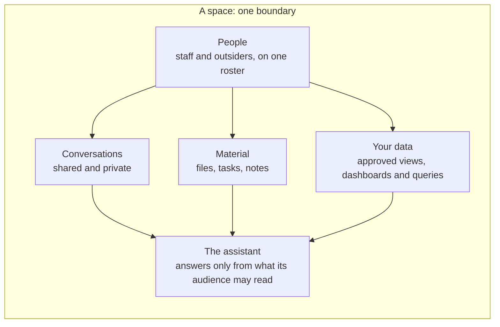

<p align="center">
  <picture>
    <source media="(prefers-color-scheme: dark)" srcset="https://github.com/MemberJunction/MJ/raw/main/MJ_logo_dark.png">
    <source media="(prefers-color-scheme: light)" srcset="https://github.com/MemberJunction/MJ/raw/main/MJ_logo.webp">
    
  </picture>
</p>

<h1 align="center">Collaboration</h1>

<p align="center">
  <strong>Spaces where your people, your partners, your data and your AI work inside one boundary.</strong>
</p>

<p align="center">
  A free <a href="https://github.com/MemberJunction/MJ">MemberJunction</a> Open App for client portals, boards and committees,<br>
  chapters and cohorts, sponsors and outside reviewers.
</p>

<p align="center">
  <a href="https://github.com/MemberJunction/bizapps-collaboration/actions/workflows/ci.yml"></a>
  
  
  
</p>

<p align="center">
  <a href="#why-collaboration">Why</a> &middot;
  <a href="#one-boundary">One boundary</a> &middot;
  <a href="#built-for">Built for</a> &middot;
  <a href="#features">Features</a> &middot;
  <a href="#how-it-works">How it works</a> &middot;
  <a href="#get-started">Get started</a> &middot;
  <a href="#extend-it">Extend it</a> &middot;
  <a href="#roadmap">Roadmap</a> &middot;
  <a href="#documentation">Docs</a>
</p>

<!-- Screenshots: add real Explorer captures once the walkthrough lands (PR 9's plan, stage 4). -->

---

## Why Collaboration

Every organization works with people it doesn't employ: clients, board members, volunteers, chapter leaders, sponsors, reviewers. The tools for that work are rented one project at a time. Board portals charge per seat and sell AI as an extra. Client portals keep your files and your chat in someone else's cloud, and forget everything when the project ends. And none of them has an AI assistant that's bounded by the same thing that bounds who can see what.

**Collaboration puts that work inside your own MemberJunction instance.** A space is a bounded group of people, some of them from outside your organization, working on a bounded set of material. It holds the library, the tasks, the conversations, and the assistant, and it decides, in one place, who may read each of them. It runs on your database, next to the rest of your data, and it costs nothing: no tiers, no per-seat price, no separate price for the agent.

## One boundary

Most products bolt permissions onto documents, chat onto permissions, and an AI onto chat. Collaboration starts from one object, the **space**, and makes everything else answer to it.



- **The people** are one roster: your staff and your outside participants, each with a role whose flags, never its name, decide what they can do.
- **The material** is on one of two **bands**: *Team*, your working material, and *Shared*, what your outside participants see. Moving something to Shared is an audited act.
- **The conversations** belong to the space. People start them when they need them: open to everyone in the space, on a topic, or internal to the team.
- **The assistant** answers from what the space holds, bounded by the **audience of the answer**. In a private chat it uses what you can read. In a shared conversation it uses only what *everyone in it* can read, so it can't repeat your team's notes to a client who's in the conversation.
- **Your data** comes in through the space too: a chapter's members, a sponsor's booth leads, an institution's accreditation status, shown through views and dashboards your organization approved.

Who reads what is decided **in the database**, by row-level security, never by a screen hiding a button. An outside participant gets one narrow role, and the same rules hold in the browser, over the API, and for the agent.

## Built for

| | |
|---|---|
| 🤝 **Client portals** | A professional-services firm runs every client relationship as a space, with a sub-space per engagement. The portal outlives the project, and the firm's own knowledge can inform every answer without one client's material reaching another. |
| 🏛️ **Boards and committees** | Seat outside directors who aren't staff. A compensation committee under the board stays sealed from directors who don't sit on it, while a director who sits on both works across both. |
| 🎓 **Cohorts and communities** | Learning cohorts, mastermind groups, task forces and volunteer crews, with join requests and a directory to come. Each kind is a space type, a row of metadata, not a new feature. |
| 🗺️ **Federations and chapters** | A national's chapters each get a room that shows the chapter's own members, renewals and events through the national's approved definitions, next to the national's playbooks. The chapter doesn't have to run on the national's system. |
| 🏢 **Sponsors, exhibitors and accreditation** | Relationships you deliver to another organization over time: booth leads, ad performance and renewal history for a sponsor; submission status and reviewer findings for an institution. The room outlives staff turnover on either side. |
| 🔍 **Reviews by outsiders** | Standards development, peer review, certification item writing and award juries: outside experts see exactly the material they review, and nothing else. |

## Features

Collaboration is pre-release: version 0.1 hasn't shipped yet. ✅ is in the code today, 🚧 is in progress, and 🗺️ is planned. The [roadmap](#roadmap) says when.

### Spaces and people

| | Feature |
|---|---|
| ✅ | **Spaces in a tree.** A root lasts as long as the relationship; sub-spaces hold the engagements, committees, cohorts and workstreams inside it. Closing a space ends that piece of work and archives its conversations, and reopening restores them. |
| ✅ | **Access after a close is a setting:** read-only (the default), read-only with the assistant, or none, for a number of days or for good. Once it ends, only the space's owner still sees it, and the confirmation before a close says what will happen. |
| ✅ | **Sealed or inheriting sub-spaces.** A sub-space is sealed unless its creator asks for its parent's members. A person reads the union of what their seats reach, and a seat never reaches into a sealed sub-space from above. |
| ✅ | **One roster for staff and outsiders,** with roles defined by flags: who may invite, promote, see the Team band, or contribute, up to a ceiling a member can't exceed. |
| ✅ | **Invitations by email link,** through MemberJunction's magic links. Outsiders get the narrow Space Participant role, never a staff role. |
| ✅ | **Seven generic space types:** Workspace, Team, Project, Working Group, Event, Community and Cohort. Every one is metadata; add your own without code. |
| 🚧 | **Home across your spaces:** the spaces you reach, with counts of shared files, open tasks and invitations awaiting approval, from one query run on the server. |

### Library and work

| | Feature |
|---|---|
| ✅ | **A library per space,** on MemberJunction Storage: upload, open, promote from Team to Shared with a recorded stamp, share notices, and a record of who used what. |
| ✅ | **Tasks filed in spaces,** on [BizApps Tasks](https://github.com/MemberJunction/bizapps-tasks), in lists, boards and timelines. |
| 🚧 | **Where files are stored is a setting,** per app, type, space or sub-space, so each relationship's files can live in its own storage account. |
| 🗺️ | **Notes:** quick notes in a space, Shared, Team or private to their author, that the assistant can use in the right audience. |
| 🗺️ | **Pins and stars:** pin the files, notes, views and dashboards you use to the top of a space, see your pins across spaces on Home, and star the spaces you live in. |
| 🗺️ | **Meetings and agendas,** from BizApps Tasks, with Outlook and Google Calendar sync, agendas built in the app, and notes and proposed tasks drafted from the transcript. |

### Conversations and the assistant

| | Feature |
|---|---|
| ✅ | **Conversations in every space,** started when someone asks for one: open to everyone in the space, on a topic, or internal to the team, on MemberJunction's own chat area. |
| 🚧 | **Chats inside a space,** with the people you choose. Whoever adds someone decides how much history they see. |
| 🚧 | **An assistant bounded by its audience.** In a private chat it uses your reach, narrowed by a scope control; in a shared conversation, only what every participant can read, band by band. |
| 🚧 | **Per-space agents,** skills and knowledge sources, set down the tree by admins. |
| 🗺️ | **Citations and sealing.** Every answer records its sources. Someone added to a conversation later sees an answer built on material they can't read as sealed, with a way to request access. Copying an answer across an audience boundary warns. |
| 🗺️ | **The same bounded assistant** over MCP, Slack and Teams, with a real identity on every channel or a refusal. |
| 🗺️ | **Digests and proposed posts.** Members subscribe to what changed; anything unsolicited an agent drafts for outsiders waits for a named person to approve it. |

### Your data, bounded by the space

| | Feature |
|---|---|
| 🗺️ | **Anchors.** A space points at the records it's about, such as a chapter, a sponsor's company, or a deal, each with a role. |
| 🗺️ | **Grants.** A space type, a space or a sub-space offers agents, actions, queries, views, dashboards, interactive components and knowledge sources, each filled in from the space: a *Members* view that shows only this chapter's members. |
| 🗺️ | **Bound values the AI can't change.** A chapter ID bound from the space never appears in the agent's tools, and a value the model or the browser tries to supply is refused and logged. |
| 🗺️ | **Data reach, in SQL.** A space type declares which of your entities its outsiders may read and by what path; the row-level security filters are generated, reviewed and shipped as metadata. |
| 🗺️ | **The Canon.** Anything shown to outsiders through a query, view or dashboard is approved and tested first, so a chapter leader who asks how many members they have gets your organization's definition of a member. |

### Security and administration

| | Feature |
|---|---|
| ✅ | **Row-level security on every read** an outside participant can make, one filter per entity, and field rules on people, so outsiders see only a person's name and email once BizApps Common turns on field-level security for People. |
| ✅ | **Every write checked on the server,** in the entity classes, so the API, MCP and the screens obey the same rules. |
| ✅ | **One settings model,** from the app's defaults down through the type, parent spaces and the space. |
| ✅ | **Rights through MemberJunction's Authorizations:** changing a space type needs *Configure Space Types*; changing a space's settings needs *Configure Spaces* and an owner seat; closing or reopening needs *Close and Reopen Spaces* and an owner seat. |
| 🚧 | **No right decided by a role's name:** the last checks that go by role (creating a top-level space, two settings, assigning across levels, backdating a close) move onto one authorization. |
| 🗺️ | **PostgreSQL,** beside SQL Server. |

### Extensibility

| | Feature |
|---|---|
| ✅ | **Space types as plug-ins.** A type names server and browser driver classes, so another app adds behavior without Collaboration knowing it exists. The server asks the type's driver before a write to its spaces, seats and items, and before a conversation starts. |
| 🚧 | **A type's own data,** in a table that extends Space through MemberJunction's IsA, created, edited and shown through the space's own screens, including a New Space screen. |
| ✅ | **Contributions:** tabs and overview cards any app can add to any type, each card on the Shared or the Team side, and lifecycle subscribers on the server. |
| 🚧 | **More contributions:** header chips, needs-you items, agenda items and signal providers. The contracts and examples exist; the screens don't show them yet. |
| ✅ | **Widgets that run anywhere:** the space's components run in any Angular app, such as a learning portal, not only in MemberJunction Explorer. |
| 🚧 | **Spaces for other apps' records:** one call opens, or finds, the space for a record another app owns, such as a room for a deal. |

## How it works

**A space type is data.** Its vocabulary, bands, join mode, the types allowed under it, its settings and its plug-in classes are all metadata. The engine reads flags, never names.

**Reach.** An active seat reaches its space and every descendant that inherits membership. A sealed sub-space is reached only by its own seats. A person reads the union of what their seats reach, anywhere in the tree. The same walk runs in three places, the rules module, the server's write gates and the database's `fnCollaborationAccess`, so they can't disagree.

**The audience rule.** What the assistant may use depends on who will see its answer, not on where the asker is standing. One person with the assistant: that person's reach, which they can narrow. Two or more people: the intersection of what each of them can read, and nobody can widen it, the asker included. The assistant always runs as the asking user, never as a service account.

**Reads in SQL, writes in the entity classes.** Every read grant the Space Participant role holds carries a row-level security filter, and every write is checked by a server subclass of the entity, so a forged API call meets the same rule as a click.

The full set of rules, each marked built or planned, is in [How Collaboration works](docs/HOW_THE_SYSTEM_WORKS.md).

## Get started

### Install it on a MemberJunction host

**Requirements** (from [`mj-app.json`](mj-app.json)):
- MemberJunction `>=6.1.2 <7.0.0`, on SQL Server. PostgreSQL is on the roadmap. For now the code also uses chat-area inputs that exist only on MemberJunction's `next` ([MJ#4788](https://github.com/MemberJunction/MJ/pull/4788)); a release that carries them is pinned before a first install.
- [BizApps Common](https://github.com/MemberJunction/bizapps-common) and [BizApps Tasks](https://github.com/MemberJunction/bizapps-tasks), which the installer brings in.

```bash
mj app install https://github.com/MemberJunction/bizapps-collaboration
```

The host gets Collaboration's migrations and its npm packages: MJAPI loads the server package, and MJExplorer loads the client. Collaboration ships no API or Explorer of its own; it runs inside yours.

**Inviting outsiders** uses MemberJunction's magic links, through the host's `magicLink` settings:
- `enabled` is true, and `Space Participant` is in `grantableRoleNames`;
- `restrictedRoleName` stays the host's own default, so other apps are unchanged;
- `communicationProvider` and `fromAddress` let Collaboration email the sign-in link. Without them, the raw link goes only to an `Owner` user or to a role in `inviteIssuerRoleNames`;
- `defaultExpiresInHours` sets the link's lifetime, 72 hours when unset.

Never give an outside participant MemberJunction's `UI` role: one unfiltered grant exempts a user from every filter on that entity.

### Develop it

This is a pnpm workspace; CI uses Node 22. For now it builds against MemberJunction's `next`, in a workspace made by `mj dev workspace` beside MemberJunction, BizApps Common and BizApps Tasks ([PR 9's plan § 3.1](plans/pr9-plan.md#31-working-on-mj-next)). Install from that parent folder, not here. CI installs published packages, so it fails on the `next`-only types until a release is pinned.

```bash
pnpm run build             # every package
pnpm test                  # the unit tests
pnpm run mj:migrate        # the migrations, into __mj_BizAppsCollaboration
pnpm run mj:push           # the metadata, while developing
pnpm run test:integration  # both harnesses; the client half needs MJAPI running
```

The integration checks run against a real database with the sample world loaded; [the data guide](docs/reviewing-the-data.md) describes its people and spaces and how to load them.

## Extend it

Collaboration is a base other apps build on. To add a kind of space:

1. **Ship a space type** as metadata, with its vocabulary, bands, settings and allowed children.
2. **Add behavior,** if it needs any, with a server driver (rules checked before a save, and reactions after it) and a UI driver (its tabs and Overview cards, and checks before an invite or a new conversation; header chips and more are coming). A type's message hooks take effect once MemberJunction records who wrote a message ([MJ#4789](https://github.com/MemberJunction/MJ/pull/4789)).
3. **Add data,** if it has its own, as a table that extends Space through IsA, filtered with Collaboration's published `fnCollaborationAccess`. This path is being finished in [#9](https://github.com/MemberJunction/bizapps-collaboration/pull/9).
4. **Offer your data** through anchors and grants, bounded by the space.

The rules, the hooks and three worked examples (a committee, a deal room, and Collaboration's own private example plug-ins) are in the [extensibility plan](docs/EXTENSIBILITY_PLAN.md). BizApps Committees will be rebuilt this way.

## Packages

| Package | Layer | What it holds |
|---|---|---|
| [`@mj-biz-apps/collaboration-core`](packages/Core/README.md) | L0 | The rules as pure functions, the view models and the extension contracts |
| [`@mj-biz-apps/collaboration-entities`](packages/Entities/README.md) | L0 | The entity classes, the typed GraphQL client and the permission domain |
| [`@mj-biz-apps/collaboration-engine-base`](packages/EngineBase/README.md) | L0 | The metadata engine and the rights, safe in the browser and on the server |
| [`@mj-biz-apps/collaboration-actions`](packages/Actions/README.md) | L0 | The app's actions |
| [`@mj-biz-apps/collaboration-core-entities-server`](packages/CoreEntitiesServer/README.md) | server | The write gates, the drivers and the server operations |
| [`@mj-biz-apps/collaboration-server`](packages/Server/README.md) | server | The server bootstrap and the GraphQL resolvers |
| [`@mj-biz-apps/collaboration-ng-widgets`](packages/AngularWidgets/README.md) | L1, L2 | Angular widgets that run in any Angular app |
| [`@mj-biz-apps/collaboration-ng`](packages/Angular/README.md) | L3 | The Explorer surface and the client bootstrap |

The [UX gallery](packages/UXGallery/README.md), the [example plug-ins](packages/ExampleSpaceTypes/README.md) and the [integration checks](packages/IntegrationTests/README.md) are private packages in the same workspace. Every package declares its UI layer, and MemberJunction's layer check enforces it.

## Roadmap

| When | What |
|---|---|
| **Done: [#7](https://github.com/MemberJunction/bizapps-collaboration/pull/7)** | The engine's next phase: the metadata engine, one settings model, settings rights, generic space types, plug-in drivers, a room in every space, retrieval bounded by a room's audience, and the screens |
| **Done: [#8](https://github.com/MemberJunction/bizapps-collaboration/pull/8)** | The chat on MemberJunction's chat area: conversations started when someone asks for one, and agent turns run on the server, bounded by the conversation's audience |
| **Now: [#9](https://github.com/MemberJunction/bizapps-collaboration/pull/9)** | Finishing the chat, on MemberJunction's latest `next`; testing the extension model end to end, with subtypes and their screens; closing and reopening as a right of their own, and no right decided by a role's name; then anchors, grants, data reach, notes and pins, the screens walked end to end, and a first host ([its plan](plans/pr9-plan.md)) |
| **Then** | MemberJunction's view and dashboard properties, bound agent parameters and locked query parameters, which open the closed grants; meetings and agendas in BizApps Tasks, with calendar sync; Committees rebuilt on Collaboration; provenance and sealing; the assistant over MCP, Slack and Teams; PostgreSQL |

The whole plan, with every decision and its reason, is [`plans/plan.md`](plans/plan.md).

## Documentation

| Document | What it covers |
|---|---|
| [The plan](plans/plan.md) | What's being built and why: the model, the security doctrine, every decision, the roadmap and the open questions |
| [PR 9's plan](plans/pr9-plan.md) | Finishing the chat, then #8's stages and the rest of the plan, in order |
| [PR #8's plan](plans/pr8-plan.md) | The build plan for anchors, grants, data reach, notes and pins |
| [How Collaboration works](docs/HOW_THE_SYSTEM_WORKS.md) | The rules the rules module, the server and the database share, each marked built or planned |
| [The extensibility plan](docs/EXTENSIBILITY_PLAN.md) | Space types as plug-ins, with chats, history and agents |
| [The data guide](docs/reviewing-the-data.md) | The sample world's people and spaces |

## Contributing

Feature work goes to `next`, the integration branch; `main` is the release branch. A migration carries DDL and its CodeGen output only: roles, permissions, filters, space types and other seed rows are JSON under `metadata/`. [`CLAUDE.md`](CLAUDE.md) and each package's README have the conventions.

## Built on MemberJunction

Collaboration is a [MemberJunction](https://github.com/MemberJunction/MJ) Open App. It uses MemberJunction's entities and row-level security, its storage, its conversations and agents, its actions, queries, views and dashboards, and BizApps Tasks and Common, rather than rebuilding them. It adds the container and the rules that bind them together.

## License

Collaboration is free: no tiers and no per-seat price. Its license is still being chosen; until it is, the packages and `mj-app.json` say `UNLICENSED`, and the repository has no `LICENSE` file.
