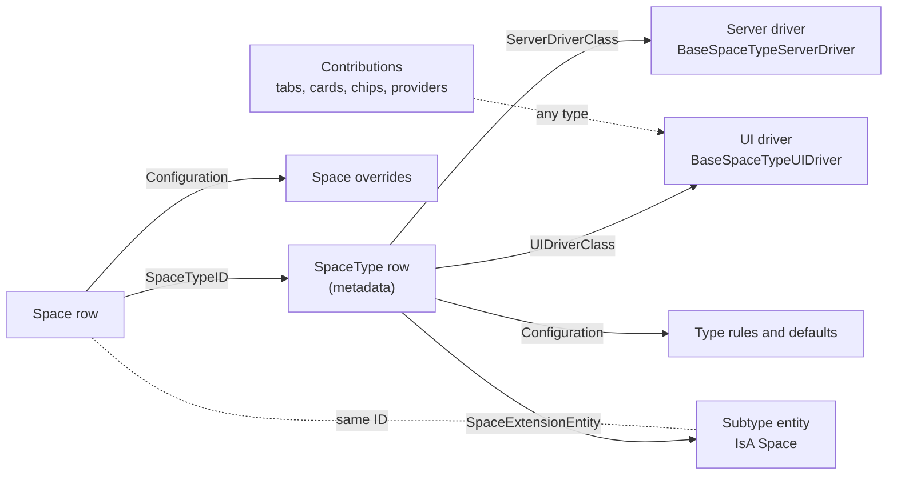

# Collaboration extensibility: space types as plug-ins

This plan makes Collaboration a base that other apps build on without Collaboration knowing about them. A downstream app adds a **space type**. The type names server and browser plug-in classes, and optionally a table of its own that extends `Space` through MJ's IsA. The first app to be built this way is Committees (bizapps-committees), rebuilt on it (the plan's C4).

It replaces [the UX plan's § 9](ux/IMPLEMENTATION_PLAN.md#9-extension-points-for-apps-on-top), and it settles the rules for chats and agents ([§ 8](#8-chats-history-and-agents)).

**Status:** agreed on 2026-09-26, and amended by the decisions in [the plan](../plans/plan.md): its D1, D2 and D8 to D11 the same day, D16 to D25 on 2026-09-27, D26 to D35 later that day (the plan's v0.5: anchors, grants, data reach, notes and meetings), and D40 to D48 on 2026-09-29. PR #7 built the base of this model and PR #8 the chat; both have merged. PR 9 finishes the chat and builds subtypes end to end (D42). D26 to D35's changes come in the stages after it, from [PR 9's plan](../plans/pr9-plan.md) ([§ 13](#13-order-of-work)). What isn't built yet is marked where it's described. Where this document and the plan disagree, the plan wins.

## Contents

1. [Decisions](#1-decisions)
2. [The model](#2-the-model)
3. [Data](#3-data)
4. [Configuration: one bag per type and per space](#4-configuration-one-bag-per-type-and-per-space)
5. [Server drivers](#5-server-drivers)
6. [UI drivers and contributions](#6-ui-drivers-and-contributions)
7. [IsA subtypes and their forms](#7-isa-subtypes-and-their-forms)
8. [Chats, history and agents](#8-chats-history-and-agents)
9. [MJ changes](#9-mj-changes)
10. [Examples](#10-examples)
11. [Security rules for plug-ins](#11-security-rules-for-plug-ins)
12. [Tests](#12-tests)
13. [Order of work](#13-order-of-work)
14. [Changes to the UX plan](#14-changes-to-the-ux-plan)

## 1. Decisions

| # | Decision | Section |
|---|---|---|
| 1 | A space type names a server plug-in class and a browser plug-in class: `SpaceType.ServerDriverClass` and `SpaceType.UIDriverClass`. Only types name them in v1. A space that needs different code is a different type, and a driver can branch on the space's configuration. | [3](#3-data), [5](#5-server-drivers), [6](#6-ui-drivers-and-contributions) |
| 2 | A type's own data is a table that extends `Space` through MJ's IsA (disjoint), named by `SpaceType.SpaceExtensionEntity`, the way bizapps-orders' `ProductType.ProductExtensionEntity` names a product's extension. No `EmbeddedRecord`. `RelatedRecordCollection` only where the native model has an aggregate; with a chat's people in MJ core, none is planned. | [3](#3-data), [7](#7-isa-subtypes-and-their-forms) |
| 3 | Rules and settings live in a JSON configuration bag (an MJ JSONType column) on `SpaceType` and `Space`. The type sets defaults and names the keys a space may override. Anything SQL reads stays a column. | [4](#4-configuration-one-bag-per-type-and-per-space) |
| 4 | The types allowed under a type live in its configuration, by type code, not in a join table. | [4](#4-configuration-one-bag-per-type-and-per-space) |
| 5 | Plug-ins follow MJ's forms pattern: base classes with hooks to override, resolved through ClassFactory, and contributions registered with metadata. | [5](#5-server-drivers), [6](#6-ui-drivers-and-contributions) |
| 6 | IsA's lookup cost is accepted. Collaboration reads lists as plain rows, and MemberJunction/MJ#4787, merged into MJ `next` on 2026-09-27, removes the per-record probe for an entity that opts in. | [7](#7-isa-subtypes-and-their-forms), [9](#9-mj-changes) |
| 7 | Anyone in a space with a seat that can post can start a chat, unless the type or the space narrows it to owners (the plan's D43). A read-only guest can't start one. An agent replies when it's tagged, or to every message in a chat that holds one person and one agent. | [8](#8-chats-history-and-agents) |
| 8 | Whoever adds a person to an existing chat chooses how much history they see: none, all, or from a date. It's the `HistoryFrom` on MJ core's conversation participant row. Nothing else in a space is time-limited: a seat opens everything its band allows, from the start. Sub-spaces keep their own membership. | [8](#8-chats-history-and-agents) |
| 9 | The audience of an answer decides what the agent may use (the plan's D2). In a chat with two or more people, the agent sees only what every person in it can see now. In a private chat, it uses the caller's union of reach, narrowed by a scope control. | [8](#8-chats-history-and-agents) |
| 10 | Allowed agents resolve top-down: the app's default, the space's type, the root space, down to the space. Each level extends or replaces the list above, and a level without its own rows inherits it. MJ's agent Run permission stays the security boundary. An app supplies its own agent the same way, through its type's rows, with `IsDefault`. **Amended by 28:** the chain restarts where the type changes, and the rows are grants. | [8](#8-chats-history-and-agents) |
| 11 | The chat stays MJ's `mj-conversation-chat-area`. Collaboration never forks it. `ng-conversations` gained the inputs, the reworked event and the slot these rules need in MemberJunction/MJ#4788, merged into MJ `next` on 2026-09-27. | [9](#9-mj-changes) |
| 12 | Committees keeps its membership records, and its server driver keeps the seats in step. | [10](#10-examples) |
| 13 | Settings rights are an MJ Authorization tree rooted at *Collaboration*. Collaboration grants *Configure Space Types* and *Configure Spaces* to the Developer role by default, and an app grants them to its own admin roles (the plan's D23). Closing and reopening a space take their own authorization, *Close and Reopen Spaces*, with an owner seat (D40). No right is decided by a role's name (D41). | [4](#4-configuration-one-bag-per-type-and-per-space) |
| 14 | A chat's people are MJ core's conversation participants (the plan's A5 and D10), and core's row-level security enforces each one's `HistoryFrom` for everyone, staff included. Inside that window, an AI message whose sources the newcomer can't read is sealed for them (the plan's D4 and A7). The chat area needs no cutoff of its own. | [8](#8-chats-history-and-agents) |
| 15 | A space can be anchored to a record in another app (`Space.AnchorEntityID` and `AnchorRecordID`), and one call finds or creates it. So an app can open a space for its own record, such as a room for a deal, from its own screens. **Amended by 25:** a space can have several anchors. | [3](#3-data), [5](#5-server-drivers), [10](#10-examples) |
| 16 | Seats can be synced from an app's own roster (`SpaceMember.SyncSource`), beside the seats people invite. A sync changes only its own seats. | [3](#3-data), [5](#5-server-drivers) |
| 17 | A space shows data it doesn't own only through its subtype's own columns, kept in step by its driver and filtered like the space. Never through a privileged read. **Amended by 27:** a type's data reach adds a second path, still in SQL. | [10](#10-examples), [11](#11-security-rules-for-plug-ins) |
| 18 | A new sub-space is sealed unless its creator asks for its parent's members: `Space.InheritsMembership` defaults to 0, and no type sets a default (the plan's D22). | [3](#3-data) |
| 19 | Access after a space closes is `PostCloseAccess` (`ReadOnly`, `ReadOnlyWithAgent` or `None`) and `PostCloseAccessDays`: settings, whose app default is `ReadOnly` with no end, stamped on the space when it closes (the plan's D21). They replace what `DefaultRetention` and `Space.Retention` meant. | [3](#3-data), [4](#4-configuration-one-bag-per-type-and-per-space) |
| 20 | A type or a space can bind Content Sources that its agents may use beyond the space's own items. **Amended by 26:** they're grants of kind `KnowledgeSource`. | [3](#3-data), [8](#8-chats-history-and-agents) |
| 21 | Any app can subscribe to a space's lifecycle events (`AfterSpaceClosed`, `AfterMemberAdded`, `AfterMemberRemoved` and `AfterItemPromoted`) and register signal providers (`BaseSpaceSignalProvider`), beside the type's own driver hooks. | [5](#5-server-drivers) |
| 22 | One settings shape at every level: the Collaboration app's default in MJ's Application Settings, and overrides in a type's and a space's `Configuration`, resolved sub-space, parents, type, then app (the plan's D20). Where files are stored is a setting (the plan's D17). | [4](#4-configuration-one-bag-per-type-and-per-space) |
| 23 | `CollaborationEngineBase`, with the server's `CollaborationEngine`, caches Collaboration's metadata (the plan's D19). | [5](#5-server-drivers), [6](#6-ui-drivers-and-contributions) |
| 24 | Collaboration ships seven generic space types. Professional-services types belong to the layer that needs them (the plan's D18). | [10](#103-examples-in-collaboration-itself) |
| 25 | A space can be anchored to several records, each with a role, at most one of them primary: `SpaceAnchor`. `EnsureSpaceForRecord` finds or creates a space by its primary anchor. IsA stays for concepts that exist only as a space (the plan's D26). | [3](#3-data), [5](#5-server-drivers) |
| 26 | What a type, a space or a sub-space offers is a grant, `SpaceGrant`: agents, actions, queries, views, dashboards, components and knowledge sources, with bindings the server fills in from the space, its anchors and the caller, hidden from the model and refused from a client. It replaces `SpaceAgent`, `SpaceAgentSkill` and `SpaceKnowledgeSource` (the plan's D27 and D31). | [3](#3-data), [8](#8-chats-history-and-agents) |
| 27 | A type's data reach lets its participants read another app's rows through generated row-level security filters, one per entity, and a granted query is the one read the server runs for them. What's granted to a type that seats outsiders is Canon-approved (the plan's D28, D29 and D34). | [11](#11-security-rules-for-plug-ins) |
| 28 | One effective configuration (settings, grants and agent settings), resolved through the space's same-type run, restarting where the type changes (the plan's D30). | [4](#4-configuration-one-bag-per-type-and-per-space) |
| 29 | Notes and pins are Collaboration's; meetings and agendas move to bizapps-tasks, and a space shows its meetings through a link (the plan's D32 and D33). | [10](#10-examples) |

## 2. The model

A space type is a metadata row. Besides its name, vocabulary and defaults, it can name three things a downstream app ships:

- **A server driver:** rules checked before a save of the type's spaces, and reactions after it (inside the save's transaction from stage 2).
- **A UI driver:** what a space of the type shows, and what happens on its UI events.
- **A subtype entity:** the app's own table, which extends `Space` through IsA, for typed data and its form.

Anything that isn't owned by one type is a **contribution**: for example a tab that one app adds to every space, or a source of dated items. Collaboration reaches all of it through base classes, ClassFactory and IsA. Its own code never names a downstream app.

Reads stay in SQL. A driver can refuse a write and react to one, but it never widens who can read what.



**What a downstream app ships:**

| Where | What |
|---|---|
| `metadata/` | Its `SpaceType` rows, with the driver keys, `SpaceExtensionEntity` and `Configuration`. Its allowed-agent rows, entity permissions and row-level security filters. |
| `migrations/` | Its subtype tables, declared as IsA children of `Space` in its `codegen-schema-info.json`, with the CodeGen output. |
| A server package | The server driver and the subtype entities' server classes, registered at module level and listed under `packages.server` in `mj-app.json`, which the installer adds to the host's `dynamicPackages.server`. |
| A client package | The UI driver and its contributions, listed under `packages.client` in `mj-app.json`, with `"sideEffects": true` or a `Load*()` anchor. |

Collaboration owns the engine, the base classes, its schema, and the default behavior every type gets when it names no driver.

## 3. Data

**`SpaceType`**, added:

| Column | Type | Meaning |
|---|---|---|
| `ServerDriverClass` | `NVARCHAR(255) NULL` | The ClassFactory key under `BaseSpaceTypeServerDriver`. Empty means Collaboration's base driver. |
| `UIDriverClass` | `NVARCHAR(255) NULL` | The ClassFactory key under `BaseSpaceTypeUIDriver`. Empty means the base driver. |
| `SpaceExtensionEntity` | `NVARCHAR(255) NULL` | The MJ entity name of the IsA child that every space of this type has, for example `Committees: Committees`. Empty means a plain space. The server checks on save that it names an existing entity that is an IsA child of Spaces, and that every role that reads it does so under the same row filter as Spaces ([§ 7](#7-isa-subtypes-and-their-forms)). |
| `Configuration` | `NVARCHAR(MAX) NULL` | The type's rules and defaults, as `ISpaceTypeConfiguration` ([§ 4](#4-configuration-one-bag-per-type-and-per-space)). |

- **Removed:** the `committee` seed row, in PR #3 (the plan's B0.11); Committees ships its own type. **Still to remove:** the `GovernancePanel` column.
- **Settings, not columns** (the plan's D20 to D22): where files are stored and access after close are keys of the settings shape ([§ 4](#4-configuration-one-bag-per-type-and-per-space)), and there's no type-level inheritance default, since every new sub-space is sealed unless its creator asks. The schema doesn't match yet: `SpaceType` still has `DefaultInheritsMembership` (default 1), which `EnsureSpaceForRecord` applies, and `PostCloseAccess` (default `None`) and `PostCloseAccessDays`, which `fnCollaborationAccess` reads when a closed space has no value of its own.
- **Replaced:** `PostCloseAccess` and `PostCloseAccessDays` replace what `DefaultRetention` and `Space.Retention` meant. Nothing enforces those. They're still columns, and Settings still shows and saves a Retention Policy that has no effect; the columns and the control are to go.
- **Kept as they are:** the other columns. SQL reads `Discoverability`, `JoinMode`, `DefaultAgentRetrieval`, `DefaultBand`, `DefaultAllowParentAssignees`, `InviteApproval` and `MemberCap`. The panel flags become the base UI driver's defaults.

**`Space`**, added:

| Column | Type | Meaning |
|---|---|---|
| `Configuration` | `NVARCHAR(MAX) NULL` | The space's overrides, as `ISpaceConfiguration` ([§ 4](#4-configuration-one-bag-per-type-and-per-space)). |
| `AnchorEntityID` | `UNIQUEIDENTIFIER NULL`, FK to `__mj.Entity` | The entity of the record this space belongs to, for a space another app opens for its own record ([§ 5](#5-server-drivers)). **To be replaced by `SpaceAnchor`** (decision 25), in the stages after PR 9. |
| `AnchorRecordID` | `NVARCHAR(450) NULL` | That record's key, the same shape as `SpaceItem.RecordID`. Nothing makes it unique yet. **To be replaced by `SpaceAnchor`**, whose anchors are unique. |
| `PostCloseAccess` | `NVARCHAR(20) NULL` | `ReadOnly`, `ReadOnlyWithAgent` or `None`. Written by the server when the space closes, from the resolved setting ([§ 4](#4-configuration-one-bag-per-type-and-per-space), the plan's D21), because SQL reads it. Someone with *Configure Spaces* and an owner seat can change it later. Empty while the space is open. |
| `PostCloseAccessDays` | `INT NULL` | How long that access lasts after `ClosedAt`, stamped with it. Empty means no end. |

`PlannedCloseAt` is already in. `fnCollaborationAccess` applies `PostCloseAccess` through `ClosedAt`. `fnCollaborationAncestorMembers` applies the same check at every hop.

`Space.InheritsMembership` stays, and its default becomes 0 (the plan's D22). A sub-space's creator chooses; the UI asks, with no preselected answer.

**`SpaceItem`**, to add (not built yet):
- `StorageAccountID UNIQUEIDENTIFIER NULL`, FK to `MJ: File Storage Accounts`: for an item that is a stored file, the account the file went to. Reads and deletes use it, so a later change to the setting applies to new uploads only (the plan's D17). Today an upload doesn't use the setting, and MJ stores the file in the host's active account.

**`SpaceMember`**, added:
- `SyncSource NVARCHAR(100) NULL`. Empty means a person invited this seat. A value names the roster that manages it, for example `committees:membership`, and only that roster's sync changes or removes it.
- `PersonID UNIQUEIDENTIFIER NULL`: the seat's person in bizapps-common, filled when the seat's user is linked to a Person (the plan's B9). Apps keyed on People, such as Committees, project their rosters onto seats through it.
- Both columns exist, and nothing fills or guards them yet: `SyncSeats` isn't built ([§ 5](#5-server-drivers)), and `PersonID` is filled with B9.

**New tables:**

- `SpaceChat`, for chats ([§ 8](#8-chats-history-and-agents)). A chat's people aren't a Collaboration table: they're MJ core's conversation participants (the plan's A5). The table `SpaceChatMember` that this plan first proposed is gone.
- `SpaceAgent`, for allowed agents ([§ 8](#8-chats-history-and-agents)). It's a table rather than configuration because its rows point at agents, which can be deleted. The foreign key keeps the list honest. No app-wide rows ship yet: with none, the app level is the shipped agent, found by its fixed ID.
- `SpaceAgentSkill`, for the Assistant's skills at one level ([§ 8](#8-chats-history-and-agents)): `SkillID`, an `MJ: AI Skills` row, and at most one of `SpaceTypeID` and `SpaceID`, resolved down the tree like `SpaceAgent`. It's a table for the same reason: skills can be deleted.
- `SpaceKnowledgeSource`, for knowledge bindings: one row per Content Source an agent may use at one level, with `ContentSourceID` and at most one of `SpaceTypeID` and `SpaceID`, resolved down the tree like `SpaceAgent`. It's a table for the same reason: Content Sources can be deleted. What an agent may quote from a source follows its classification (the plan's A10).

**Changed by the plan's v0.5 (D26 to D33), to be built in PR 10's stages** ([PR 10's plan](../plans/pr10-plan.md), from [#8's plan](../plans/pr8-plan.md)):
- **`SpaceAnchor`** replaces `Space.AnchorEntityID` and `AnchorRecordID`: `SpaceID`, `EntityID`, `RecordID`, `Role`, `IsPrimary` and `Sequence`, unique on the space, entity, record and role, with at most one primary anchor per type, entity and record (the plan's B14).
- **`SpaceGrant`** replaces `SpaceAgent`, `SpaceAgentSkill` and `SpaceKnowledgeSource`: at most one of `SpaceTypeID` and `SpaceID`, a `Kind`, the target's `TargetEntityID` and `TargetRecordID`, `Label`, `Band`, `IsDefault`, `Bindings` and `Settings` as JSON, `Mode` and `Sequence` (the plan's B15). An agent's skills live in its grant's settings.
- **`SpaceNote`** (the plan's B21) and **`SpaceMemberPin`** (B22).
- **`DataReach`** joins the type's configuration ([§ 4](#4-configuration-one-bag-per-type-and-per-space)).

**How this follows bizapps-orders.** Orders extends products the same way, and Collaboration copies its shape:

| bizapps-orders | Collaboration |
|---|---|
| `ProductType.ProductExtensionEntity` and `OrderLineExtensionEntity` hold the IsA child's entity name | `SpaceType.SpaceExtensionEntity` |
| `Entity.SubtypeSelector` on Products: `ProductTypeID.ProductExtensionEntity` | on Spaces: `SpaceTypeID.SpaceExtensionEntity` ([§ 7](#7-isa-subtypes-and-their-forms)) |
| `ProductType.Configuration`, a JSON bag | `SpaceType.Configuration` and `Space.Configuration`, registered as JSONTypes |
| `DriverClass` on `SubscriptionType` and `RevenueRecognitionType`, optional, subclassing a working base | `ServerDriverClass` and `UIDriverClass` on `SpaceType` |
| `mj-entity-form-host` shows an order line's extension | the same host shows a space's extension |

Collaboration adds four things orders doesn't have:
- **Behavior per type.** Orders' type row names no code: event products' rules are written against their entity, so a new product type can't add rules of its own. A space type names its drivers.
- **Checked values.** Orders doesn't check the extension's name, and reads its configuration as an untyped string. Collaboration validates both on save.
- **A missing driver is caught.** For an unregistered key, MJ's `ClassFactory.CreateInstance` returns the base class rather than null, so a null check never fires. Collaboration uses `TryCreateInstance` ([§ 5](#5-server-drivers)).
- **The selector reaches hosts.** Orders' `SubtypeSelector` rows aren't in its migrations yet, so a host installed from migrations falls back to "the only child". Collaboration declares no selector yet: a resolver in code covers it ([§ 7](#7-isa-subtypes-and-their-forms)).

**Where a setting goes:**

- if SQL reads it (row-level security, the access functions, a join), it's a column;
- if it points at a record that can be deleted, it's a row with a foreign key;
- otherwise it goes in `Configuration`.

The DDL is `migrations/V202609262200__v0.1.x__Extensibility_Schema_And_Tables.sql`, with its CodeGen output. The type rows are metadata JSON. The JSONType wiring, the `SubtypeSelector` and app-wide agent rows aren't in `metadata/` yet.

## 4. Configuration: one bag per type and per space

`SpaceType.Configuration` and `Space.Configuration` are MJ JSONType columns, like `Entity.Configuration`, `EntityField.Configuration` and `EntityRelationship.Configuration` in MJ 6.1.

- **The interfaces** live in `collaboration-core` (L0): `ISpaceTypeConfiguration` and `ISpaceConfiguration`.
- **The wiring** is metadata: a row on `MJ: Entity Fields` for each column, with `JSONType`, `JSONTypeIsArray: false` and `JSONTypeDefinition: "@file:…"`. CodeGen then emits a typed `ConfigurationObject` on both entities. Not wired yet: no row sets `JSONType`, so there's no `ConfigurationObject`, and Collaboration parses and checks the JSON itself, with `ValidateCollaborationSettings`.
- **Order matters:** `mj sync push` runs before `mj codegen`, because CodeGen reads the JSONType from the database.
- **Keys are PascalCase,** like MJ's own configuration interfaces.

```ts
/** A JSON value, for settings that a type's own drivers define. */
export type ConfigurationValue =
    | string | number | boolean | null
    | ConfigurationValue[]
    | { [key: string]: ConfigurationValue };

export interface ISpaceRules {
    Chats?: {
        /** Who may start a chat. Default 'Anyone': every seat that can post. 'Owners': owner seats only. */
        WhoCanStart?: 'Anyone' | 'Owners';
        /** When an agent replies. Default 'MentionOrOneToOne'. */
        AgentReplyMode?: 'MentionOrOneToOne' | 'MentionOnly' | 'Always';
        /** The choice preselected when someone is added to an existing chat. Default 'None'. */
        HistoryOnAdd?: 'None' | 'All' | 'Since';
    };
    Agents?: {
        /** How this level's SpaceAgent rows combine with the list above. Default 'Extend'. A level without rows passes the list down. */
        ListMode?: 'Extend' | 'Replace';
    };
    /** Behavior switches that the type's own drivers read, keyed by the app that owns them. Data goes in the subtype entity, never here. */
    Extensions?: Record<string, Record<string, ConfigurationValue>>;
}

/**
 * The settings every level can hold: the Collaboration app, a type, a space (the plan's D20).
 * Each level stores only the keys it sets. The app's row must set PostCloseAccess, PostCloseAccessDays and every Chats and Agents key.
 */
export interface CollaborationSettings extends ISpaceRules {
    /** Where new files are stored: an MJ: File Storage Accounts ID (the plan's D17). */
    StorageAccountID?: string;
    /** What happens once a space closes (the plan's D21). The app's default is 'ReadOnly'. */
    PostCloseAccess?: 'ReadOnly' | 'ReadOnlyWithAgent' | 'None';
    /** How long that access lasts after ClosedAt, in days. Absent means no end. */
    PostCloseAccessDays?: number;
    /** Words shown instead of Collaboration's, for example { Tabs: { Library: 'Papers' } }. Only tab labels are read; band names are not configurable. */
    Labels?: { Tabs?: Record<string, string> };
}

export interface ISpaceTypeConfiguration extends CollaborationSettings {
    /** Types that may be created under a space of this type, by SpaceType.Code. Absent means any. */
    Children?: { AllowedTypeCodes?: string[]; MaxOpen?: number };
    /** Dotted keys a space may override, for example 'Chats.WhoCanStart'. Absent means none. */
    SpaceOverridable?: string[];
}

export interface ISpaceConfiguration extends CollaborationSettings {}
```

In code (`packages/Core/src/configuration.ts`), `CollaborationSettings` holds every key, `Children`, `SpaceOverridable` and `Extensions` included, and `ISpaceRules`, `ISpaceTypeConfiguration` and `ISpaceConfiguration` extend it with nothing added. `StorageAccountID` and `PostCloseAccessDays` also accept `null`. Validation refuses `Children` and `SpaceOverridable` on a space, and a top-level key in `SpaceOverridable`, such as `'Chats'`, allows every key under it. `MaxOpen` caps a space's open sub-spaces, and an empty `AllowedTypeCodes` list allows none.

**Where each level's settings live:**
- **The Collaboration app:** one row in MJ's Application Settings (`ApplicationID`, `Name`, `Value`), whose value is a `CollaborationSettings`. It ships as metadata, so the defaults are data, not code.
- **A type and a space:** their `Configuration`.
- `StorageAccountID` points at a record, which [§ 3](#3-data)'s rule would make a row. It's a setting anyway (the plan's D20): storage accounts are few and rarely deleted. A save checks that the account exists and is active, and an upload that resolves to a missing or inactive account is refused with a message, never sent somewhere else. Not built yet: the upload doesn't read the setting, and MJ stores the file in the host's active account.

**The effective settings** come from one pure function in `collaboration-core`, used by the server and the browser alike:

```ts
ResolveCollaborationSettings({ spaces, type, app }): ResolvedCollaborationSettings
```

The engines wrap it as `ResolveSettingsForSpace(spaces, spaceTypeId)`. A narrower `ResolveSpaceRules(type, space)` reads only the type and the space, and feeds the drivers' contexts. Stage 2 replaces both with one resolver.

`spaces` is the space and then its parents up the tree, nearest first. For each key, the first value set wins:
1. If the space's type lists the key in `SpaceOverridable`: the space's own value, then each parent's.
2. Then the type's value.
3. Then the app's.
4. The type's server driver can narrow the rules through `AdjustRules` ([§ 5](#5-server-drivers)). Today only a space save's `ValidateSpaceChange` gets the narrowed rules; the chat, the agent turn and the close read the resolved settings without them.

Validation refuses any key a space sets that its type doesn't allow, so nothing is ignored silently.

**Amended by the plan's D30,** in PR 10's stages (the resolver is stage 2 of [PR 10's plan](../plans/pr10-plan.md)). The chain covers the grants and each agent's settings as well as these keys, and it restarts where the type changes:
- the order, lowest first, is the app's defaults, the space's type, each ancestor in the space's **same-type run** top down, then the space. The same-type run is the unbroken line of ancestors directly above the space that have the space's type, so a sub-space of another type starts again from its own type;
- grants combine per kind with a `ListMode` (`Extend` or `Replace`), and a level can remove one grant it inherits;
- one function, `ResolveSpaceConfiguration`, returns one document, `EffectiveSpaceConfiguration`, which the server, the browser and the agent path all use. It replaces `ResolveCollaborationSettings` and `ResolveSpaceRules` above and the separate agent, skill and knowledge resolution in [§ 8](#8-chats-history-and-agents);
- a type's configuration gains `DataReach: [{ Entity, Path, AnchorRole, Band, Fields }]`, from which the participant role's filters on other apps' entities are generated (the plan's D28 and B18).

**Stamped where it's used.** A value SQL or history needs is written where it's used: when a space closes, the server stamps the resolved `PostCloseAccess` and `PostCloseAccessDays` on the space ([§ 3](#3-data)), and each stored file is to record its account on its item (not built yet; [§ 3](#3-data)).

**Validation,** in the entity server classes:

- the JSON must parse and match the interface. One that doesn't is refused, and at read time it fails closed; it's never ignored;
- every `AllowedTypeCodes` entry must be an existing type code (not checked yet: a type's save checks only that it's a list);
- a space may set only the keys its type allows;
- a `StorageAccountID` must name an active storage account;
- the app's row must set `PostCloseAccess`, `PostCloseAccessDays` and every `Chats` and `Agents` key. With no app row, what depends on it is refused, with a message saying where to fix it;
- **only users with Collaboration's settings authorizations write settings** (the plan's D23): *Configure Space Types* for a type's, and *Configure Spaces*, with an owner seat on the space, for a space's. They're an MJ Authorization tree rooted at *Collaboration*, and the server checks them on every such write. The Developer role gets them by default, an app grants them to its own admin roles, and Space Participant gets none. The app's row is guarded only by MJ's own permissions on Application Settings. The type decides which keys a space can change;
- **closing and reopening a space** need *Close and Reopen Spaces*, also under *Collaboration*, and an owner seat on the space (the plan's D40). It's granted by default to Space Participant, UI, Developer and Integration.

**A space-level driver override** isn't in v1. If one is ever needed, it's a key in `ISpaceConfiguration`, with no schema change.

## 5. Server drivers

`BaseSpaceTypeServerDriver` lives in `collaboration-core-entities-server`, next to the entity server classes that call it. A downstream app subclasses it and registers the subclass under the key its type row names:

```ts
@RegisterClass(BaseSpaceTypeServerDriver, 'CommitteeSpaceServerDriver')
export class CommitteeSpaceServerDriver extends BaseSpaceTypeServerDriver { … }
```

**The hooks.** Every method has a working default, so a subclass overrides only what it needs. Each receives a context holding:
- the acting user and the provider (`this.ProviderToUse` of the entity being saved);
- the space, its type and the effective rules. Today only `ValidateSpaceChange` gets the space's own rules, its type's and its own narrowed by `AdjustRules`; the other hooks get Collaboration's defaults until stage 2's one resolver;
- the change (`Create`, `Update`, `Move`, `Close`, `Reopen` or `Delete`), with the old values;
- `subtypeEntityName`, the subtype entity's name when an IsA child started the save, in every context (for a space, its seats and its items, the name comes from the type, since a seat or an item isn't saved through the subtype), and `subtypeOf(spaceType)` for the type's own answer.

**The kinds of change.**
- A space's own driver hears `Create`, `Update`, `Move`, `Close`, `Reopen` and `Delete`.
- Its parent's driver hears the same change as a sub-space's: `CreateChild`, `UpdateChild`, `ReopenChild`, `MoveChildIn`, `MoveChildOut`, `CloseChild` and `DeleteChild`. A move is one save seen from both parents: the one it joins hears `MoveChildIn`, the one it leaves `MoveChildOut`. A close and a move in one save are refused, so no save is both. A delete is judged in `ValidateSpaceChange` and raises no reaction.
- A member's driver hears `Invite`, `RoleChange`, `BandChange` and `Remove`. A new seat is an `Invite` (a `Remove` when it is made Removed), and so is a seat whose status becomes Active or Invited: an approval, a reinstatement or a re-invitation. A role or band edit is a `RoleChange` or `BandChange`, as asked: a band the gate puts back still reaches the driver as a `BandChange`. A save that touches none of status, role and band raises no seat reaction. A rule on who may hold a seat judges `Invite`, `RoleChange` and `BandChange` alike: judging only invitations lets a role change walk around it.
- Validation and reaction share one reading of the change, taken by `Save` before anything changes a field and handed to validation (validation called on its own takes its own), so they can't disagree about what kind it was. A save that changes nothing raises no reaction. Each reaction runs on its own: a driver that throws is logged with its hook and space, and doesn't silence the next.
- **Today** the reactions run after the space's own save returns, and a failure is logged and does not undo the save. When that save is part of a larger transaction, they run inside it, before it commits: a space saved through its subtype (MJ's IsA save wraps both rows) and `CreateSpace` (which writes the owner's seat too). A later refusal then rolls back what they wrote through the context's provider; outside work belongs in `provider.RunAfterCommit`, which runs only once the whole transaction commits. Moving every reaction inside the save's own transaction is planned for stage 2, with the one resolver for the rules.

| Area | Validate (can refuse) | React (after the save today, inside the caller's transaction when there is one; inside the save's own is planned) |
|---|---|---|
| Rules | `AdjustRules(ctx, rules)` narrows the effective rules | |
| The space | `ValidateSpaceChange` | `OnSpaceChanged` |
| Sub-spaces, on the **parent's** type driver | `ValidateChildSpaceChange` | `OnChildSpaceChanged` |
| Members | `ValidateMemberChange` (invite, role, band, remove) | `OnMemberChanged` |
| Items | `ValidateItemChange` (add, update, promote, move, remove) | `OnItemChanged` |
| Chats | `ValidateChatChange`, when a conversation is started. `ValidateChatMemberChange` waits for chats with their own people (A5), and `ValidateMessage` for A19 (the plan's D44). | `OnMessagePosted`, which waits for A19 too |
| Agents | | `BuildAgentContext` adds type-specific instructions and data to an agent turn, such as the roster and the next meeting. It receives the chat and its members' bands, so it can leave out Team-only data when an outside person is in the chat. Not called yet: the agent turn doesn't use it. |
| Tasks | | `OnTaskFiled` |
| Anchored spaces | `ValidateAnchor` (who may open the record's space) | `ResolveAnchorParent` names the parent, for example the account's root space |

**Where Collaboration calls them.**
- `SpaceEntityServer`, `SpaceMemberEntityServer` and `SpaceItemEntityServer`; `CreateSpaceConversation` (`ValidateChatChange`); `CreateSpaceTask` (`OnTaskFiled`); and `EnsureSpaceForRecord` (`ValidateAnchor`, `ResolveAnchorParent`). The message hooks wait for A19 (D44), adding people waits for A5, and the agent turn doesn't call `BuildAgentContext` yet.
- Validate hooks run in `ValidateAsync` and add `ValidationErrorInfo`, so `Save()` returns false with the driver's message.
- React hooks run after the space's own save, as above, inside the caller's transaction when there is one. Running them inside the save's own transaction, through MJ's `RunInEntityTransaction`, is planned for stage 2; then a thrown error will roll the whole save back.
- Email, HTTP and other outside work goes through `provider.RunAfterCommit`.

**Resolving a driver.**
- An empty `ServerDriverClass` means the base driver.
- A named class is resolved with `ClassFactory.TryCreateInstance`, and its `Resolved` flag is checked. `CreateInstance` alone can't tell: for an unregistered key it returns the base class.
- A named class that isn't registered on the server refuses every write to that type's spaces, with a message naming the missing class. Reads keep working. A type's rules may be exactly what the missing driver enforces, so writes never go ahead without it.
- Drivers hold no state. One instance per driver class is cached in a `BaseSingleton` registry, `ServerDriverRegistry`, which is cleared when a `SpaceType` row is saved.

**Seats from an app's roster.** The base driver declares a helper, `SyncSeats(space, source, people, actingUser, provider)`. It isn't built yet: the base changes nothing and returns an error. Once built, it adds, updates and removes the seats marked with that `SyncSource`, and leaves every other seat alone.
- **People without an MJ user,** such as an Employee or a Person with no linked user, get an email invite through Collaboration's pending invites.
- **A sync is a write like any other,** so the type's `ValidateMemberChange` can still refuse a seat.
- **Committees** syncs from its memberships, and a deal room from a deal's team and its buyer contacts ([§ 10](#10-examples)).

**Spaces another app opens for its own record.** `EnsureSpaceForRecord({ typeCode, entityName, recordId, spaceName, contextUser, provider })` is a Collaboration function on the server; it has no GraphQL operation or client call yet. It returns the space anchored to that record, creating it the first time. Today it matches `Space.AnchorEntityID` and `AnchorRecordID` alone, whatever the type, and nothing stops two concurrent calls from creating two spaces. Under the plan's D26 it will work on the space's primary `SpaceAnchor`, and a space can hold other anchors beside it, each with a role.
- **Who may open it:** anyone who can update the record, by MJ's own permissions and row-level security, unless the type's `ValidateAnchor` refuses. Collaboration creates the space on the server, with the caller as its owner. Not built yet: today only `ValidateAnchor` is asked, and nothing checks the caller's rights on the record. The new space's `InheritsMembership` comes from the type's `DefaultInheritsMembership` (default 1), against decision 18.
- **Where it goes:** under the space `ResolveAnchorParent` names, or at the root.
- **Where it's called from:** the owning app's own form or lifecycle code.

**Apps that own the record call Collaboration after their own commit,** through `provider.RunAfterCommit`: `EnsureSpaceForRecord`, `SyncSeats`, and closing or reopening a space. MJ raises an entity's save event inside the saving transaction, so a listener could react to a change that's later rolled back.

**Contributions on the server.** Any app can add these to any type, without owning the type. They register with `@RegisterClass` under their base class. Collaboration finds lifecycle subscribers with `GetAllRegistrations`, so every subscriber hears every event for every space, and filters for itself.
- **Lifecycle subscribers,** for `AfterSpaceClosed`, `AfterMemberAdded`, `AfterMemberRemoved` and `AfterItemPromoted`. They run after the save commits, through `provider.RunAfterCommit`, so they never see a change that's rolled back, and they can't refuse one: the type's Validate hooks do that. It's how an app turns a closed engagement into a case-study draft, or tells a team.
- **Signal providers,** extending `BaseSpaceSignalProvider` and its `GetSignals`. Each produces dated observations about a space, such as "a public filing changed". Not wired yet: nothing calls `GetSignals`. The plan is that Collaboration stores them as Team items, and only an approved proposed post (the plan's A8) turns one into a message people receive.

**Rules for driver authors.**
- **Drivers never grant reads.** Reach stays in `fnCollaborationAccess` and row-level security ([§ 11](#11-security-rules-for-plug-ins)).
- **IsA saves the parent first.** Saving a Committee saves its Space first: MJ passes `IsParentEntitySave` and `ISAActiveChildEntityName`. So the space hooks run before the Committee row exists. A save that changes only the Committee's own columns reaches `ValidateSpaceChange` as an `Update`, told the subtype and the columns' old values, and raises no reaction, since the space's own row doesn't change. Rules on one column's own values belong in the subtype entity's server class.
- **Use the driver, not a second `SpaceEntityServer`.** Only one class can hold an entity's ClassFactory key: the last one loaded wins, and the other gets only a console warning.
- **Use the context's provider.** It owns the open transaction; `new Metadata()` doesn't.

**The type/subtype pairing,** from MJ's save options. All three rules are built:
- a space whose type names a subtype must be saved as that subtype;
- a subtype record must use a type that names its entity;
- `SpaceTypeID` may change only between types with the same subtype. Turning a plain space into a subtype is IsA promotion, which MJ's browser path supports only from MJ `next` ([§ 7](#7-isa-subtypes-and-their-forms)).

The first two apply to a new space, and to an existing one only in the direction that can't strand it: an existing plain space under a type that now names a subtype may still be edited. A change of type is judged by the third rule alone, which names the reason.

## 6. UI drivers and contributions

`BaseSpaceTypeUIDriver` lives in `collaboration-ng-widgets` (L2), so it can name Angular components. It imports no router and no Explorer package. Like the server driver, it is registered under the key the type names, and an unregistered key falls back to the base driver, logged once; the server still enforces the rules.

**Composition.** Each hook receives Collaboration's default list for the space and returns the final one:
- `GetTabs`, `GetOverviewCards`, `GetHeaderChips`, `GetHeaderActions`, `GetSettingsSections`, `GetNewSpaceSteps`, `GetDetailsForm`;
- items are descriptors (key, label, icon, count, and the component class), so the host has labels and counts without mounting anything;
- an Overview card also says its **side**: `Shared` shows it to everyone in the space, `Team` only to those who can see the Team band. A card that doesn't say is a Team card, so an outside participant never sees a card unless its author said they may.

Today the page calls `GetTabs`, `GetTabLabel`, `GetOverviewCards` and `GetDetailsForm`. `GetHeaderChips`, `GetHeaderActions`, `GetSettingsSections`, `GetNewSpaceSteps` and `GetVocabulary` are declared and not called yet. `GetOverviewCards` gets only the contributed cards, since the Overview's own sections aren't descriptors.

**Events.** The UI driver has cancellable `Before…` hooks and one `After…` hook: `BeforeInvite`, `BeforeCreateChildSpace`, `BeforeStartChat`, `BeforeAddToChat`, `BeforePostMessage`, `BeforeCloseSpace` and `AfterSpaceOpened`. Their args carry `cancel` and `cancelReason`. Today the page raises only `BeforeInvite` and `BeforeStartChat`; the others are declared and not raised yet. The driver can cancel, and the server hook still enforces.

**Words.** Tab labels come from the type's and the space's `Labels` ([§ 4](#4-configuration-one-bag-per-type-and-per-space)), through the driver's `GetTabLabel`, which it can override. A space's noun, the type's `Vocabulary`, comes through `GetVocabulary`, which the page doesn't call yet.

**Contributions** are parts that any app can add to any type, without owning the type:
- **components:** a tab, an overview card or a settings section, extending `BaseSpaceTab`, `BaseSpaceOverviewCard` and `BaseSpaceSettingsSection` in the widgets package;
- **providers:** needs-you rows, dated items and header chips, extending `BaseNeedsYouProvider`, `BaseAgendaProvider` and `BaseSpaceHeaderChipProvider` in `collaboration-core`. Each takes a batch of spaces, the viewer and the provider, and runs one `RunViews` for the batch. Not wired yet: nothing in Collaboration calls these providers, so a contributed needs-you row, dated item or header chip isn't shown. The scaffold's `NeedsYouProvider`, `AgendaProvider` and `SpaceHeaderChipProvider` are still exported beside them.

They register the way MJ's `BaseFormPanel` does:

```ts
@RegisterClassEx(BaseSpaceTab, {
    key: 'committees:meetings',
    metadata: { spaceTypes: ['committee'], slot: 'tab', sortKey: 40, contributionKey: 'meetings' },
})
export class CommitteeMeetingsTab extends BaseSpaceTab { … }
```

**How the host assembles a space's parts:**
1. It starts from Collaboration's own parts, filtered by the type's panel flags.
2. It adds the contributions `GetAllRegistrationsByMetadata` finds for the type (or `'*'`), keeping the highest priority for each `contributionKey`. A contribution whose key matches a built-in part is refused and logged: contributions add parts, and only the type's own UI driver may replace one.
3. It sorts them by `sortKey`.
4. It hands the list to the type's UI driver, which has the final say; `overlayDescriptors(defaults, own)` lets a driver replace the parts it names and keep the rest.
5. It mounts each component with Angular's `NgComponentOutlet`, passing its inputs, never with `CreateInstance`, which builds the component outside Angular's injector and breaks `inject()`.

This replaces the UX plan's `GetAllRegistrations` filtered by code and ordered by `Sequence`, which returns overridden registrations too and has to create a component to read its order.

**Keeping Collaboration blind.**
- **Two example plug-ins** override every server hook and most UI hooks, in a private package that only the gallery and the integration tests load ([§ 10](#103-examples-in-collaboration-itself)).
- **A check,** `scripts/check-downstream-names.mjs`, run by `pnpm test` and CI, fails when a downstream app's name appears in Collaboration's packages or metadata, outside the example package, tests and fixtures.

## 7. IsA subtypes and their forms

**Status:** built in PR 9 (the plan's D42): the resolver, the pairing rules, the checks on a type's subtype, the rules for a change to only a subtype's columns, the example tables and forms, `CreateSpace`, and the three screens (New space, Settings → Details, About). Not built: the `SubtypeSelector` metadata, creating a sub-space through the same dialog, and a form that shows only the subtype's own columns (below).

**Declaring.** A downstream app declares its table as an IsA child of `Space` in its own `codegen-schema-info.json`, disjoint (MJ's default). Collaboration changes nothing to allow it; bizapps-sales already subtypes bizapps-common's entities across schemas the same way.

**Creating.**
- Collaboration registers an `EntitySubtypeResolver` for Spaces in `collaboration-entities`, so the server and the browser both load it. It reads the type's `SpaceExtensionEntity` from Collaboration's cached types, and answers MJ's two questions with its two methods ([§ 9.2](#92-mj-core-knowing-a-subtype-on-load)):
  - `Resolve()`, for a new space, reads the type itself when the types aren't loaded yet, since its answer has to be right.
  - `ResolveLoadHint()`, for a loaded space, reads the cached type only once that engine is loaded, and returns `null` (no hint) until then. It never queries.
- **The resolver** is `SpaceSubtypeResolver` in `collaboration-entities`. It answers from `SpaceSubtypeDirectory`, which the engine fills with the types' `SpaceExtensionEntity` whenever it loads, and falls back to reading the type when the directory is empty. The rule lives in code because it depends on a row of another table.
- **Not built:** declaring `SubtypeSelector` = `{"Path": "SpaceTypeID.SpaceExtensionEntity"}` on the Spaces entity as metadata, so offline tools such as MetadataSync and Loom see the same rule. The path's last step has to be a column holding the entity's name, which is why the type stores a name rather than an ID, as orders does. Where Collaboration's packages are loaded, MJ follows the registered resolver on create and on load and doesn't need it.
- **The New space dialog** makes a draft (`NewSpaceDraft`): a `SpaceEntity` with the type, the owner and the type's default for inheriting membership, and `EnsureISAChild()` called on it, so the screen can draw the subtype's own fields and read what was typed. Nothing is saved from the browser. Create sends the type, the name, the description and those values to `CreateSpace`, which builds the space and its subtype on the server, saves them and the person's owner seat (an active seat on the Team band) in one transaction, and rolls all of it back when any part is refused, so a failed seat leaves no space nobody is seated on. A value is accepted only for a column the subtype adds. It is offered from the rail's + to a person who holds `Administer Spaces` and may create Space rows; a sub-space is not made through it yet.
- The resolver answers "none" for plain types. Without it, `EnsureISAChild()` falls back to "the only subtype", so once Committee were Space's only subtype, every new space would become a committee.

**Showing.** Where a space has a subtype, one component (`SpaceDetailsViewComponent`) draws its details on all three screens, and it draws them, in order of preference:
1. **a component the type's UI driver gave**, through `GetDetailsForm(ctx, { entityName })` returning `component` (mounted with `Record` and `EditMode` inputs);
2. **the form MemberJunction has for the subtype**, through `<mj-entity-form-host [Record]="space.LeafEntity">`, whenever the form resolver finds one (a registered form, or an interactive override) **and** the subtype's columns sit in sections of that form that hold none of the space's: no toolbar, no related entities, no record links, sections not collapsible, and `VisibleSectionKeys` naming those sections, since an IsA child's form lays out every column of its view (the space's name, owner, type, close date, `Configuration` and `__mj_` columns too). The sections come from a category on each column the subtype adds (`EntityField.Category` with `GeneratedFormSection` set to `Category`, `AutoUpdateCategory` off), which the example package sets in `metadata-tests/entity-fields/` before CodeGen makes its forms. A subtype whose columns are uncategorised share the space's `details` section, so its form isn't shown and the field list is drawn instead;
3. **a field for each column the subtype adds**, with `<mj-form-field>`, so any subtype works without a form of its own: every column in the entity's order, not the key, a column of the space (`ParentEntityFieldNames`), a view-only column or a `__mj_` column.
- **Required details:** a column that allows no null and has no default. Create and Save wait for it, whichever way the details are drawn; a required field is never hidden.
- **Where:** a details block in New space, a Details card in Settings, and an About card on the Overview, read-only. Settings has its own Save details and Discard, kept apart from the settings' Save, and it is read-only to a person who may not change settings. Leaving Settings drops details that were changed and not saved, so the About card never shows a value that isn't saved.
- **Who may save them:** saving a subtype's own columns applies the space's rules for a change, though MJ saves and validates the space first only when the space itself changed: a signed-in user, the right Settings asks for (*Configure Spaces* and an owner seat), and the type's driver, asked before the save (`ValidateSpaceChange`, kind `Update`) and told after it (`OnSpaceChanged`, the space's own driver only), with the subtype and what its columns held.
  - The subtype is in reach whichever side the save starts from: loaded through the space, or built by its own save, as a save from a browser or any other client arrives, and then linked back to the space it makes ([MJ#4870](https://github.com/MemberJunction/MJ/issues/4870), fixed in [MJ#4891](https://github.com/MemberJunction/MJ/pull/4891)). The driver gets the space being saved, whose `LeafEntity` holds the new values, and `oldValues` holds what they were. A save that changes nothing asks and tells nobody.
  - `ST4` and `ST5` check it in process, and `SC3` and `SC4` over the wire. `ST5` and `SC4` use the example board's rule that an open board's quorum may rise and not fall.
- **The UI driver** trims the field list through `hiddenFieldNames` (an optional field only), returns `undefined` to show none, or gives a component. A driver that throws leaves the default. It also decides which of a form's sections can be shown: a section of only hidden columns is left out, and one that mixes hidden and shown columns can't be shown, so the field list is drawn instead.
- **The example package** has CodeGen's Angular forms for its two subtypes (`src/generated/forms`, registered by its client entry), so a host that loads it shows the forms and the gallery's path is the form host's. A host without the package shows the field list.
- **The gallery** draws them from fixtures, since the host shows "No form is registered" without the downstream package.

**Costs, accepted.**
- **Space loads probe for the subtype.** Once Space has subtypes, every load of a space as an entity runs a query across the subtype views, then loads the subtype row. A `RunView` of entity objects does it once per row: in the browser, one round trip per space.
  - Collaboration's lists and the tree read plain rows (`ResultType: 'simple'`), and only the open space loads as an entity.
  - An engine that caches spaces caches them as plain rows. `BaseEngine` defaults to entity objects, which would pay the probe on every load and refresh.
  - The space type engine caches the types, and the resolver reads them for both of its answers.
  - [§ 9.2](#92-mj-core-knowing-a-subtype-on-load) removes the probe when the cached type already says what the subtype is, through the resolver's `ResolveLoadHint()`.
- **Security isn't inherited.** Space's read filter doesn't filter the subtype's views. Each downstream app gives every role's read on its subtype Space's own filter, and Collaboration refuses a type naming a subtype that some role reads otherwise, or that a role reads without being able to read Spaces. It checks when the type is saved, so a permission changed later isn't checked again. Other space-scoped tables filter with `fnCollaborationAccess`, which becomes a published contract ([§ 11](#11-security-rules-for-plug-ins)).
- **Space's column names are shared** with every subtype. If a subtype has a column with the same name as a Space column, CodeGen logs a field collision and skips the subtype's inherited fields altogether. So:
  - a subtype never reuses a Space column's name: `Name`, `Description`, `ParentID`, `StartedAt`, `ClosedAt` and the rest, as the Space table defines them;
  - a new `Space` column needs a changeset note, since it can collide with a column a downstream subtype already has;
  - Committees drops `Committee.Name`, `Description` and `ParentCommitteeID`, and `Term.Name`, as part of its move.
- **Deletes cascade up.** Deleting a Committee deletes its Space, and there is no way to remove a subtype but keep the space. A space that has its subtype attached is deleted through the subtype, which deletes its own row, then the space's, in one transaction: MJ routes a plain `Delete()` that way ([MJ#4850](https://github.com/MemberJunction/MJ/issues/4850), fixed in MJ#4891), and the type's driver is asked once, when the delete reaches the space's row.
- **Converting** an existing plain space into a subtype from the browser (IsA promotion) needs MJ `next`. In 6.1.3 only the server can do it.

## 8. Chats, history and agents

This section's rules come from decisions of 2026-09-25 and 2026-09-26, and the plan's D2, D4, D10 and D25.

**What's built** (the plan's D25): a space's General, Topic and Internal Only conversations, started on request through `CreateSpaceConversation`, in MJ's chat area. Each agent turn runs on Collaboration's server (`ExecuteSpaceChatTurn`). Chats with their own people, a newcomer's history window, sealing, recorded sources and the union and intersection bounds wait for MJ core's A4 to A7.

### Data

- **`SpaceChat`**, one per conversation in a space:
  - `SpaceID`, `ConversationID` (an MJ Conversation), `Kind` (`General`, `Topic` or `Private`, which the page calls Internal Only), `Name`, `Subject` (text), `Status` (`Active` or `Archived`) and `ArchivedOnSpaceClose`;
  - a chat about one record, such as a meeting, a document or a task, and a creator column, are planned;
  - it replaced the binding through `Conversation.LinkedRecordID`, which allowed only one conversation per space.
- **A chat's people are MJ core's conversation participants,** `MJ: Conversation Participants` (the plan's A5 and D10). MJ has no such table today, in 6.1.3 or on `next` as of 2026-09-29; the nearest are the realtime bridges' `MJ: AI Agent Session Bridge Participants`, a conversation's owner (`Conversation.UserID`) and Resource Permission shares.
  - Each participant row carries `AddedByUserID`, `AddedAt`, `RemovedAt` and `HistoryFrom`.
  - `HistoryFrom` is the first moment of the conversation that person sees. Empty means all of it.
  - Collaboration's `SpaceChatMember` table is gone.
- **Where a chat's agents are recorded,** an `AgentID` on core's participant rows or a row on Collaboration's side, is settled with MJ core's conversation participants (A5).
- **`SpaceAgent`**, one row per allowed agent at one level:
  - `AgentID`, and at most one of `SpaceTypeID` and `SpaceID`;
  - `IsDefault` marks the agent that a new chat with the Assistant starts with.
- **The DDL** is in `V202609262200__v0.1.x__Extensibility_Schema_And_Tables.sql`.

### Who sees what

- **A space's conversations** are started on request, and none is created with the space (the plan's D25). Their participants are derived from the space's roster: everyone who reaches the space for General and Topic, and only those who see Team for Internal Only. Collaboration keeps them in step as seats change (the plan's B3). Each sees all of it, from its first message, like a Teams channel, except the AI messages sealed for them. Until A5, the roster applies through Collaboration's row-level security on the conversations and their messages, Collaboration keeps each contributing seat's Edit grant in step with the seats, and sealing waits for A4 and A7.
- **A chat with its own people** is B3's, and waits for A5. Only its participants will see it.
- **Nothing else in a space is time-limited.** A seat opens everything its band allows, from the space's first day: the library, the tasks, the space's conversations and every chat the person is in.
- **Sub-spaces keep their own membership** when `InheritsMembership` is off, as today. A compensation sub-committee under a board, for example, isn't open to the whole board. A type's server driver can set the switch for the sub-spaces it allows ([§ 5](#5-server-drivers)).
- **Reads are enforced in SQL:** row-level security on `SpaceChat`, as Collaboration's metadata, and core's row-level security on Conversations and Conversation Details, keyed on participants and their `HistoryFrom` (the plan's A5). Core applies it to everyone, staff included, so the chat area needs no cutoff of its own. That's decision 14. Until A5, reads by the Space Participant role go through Collaboration's own filters on Conversations and Conversation Details, keyed on the space's roster and the conversation's kind.
- **Sealing.** A newcomer to a conversation or a chat, or a new seat on a space, sees an AI message inside their window only if they can read every source it recorded. Otherwise it's sealed for them: they see who wrote it and when, and can request access (the plan's D4 and A7). People's own messages aren't sealed.

### Starting a chat and adding people

- **Anyone in the space with a seat that can post can start a chat** (the plan's D43). A read-only guest can't, since they couldn't post in it, and the chat shows anyone without a seat that can post no composer, and a lock whose label says why. The rule is `Chats.WhoCanStart` in the configuration ([§ 4](#4-configuration-one-bag-per-type-and-per-space)): `Anyone` by default, and a type or a space can narrow it to `Owners`. The server checks it when the conversation is created (`CreateSpaceConversation`).
- **A chat can hold several people and several agents.**
  - People must already reach the space. Someone from outside is invited to the space first, so there's one access model.
  - Agents must be on the space's allowed list.
- **Adding someone to an existing chat** (with A5; not built yet) asks the person adding them how much history to show, stored as `HistoryFrom` on their participant row:
  - none: `HistoryFrom` is the moment they're added;
  - all: `HistoryFrom` is empty;
  - since a date and time they pick.
- **The preselected choice** is `Chats.HistoryOnAdd`, `None` by default. The people in a new chat see all of it, since there's nothing before them.
- **Tagging an allowed agent runs it.** Recording which agents a chat holds waits for A5.
- **The type's server driver can refuse a new conversation** in `ValidateChatChange`, and the UI driver can cancel it first in `BeforeStartChat`. Adding people, and its hooks (`ValidateChatMemberChange`, `BeforeAddToChat`), wait for A5.

### When an agent answers

- **By default** (`Chats.AgentReplyMode` = `MentionOrOneToOne`), an agent answers when it's tagged, or on every message in a chat that holds exactly one person and one agent. In any other chat, a space's conversations included, it answers only when tagged. Until chats with their own people exist, `MentionOrOneToOne` works as `MentionOnly` (the plan's D25).
- **A type or a space can change it** to `MentionOnly` or `Always`.
- **The reply goes to the chat it was asked in.** A private chat's reply is seen only by that person; a group chat's by everyone in it.
- **In the chat area:** MJ's `mj-conversation-chat-area` has `AgentReplyMode`, `Always` (its default) or `MentionOnly`, from MemberJunction/MJ#4788 ([§ 9](#9-mj-changes)). Collaboration works out its own three modes and passes one of those two:
  - for a chat with one person and one agent under `MentionOrOneToOne`, `Always`, with that agent as the default and the only allowed agent;
  - for any other chat, `MentionOnly`, unless the space's mode is `Always`.

### Every agent turn goes through Collaboration's server

- **The chat area hands each turn to Collaboration** through the `AgentTurnHandler` input of [§ 9](#9-mj-changes), before any reply row exists.
- **Collaboration's server operation** then:
  - checks that the asker reaches the space with a seat that can post (and sees Team, for an Internal Only conversation), that the message is theirs and not yet answered, that the agent is on the space's allowed list, and that the reply rule allows a turn;
  - works out the history floor and the search bound below;
  - runs the agent, and writes its reply.
- **So the rules hold on the server,** not only in the browser. The chat area's inputs only keep the screen honest: its `@` list, its placeholder and its buttons.
- **Settings for group chats:** voice and the header's agent picker are to be off, since they'd bypass the rules. Collaboration replaces the chat area's header with its own, so MJ's agent picker isn't shown, and it sets `AllowRealtime` to false, so no composer offers a voice call. Chats keep the name in `SpaceChat.Name`, so MJ's auto-naming is off. MJ has no live feed of other people's messages yet ([§ 9](#9-mj-changes)); an open chat is to refresh when it regains focus and on a capped timer, which Collaboration doesn't do yet.

### What an agent sees

- **Messages:** only the ones every current person in the chat can see: those after the latest `HistoryFrom` among them, and not sealed for any of them. So a summary can't show history to someone added with none.
  - Collaboration's server passes that floor when it runs the agent, and MJ's server loads the conversation from it ([§ 9](#9-mj-changes), `AgentHistoryFrom`).
  - Under a floor, MJ skips its summary of earlier messages, since the summary covers messages before the floor. The agent then sees the last 20 messages after the floor.
  - Until A5, the floor is the asker's own: the start of their seat, unless `Chats.HistoryOnAdd` is `All`.
- **Search: the audience of the answer decides it** (the plan's D2). This extends the subtree bound this plan first set:
  - **In a private chat,** one person plus agents, the agent uses the caller's union of reach: everything their seats reach, anywhere in the tree. A scope control narrows it to *this space*, *this space and its sub-spaces*, or *everything I can reach*. The default is *this space and its sub-spaces* when the chat is opened from a space, and *everything* from Home.
  - **In a chat with two or more people,** a space's conversations included, the agent uses the intersection of what every current participant can read, with each participant's band: a chat with anyone who can't see Team uses Shared material only. Nobody can change it, the asker included.
  - In both, the space's `AgentRetrieval` still applies, and the bound is recomputed on every turn.
  - An earlier reply stands when someone joins later, but it's sealed for them if they can't read its sources.
  - **Today** (the plan's D25), the agent may use this space's items that the asker can read and the conversation's audience can see: Shared items in a General or Topic conversation, and Shared and Team items in an Internal Only one. The scope control, the union and the intersection wait for A5 and A6.
- **Knowledge beyond the space's items** comes only from the Content Sources bound to the type or the space ([§ 3](#3-data)), under their classification. No turn uses bound Content Sources yet: `resolveSpaceKnowledgeSources` exists, and nothing calls it.
- **Memory:** in a chat with two or more people, the agent doesn't inject the asker's personal notes.
- **Sources:** every answer records the resources it drew from (the plan's A4), which the chat area shows as citations and sealing reads (waits for A4; nothing is recorded yet).
- **The asker** must reach the space with a seat that can post; with A5, they'll need to be a participant. The agent runs as the asker, never as a service account, and its reply is written as the system user with the agent's ID.
- **Type-specific context** comes from the server driver's `BuildAgentContext`: Committees gives the roster and the next meeting, for example. Not called yet.

### Which agents a space allows

- **The list resolves top-down:** Collaboration's app-wide default, then the space's type, then the root space, down to the space.
- **At each level,** `Agents.ListMode` says how that level's `SpaceAgent` rows combine with the list above: `Extend` (the default) adds them and `Replace` uses only them. A level without rows passes the list down unchanged.
- **Where the rows come from:**
  - the app-wide defaults are rows with neither a type nor a space. None ship yet: with none, the app level is the shipped agent, found by its fixed ID;
  - a type's rows ship with the type's app;
  - a space's rows are set by users with the settings authorizations (the plan's D23), when its type lists `Agents.ListMode` in `SpaceOverridable`. Otherwise the space uses its type's list, and the server refuses space rows. Not enforced yet: nothing refuses a space's rows, and the resolver adds them whatever the type allows.
- **An app supplies its own agent** the same way: it ships `SpaceAgent` rows at its type's level, for its agent or a parent agent with sub-agents, with `IsDefault` on the one a new chat starts with. There's no `DefaultAgentID` column on the type and no `AgentID` on the space.
- **The list only narrows.** Like MJ's own `allowedAgents`, it filters what the chat offers and what the server runs. A person still needs MJ's Run permission on the agent.

**Amended by the plan's D27, D30 and D31,** in PR 10's stages (agent turns are stage 3 of [PR 10's plan](../plans/pr10-plan.md)): the list is `SpaceGrant` rows of kind `Agent`, and it resolves through the same-type run of [§ 4](#4-configuration-one-bag-per-type-and-per-space), so a sub-space of another type starts again from its own type's list. Each agent grant carries settings that only narrow the agent: its skills, within its `AcceptsSkills`; plan mode, where it supports one; its effort level; memory writes; and per-run limits. An agent turn also gets the space's granted actions, queries, views and knowledge sources, for the chat's audience, with their bound parameters hidden from the model and filled in by the server (the plan's B20).

### One Assistant, set per space

- **Collaboration ships one common agent,** *Collaboration Space Agent*, which the chat shows as the Assistant. It's a Loop agent with no driver class of its own. It runs only on the server path, with its own search scope and memory off.
- **Per-space instructions** are MJ Scoped Prompt Parts keyed to the space, inherited down the tree through a `PromptComponentResolver` subclass. Only users with the settings authorizations set them (the plan's D23). Not built yet.
- **Knowledge** is the space's library, through the bounded search above, plus the Content Sources bound to the type or the space.
- **Skills** come from `SpaceAgentSkill` rows and the type's defaults. Under the plan's D31 they're the agent grant's settings instead. No turn uses them yet: `resolveSpaceAgentSkills` exists, and nothing calls it; the agent's skills are its own `MJ: AI Agent Skills` rows.
- **Other agents** can join a chat when they're on the allowed list, and every agent turn gets the trimmed conversation.
  - The bounded search is the Assistant's own. Another agent runs with the asker's reach, so in a group chat it could quote what only the asker sees.
  - Bounding every agent needs MJ core's conversation participants and agent runs bounded by an audience (the plan's A5 and A6).
  - Until they ship, Collaboration's default list holds only the Assistant, and a type should allow only agents whose data access is bounded.

## 9. MJ changes

Two small MJ pull requests, both opt-in, with every default keeping the behavior before them. They're the plan's A13.1 and A13.2, and both merged into MJ's `next` on 2026-09-27: [MemberJunction/MJ#4788](https://github.com/MemberJunction/MJ/pull/4788) (§ 9.1) and [MemberJunction/MJ#4787](https://github.com/MemberJunction/MJ/pull/4787) (§ 9.2). For now Collaboration builds against MJ's `next` with no version pin (the plan's D39); a later stage pins the first release that carries them ([§ 13](#13-order-of-work)).

### 9.1 `ng-conversations`: host rules for chats with several people

Collaboration keeps MJ's `mj-conversation-chat-area` and never forks it (decision 11). It merged as MemberJunction/MJ#4788. The chat area gained these inputs, one reworked event and one slot. Drawing sealed messages and citations wasn't in it; that's still the plan's A12.11, with A4 and A7. New members are PascalCase, like the package's newer ones.

| Addition | What it does | Collaboration uses it for |
|---|---|---|
| `AgentReplyMode`: `Always` (default) or `MentionOnly` | In `MentionOnly`, a message that tags no agent starts no turn: no placeholder row and no events | Tagged-only replies in a space's conversations |
| `AllowedAgentIDs` | Narrows the `@` list, every route and the default agent's delegation to these agents | The space's allowed list |
| `MentionPeople` | The people this composer's `@` list offers. By default it offers only the current user. | The chat's members |
| `AgentHistoryFrom` | The first moment an agent turn may read. MJ's server loads the agent's context from there and skips its summary of earlier messages. | The chat's floor ([§ 8](#8-chats-history-and-agents)) |
| `beforeAgentTurn`, reworked | Fires once per turn on every route, before any row exists. It carries the resolved agent and route, and can cancel or redirect the turn. | The UI driver's veto. Not wired: the turn's rules are checked on Collaboration's server. |
| `AgentTurnHandler` | An async hook that runs the turn on the host's server instead of MJ's own path | Collaboration's server operation |
| `composerExtra` slot | Content above the composer. The pull request named it `composerExtra`; the UX plan's gap 4 and the plan's A12.11 called it `composerTools`. | The audience line, one of the UX plan's five local builds. Not used yet: Collaboration shows the audience in its own header slot. |
| Sealed messages | Not in MJ#4788 (the plan's A12.11): a message the viewer can't read in full is drawn as a placeholder: its author, its time and *Request access* (the plan's A7) | Sealing in a space's conversations and chats |
| Citations | Not in MJ#4788 (the plan's A12.11): a message's recorded sources are drawn as citations (the plan's A4) | The answer receipt and citation chips of the UX plan's frames 05, 11 and 12 |

- **Dropped from the first design:** a `HistoryFrom` input, the first moment a viewer is shown. MJ core's conversation participants enforce that window with row-level security, for staff too (the plan's A5), so the chat area doesn't draw a cutoff of its own. `AgentHistoryFrom`, the agent's floor, stays.
- **One server change:** `AgentHistoryFrom` becomes a nullable argument on the agent-run mutation. The client sends it only when it's set, so an older MJAPI keeps working.
- **One behavior change, in the changelog:** before it, `beforeAgentTurn` fired only on the conversation manager's route, after a placeholder reply was saved, and a cancel left a "⛔ Turn canceled" row. After it, a cancel leaves nothing.
- **Also in it:** a chat whose earlier messages are hidden by a floor isn't renamed by MJ's auto-naming when a newly added person sends their first message. `AutoNameConversation` turns auto-naming off.
- **Tests:**
  - the routing matrix: reply mode × mention × allowed list × route;
  - a cancelled turn leaves no rows on any route;
  - two composers' `@` lists don't mix;
  - the agent's floor in the engine and the resolver;
  - sealed messages and citations, drawn from the data of the plan's A4 and A7;
  - the argument is left out when unset;
  - the new slot.
- **Changeset:** patch.

### 9.2 MJ core: knowing a subtype on load

- **Before it,** every load of a record whose entity has IsA children runs a query across all the children's views, then loads the child row.
  - Opening one space with a subtype takes three round trips in the browser.
  - A `RunView` of entity objects does it for every row: 201 round trips for 100 spaces.
  - Nothing caches the answer, and no option skips it. The `EntitySubtypeResolver` and `SubtypeSelector` are read only when a record is created.
- **The change:** on load, MJ asks the entity's rule for a hint first, where the rule opts in.
  - The child load that happens anyway checks the answer. On a miss, MJ runs today's query.
  - A resolver answers two questions with two methods. `Resolve()` stays the create-time question: it may query or await an engine's `Config()`, and `null` means "no subtype". The new `ResolveLoadHint()` answers from memory only, and `null` means "no hint". Its base returns `null`, so overriding it is a resolver's opt-in.
  - A selector opts in with `"UseForLoadedRecords": true`. Its answer comes only from rows already in a `BaseEngine` cache, so a hint never costs a query.
  - A registered resolver owns the rule. While one is registered, MJ doesn't consult the selector, on create or on load.
  - Overlapping hierarchies, entities with no rule, and records for which the rule gives no hint load as today.
- **Effect:** opening a space goes from three round trips to two, and 100 spaces from 201 to 101. A later pull request could batch the rest.
- **Tests:** a new `baseEntity.isa.loadHint.test.ts`, covering a right hint, a wrong hint, a null hint, a failing resolver, a hop missing from the cache, overlapping parents, and a user who can't read the child. Plus an IsA case in the entity-object `RunView` tests, and `entityInfo.subtypeSelector.test.ts` for the selector's flag.
- **Changeset:** minor, since the flag is a field on a JSON type under MJ's `metadata/`.
- **Where it is:** [MemberJunction/MJ#4787](https://github.com/MemberJunction/MJ/pull/4787), merged into MJ's `next` on 2026-09-27. Collaboration's Spaces resolver overrides `ResolveLoadHint` (PR 9, the plan's D42), so a space of a known type loads its subtype row without the probe.

### 9.3 On the MJ list, outside these pull requests

These are in the plan's workstream A:
- Subtype discovery over GraphQL isn't permission-checked, so any signed-in user can learn which subtype a record has (A13.3).
- A parent's read filter doesn't reach its subtypes' views ([§ 11](#11-security-rules-for-plug-ins); A13.3).
- A loaded record never looks for its subtype again when it's reloaded (A13.3).
- Conversation participants, and agent runs bounded by an audience, so that every agent in a chat, not only the Assistant, is bounded by everyone in it (A5 and A6).
- Chats with several people:
  - editing, deleting and answering forms are allowed to the conversation's owner rather than to a message's author (A5);
  - there's no live feed of other people's messages (A12.6).
- Who a conversation message is from (A19, in [MemberJunction/MJ#4789](https://github.com/MemberJunction/MJ/pull/4789), open). Until it ships, a type's message hooks aren't enforced (the plan's D44).
- Bound view and dashboard properties, hidden action parameters and locked query parameters (A14 to A17, in MJ#4789), which grants and a granted query need ([§ 11](#11-security-rules-for-plug-ins)).
- A read-only chat area, for a closed space and for someone who can read a space without a seat that can post ([MJ#4838](https://github.com/MemberJunction/MJ/issues/4838), fixed in the MemberJunction pull request of the plan's D48, [MJ#4891](https://github.com/MemberJunction/MJ/pull/4891)). PR 10 hands the chat area its `ReadOnly` input instead of hiding the composer from outside.
- An IsA parent's `Delete()` that never returns when its subtype is attached ([MJ#4850](https://github.com/MemberJunction/MJ/issues/4850), for the same pull request). PR 10 deletes a space with a plain `Delete()`.
- `EnsureISAChild()` on a new record reads a child row that can't exist yet and logs a load error ([MJ#4859](https://github.com/MemberJunction/MJ/issues/4859), for the same pull request). PR 10's `ST6` checks that creating a space with its subtype logs no load error.
- Over GraphQL, a subtype's `Delete()` returns false although both rows are deleted: the server deletes the space along with the subtype, and the client then sends the space's delete too ([MJ#4864](https://github.com/MemberJunction/MJ/issues/4864), for the same pull request). The integration checks trust `Delete()`'s answer and read the rows back only to confirm it (PR 10).
- An IsA parent that its child builds has no link back to the child, so the parent's save can't see a change to the child's own columns ([MJ#4870](https://github.com/MemberJunction/MJ/issues/4870), for the same pull request). Every save of a subtype from a client takes that path. With the fix, the space sees the subtype, and PR 10's `SC4` checks it over the wire ([§ 7](#7-isa-subtypes-and-their-forms)).
- A host's agent turn has no supported way to publish its live status, because `RunAIAgentResolver`'s publishing is private ([MJ#4884](https://github.com/MemberJunction/MJ/issues/4884), for the same pull request). PR 10 hands the turn MJ's publisher, `AgentRunStatusPublisher`, so nothing in Collaboration builds MJ's messages.
- A host turn that finishes before its reply row is shown stays in progress on screen until a reload ([MJ#4885](https://github.com/MemberJunction/MJ/issues/4885), for the same pull request).

## 10. Examples

A framework built around one example tends to carry that example's assumptions. So the plan is tested against three.

### 10.1 Committees: the record is the space

- A committee and a term are each a space: `Committee` and `Term` extend `Space` through IsA, disjoint, with `Committee.ID = Space.ID`.
- Seats come from Committees' memberships, through `SyncSeats`, matched on `SpaceMember.PersonID`.
- Meetings, motions, votes and minutes stay in Committees, filtered through `fnCollaborationAccess`. **Amended by the plan's D33:** meetings, agenda items, attendance and video providers move to bizapps-tasks, and Committees keeps motions, votes, ballots, quorum and the approval of minutes, re-pointed at Tasks' meetings (the plan's C4).
- After its fixes, Committees is rebuilt in one step, C4, in a major version, with no data carried over, since it has no production users yet (the plan's D35).
- Its plan is [Committees' rebuild plan](https://github.com/MemberJunction/bizapps-committees/blob/next/plans/COLLABORATION_REBUILD_PLAN.md). The staging is the plan's ([§ 13](#13-order-of-work)).

### 10.2 A deal room: the space belongs to another app's record

The bizapps catalog's best second example is a room for a deal in bizapps-sales, because it breaks Committees' assumptions:

| Committees | A deal room |
|---|---|
| The record is the space | The deal exists first, in Sales, with its own lifecycle and lock. The room is anchored to it. |
| Created in Collaboration's New space flow | Opened from Sales' deal form or a stage change, through `EnsureSpaceForRecord` |
| One roster | Two rosters, the deal team and the buyer's contacts, plus partner reps from a third company |
| Members may read the governance records | Buyers must never read the deal itself, which holds loss notes and forecasts |

**Its shape:**
- **The room** is a `DealRoom` subtype, IsA Space, with a unique `DealID`. It sits under a space for the account, which `ResolveAnchorParent` finds or opens.
- **Seats** come through `SyncSeats`: the deal team on the Team band, the buyer's contacts on the Shared band. Contacts who opted out of outreach are refused.
- **What buyers see of the deal,** such as the stage and the close date, is copied into `DealRoom`'s own columns by its driver. It's never read from the deal (decision 17).
- **Its lifecycle follows the deal:**
  - a lost deal closes the room;
  - a won deal closes it, opens an onboarding space beside it and moves the Shared items there;
  - reopening the deal reopens the room.
- **In a chat with a buyer,** its `BuildAgentContext` leaves out Team-only data such as the win probability.

**Open questions,** settled when it's built, after Committees:
- **Packaging.** An Open App can't declare an optional dependency. Either Sales depends on Collaboration, or a small bridge app ships the room. A bridge app is likely right, since not every Sales customer runs Collaboration.
- **Partner reps** sell with the firm but aren't part of it. They need a role on the Shared band, or a third band.
- **IsA or an anchor.** Now that a space can have several anchors (the plan's D26), a deal room could be a plain space anchored to the deal, and to the account, rather than a subtype. The plan's § 11 lists it as open decision 16.

### 10.3 Examples in Collaboration itself

- **Seven generic types ship, as configuration only** (the plan's D18). Professional-services types, such as the storyboard's Client relationship, Engagement and Workshop, belong to the layer that needs them, built on these extension points:

  | Type | For | `JoinMode` | `Discoverability` | `DefaultBand` | Can contain |
  |---|---|---|---|---|---|
  | Workspace | General purpose; the default | `InviteOnly` | `Hidden` | `Team` | the seven generic types |
  | Team | A standing internal group or department | `InviteOnly` | `Hidden` | `Team` | Project, Working Group, Workspace |
  | Project | Work with a goal and an end date | `InviteOnly` | `Hidden` | `Team` | Working Group, Workspace |
  | Working Group | A charge carried by staff and outside members: task forces, advisory groups, volunteer crews | `RequestToJoin` | `Listed` | `Shared` | none |
  | Event | Planning an event with speakers, sponsors and vendors | `InviteOnly` | `Hidden` | `Team` | Working Group |
  | Community | An open community of interest, or a chapter | `SelfServe` | `Listed` | `Shared` | Working Group, Cohort |
  | Cohort | A learning cohort or peer group | `RequestToJoin` | `Listed` | `Shared` | none |

  Each is a type row with a `Configuration`: which types it allows under it, generic labels, chat rules and the keys a space may override. None sets any other setting, so the app's defaults apply, and none names a driver. The sample world keeps its own copies of any type its checks need.
- **Two example plug-ins,** in a private `packages/ExampleSpaceTypes` that ships nowhere, are to use every hook between them:
  - `example-board`, shaped like Committees: its own subtype table, rules for sub-spaces, a synced roster, tabs, cards and chips. It draws frame 08 in the gallery.
  - `example-room`, shaped like the deal room: a space opened for a record through `EnsureSpaceForRecord`, two synced rosters and a copied card.
  - `example-chapter` (the plan's B24, in stage 2 of [PR 10's plan](../plans/pr10-plan.md)): a Chapter entity with Members, a primary anchor, a data reach on Members, a granted view and dashboard with bound properties, a granted aggregate query, a granted action with a bound parameter, and sub-spaces of the same type and of another.
- **Where they stand:** today they override every server hook and most UI hooks. `example-board` and `example-room` name their tables as subtypes (D42), so both are created through them. The room's `SyncSeats` passes through to the base, which isn't built, and nothing calls `EnsureSpaceForRecord` for it, so its roster sync and its record opening aren't exercised; its deal card is static. A third test type, `example-vault`, has no plug-ins. The type rows are in `metadata-tests/`, pushed with `pnpm run mj:push:tests`.
- **Their tables** are in a test-only migration folder in that package (`migrations/`, schema `__mj_BizAppsCollabExamples`, each with its primary key as a foreign key to `Space`), and no host ever gets it. The package has its own CodeGen config with the IsA relationships in `codegen-schema-info.json`; the migration carries CodeGen's output, and `src/generated/` holds the entity classes and GraphQL resolvers (`./resolvers`, which a host that shows the example types must load). Their entity permissions are in `metadata-tests/entity-permissions/`, pushed first by `pnpm run mj:push:tests`.
- **They're private** because a shipped example type would show up in every host's New space list. Developers read them as the reference implementation, and the integration suite and the gallery load them.

## 11. Security rules for plug-ins

- **Reads are SQL's.** Who sees a space, a seat, an item or a message is decided by `fnCollaborationAccess` and the row-level security filters. No driver, contribution or configuration key widens it. A driver can refuse a write, narrow the rules, and react.
- **`fnCollaborationAccess` becomes a published contract:** its name, its arguments and its columns (`SpaceID`, `CanSeeTeam`, `CanInvite`, `CanContribute`). A downstream app filters its subtype tables and its other space-scoped tables with it, for example `CommitteeID IN (SELECT SpaceID FROM fnCollaborationAccess(…))`. Changing it is a breaking change under the publish-then-no-breaking-changes policy.
- **Subtypes get the space's filter.** MJ doesn't carry Space's read filter onto a subtype's view, and CodeGen gives a new entity unfiltered read for MJ's UI role by default. So:
  - Collaboration ships its space-access filter as a reusable row-level security filter;
  - each app attaches it to every role's read permission on its subtype, as metadata;
  - when a type names an extension entity, Collaboration's server refuses the type row unless the entity is an IsA child of Spaces and every role that reads it reads Spaces too, under the same filter (PR 9, the plan's D42). The check runs when the type is saved.
- **Data a space shows but doesn't own** is copied into its subtype's own columns by its driver, and read under that filter (decision 17).
- **Configuration changes are privileged.** Only users with Collaboration's settings authorizations change settings on a type or a space (the plan's D23), and a space only the keys its type allows; the app's row is guarded by MJ's own permissions. External participants get none.
- **A failing driver fails closed.** A driver that throws, or is named and missing, refuses the write. Nothing is saved without the type's rules.
- **Agent lists narrow, never grant.** An allowed-agent list only filters what's offered and what the server runs. A person still needs MJ's Run permission on the agent.
- **Known MJ gaps**, in the plan's A13.3: subtype discovery over GraphQL isn't permission-checked (it reveals only a record's subtype entity name), and a parent's read filter doesn't reach its subtypes' views.
- **Data reach stays in SQL** (the plan's D28). A type's declared reach becomes a generated, reviewed row-level security filter on the participant role, one per entity, with a field allow-list. No driver reads another app's rows on a participant's behalf.
- **A granted query is a door, not a grant of rights** (the plan's D29). A participant runs one only through `RunSpaceQuery`, which checks reach and band, binds and locks the scope parameters, and logs the run. It needs A17's locked query parameters, in MemberJunction/MJ#4789 (open).
- **What a type that seats outsiders is granted is Canon-approved** (the plan's D34), and a grant's bound values are the server's: hidden from the model, refused from a client, and refused when they don't resolve.

## 12. Tests

Not yet tested, because not yet built: `SyncSeats`, audience-bounded turns and sealing. `EnsureSpaceForRecord` and lifecycle subscribers have no tests yet. "A reaction rolled back with its save" waits for stage 2, which moves reactions into the transaction.

- **Unit tests,** in `collaboration-core` and the server package:
  - `ResolveCollaborationSettings`: the chain in order (the space, its parents, the type, the app), allowed and refused space overrides, a missing app row refused, `AdjustRules`;
  - settings rights: a write refused without the authorization, allowed with it, and refused for a space owner who lacks it;
  - driver resolution: empty key, registered key, missing key refusing writes;
  - the type/subtype pairing both ways and its exceptions, and the checks on the entity a type names (`subtype.test.ts`), the delete of a space that has its subtype attached (`delete-driver.test.ts`), the subtype's detail fields, the draft of a new space and a saved space's details (`space-details.test.ts`, `new-space-draft.test.ts`); hook order in an IsA save (space hooks before the subtype's own validation) is covered over the wire only, by ST1 to ST3 and the example checks;
  - the allowed-agent chain: `Extend`, `Replace` and a level without rows, down a three-level tree;
  - the reply rule: tagged, one person and one agent, group chat, and each `AgentReplyMode`;
  - `EnsureSpaceForRecord`: a second call returns the same space; it's refused without update rights on the record, and when `ValidateAnchor` refuses;
  - `SyncSeats`: it changes only its own source's seats, and invites by email a person without an MJ user;
  - a type row naming an extension entity whose permissions don't match Space's is refused;
  - a named driver that isn't registered refuses writes, through `TryCreateInstance`.
  - under the plan's v0.5, in the stages after PR 9: `ResolveSpaceConfiguration`'s same-type run and its restart, `Extend`, `Replace` and `Remove` per kind, and refused overrides; the binding resolver, with every source and a missing anchor role refused; and the data-reach generator's output for each declaration shape.
- **The example plug-ins** of [§ 10](#103-examples-in-collaboration-itself), so every hook runs in:
  - **the integration suite,** over the wire:
    - a veto;
    - a reaction rolled back with its save;
    - a child-space rule;
    - a member sync;
    - the chat rules: who starts, the history window a newcomer gets, sealing, and the reply mode;
    - agent turns bounded by their audience: the caller's union in a private chat, and the intersection in a chat with two or more people (the plan's § 10 matrix);
    - a lifecycle subscriber that runs after the commit, and doesn't run when the save rolls back;
  - **the gallery,** where `example-board` draws frame 08 (slice I of the UX plan).
- **The MJ pull requests** carry their own tests ([§ 9](#9-mj-changes)).

## 13. Order of work

1. **The two MJ pull requests of [§ 9](#9-mj-changes)** merged into MJ's `next` on 2026-09-27 (MJ#4788 and MJ#4787). For now Collaboration builds against MJ's `next` with no pin (D39); stage 5 of [PR 9's plan](../plans/pr9-plan.md) pins a release that carries them.
2. **PR #7 built this order** after PR #3 merged, and PR #8 built the chat. What each step left is marked in its section: the providers in step 3 aren't called yet, the scaffold's three provider classes are still exported, and step 4 still needs A5 to A7. The order was: Each step came with its tests ([the plan's § 9](../plans/plan.md#9-sequencing)). The screens come last (the plan's D16): steps 4 and 6 build their server side here, and slices G and I wait for the UI stage with the other slices:
   1. the schema: the `SpaceType` and `Space` columns, `SpaceMember.SyncSource` and `PersonID`, the chat, agent and knowledge-binding tables, the JSONType wiring and the type rows;
   2. the server drivers, the registry and the calls in every entity server class and operation, with the lifecycle subscribers and signal providers;
   3. the UI drivers and contributions, replacing the scaffold's `BaseSpaceTab`, `BaseSpaceOverviewCard` and three provider classes, with slice D's needs-you and agenda rows moved onto the providers;
   4. chats, history and agents, rewritten from [§ 8](#8-chats-history-and-agents), with slice G (frame 09). It needs MJ core's conversation participants (A5), audience-bounded agent runs (A6) and sealing (A7), and the chat area needs the `ng-conversations` change, each in a released MJ. Where one isn't out yet, build the parts that don't need it first, and wire the rest when it lands;
   5. the seven generic types' configuration ([§ 10](#103-examples-in-collaboration-itself), the plan's D18);
   6. the example plug-ins, and slice I (frame 08) through `example-board`.
3. **Committees moves** in bizapps-committees: its fixes first, then C4 in one step, after bizapps-tasks gains meetings (the plan's D35 and workstream T; [the plan's § 8](../plans/plan.md#8-workstream-c-committees-on-collaboration)).
4. **Then the deal room** ([§ 10](#102-a-deal-room-the-space-belongs-to-another-apps-record)), in Sales or a bridge app.
5. **PR 10's stages build the plan's v0.5:** anchors, grants, the configuration resolver, bindings and the grant operations, data reach, agent turns on the effective configuration, notes, pins, the data surface and `example-chapter`. PR 10 carries all of it, and the rest of the plan, until it's done (the plan's D51); the order is in [PR 10's plan](../plans/pr10-plan.md), from [#8's plan](../plans/pr8-plan.md). PR 9 finished the chat and built subtypes end to end (the plan's D42).

## 14. Changes to the UX plan

- **§ 9, extension points,** now points here.
- **§ 8, gap 2, per-type tab labels:** the type's `Configuration.Labels` and its UI driver's `GetTabs` cover it, with no new column.
- **§ 8, gap 9, the Assistant per space:** built from [§ 8](#8-chats-history-and-agents) of this plan.
- **§ 11, slice D** builds frame 01 from Collaboration's own data. Its needs-you and agenda rows move onto the providers of [§ 6](#6-ui-drivers-and-contributions) in step 3 of [§ 13](#13-order-of-work). Not done yet: nothing calls the providers.
- **§ 11, slice G** (frame 09) is built with [§ 8](#8-chats-history-and-agents), in step 4.
- **§ 11, slice I** draws frame 08 through `example-board`, in step 6.
- **§ 8, gap 10, the committee specifics,** is the plan's B0.11: PR #3 took the `committee` row out, and `GovernancePanel` goes with slice I.
- **§ 11, slices B to I** are the plan's B13, built after stage 5 of [PR 10's plan](../plans/pr10-plan.md), except slice H's subtype screens, which PR 9 built (D42). Slice B also takes the scope control, sealed messages and answer receipts.
