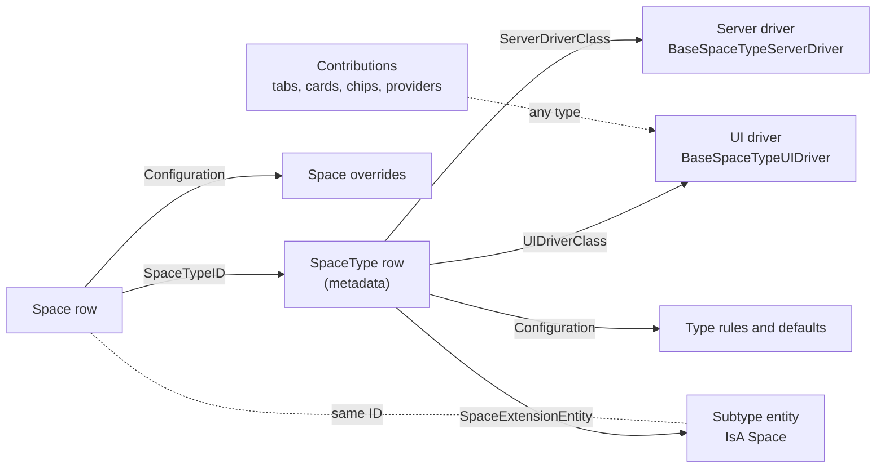

# Collaboration extensibility: space types as plug-ins

This plan makes Collaboration a base that other apps build on without Collaboration knowing about them. A downstream app adds a **space type**. The type names server and browser plug-in classes, and optionally a table of its own that extends `Space` through MJ's IsA. The first app built this way is a refactored Committees (bizapps-committees).

It replaces [the UX plan's § 9](ux/IMPLEMENTATION_PLAN.md#9-extension-points-for-apps-on-top), and it settles the chat and agent rules of round 94's task 6, which moved to the next pull request.

**Status:** agreed with Amith on 2026-09-26, and amended by the decisions in [the plan](../plans/plan.md): its D1, D2 and D8 to D11 the same day, D16 to D25 on 2026-09-27, and D26 to D35 later that day (the plan's v0.5: anchors, grants, data reach, notes and meetings). PR #7 builds this document as it stood before D26; PR #8 builds D26 to D35's changes to it, from [its own plan](../plans/pr8-plan.md) ([§ 13](#13-order-of-work)). Where this document and the plan disagree, the plan wins.

## Contents

1. [Decisions](#1-decisions)
2. [The model](#2-the-model)
3. [Data](#3-data)
4. [Configuration: one bag per type and per space](#4-configuration-one-bag-per-type-and-per-space)
5. [Server drivers](#5-server-drivers)
6. [UI drivers and contributions](#6-ui-drivers-and-contributions)
7. [IsA subtypes and their forms](#7-isa-subtypes-and-their-forms)
8. [Chats, history and agents](#8-chats-history-and-agents)
9. [MJ changes](#9-mj-changes)
10. [Examples](#10-examples)
11. [Security rules for plug-ins](#11-security-rules-for-plug-ins)
12. [Tests](#12-tests)
13. [Order of work](#13-order-of-work)
14. [Changes to the UX plan](#14-changes-to-the-ux-plan)

## 1. Decisions

| # | Decision | Section |
|---|---|---|
| 1 | A space type names a server plug-in class and a browser plug-in class: `SpaceType.ServerDriverClass` and `SpaceType.UIDriverClass`. Only types name them in v1. A space that needs different code is a different type, and a driver can branch on the space's configuration. | [3](#3-data), [5](#5-server-drivers), [6](#6-ui-drivers-and-contributions) |
| 2 | A type's own data is a table that extends `Space` through MJ's IsA (disjoint), named by `SpaceType.SpaceExtensionEntity`, the way bizapps-orders' `ProductType.ProductExtensionEntity` names a product's extension. No `EmbeddedRecord`. `RelatedRecordCollection` only where the native model has an aggregate; with a chat's people in MJ core, none is planned. | [3](#3-data), [7](#7-isa-subtypes-and-their-forms) |
| 3 | Rules and settings live in a JSON configuration bag (an MJ JSONType column) on `SpaceType` and `Space`. The type sets defaults and names the keys a space may override. Anything SQL reads stays a column. | [4](#4-configuration-one-bag-per-type-and-per-space) |
| 4 | The types allowed under a type live in its configuration, by type code, not in a join table. | [4](#4-configuration-one-bag-per-type-and-per-space) |
| 5 | Plug-ins follow MJ's forms pattern: base classes with hooks to override, resolved through ClassFactory, and contributions registered with metadata. | [5](#5-server-drivers), [6](#6-ui-drivers-and-contributions) |
| 6 | IsA's lookup cost is accepted. Collaboration reads lists as plain rows, and an MJ pull request removes the per-record probe when an entity already knows its subtype. | [7](#7-isa-subtypes-and-their-forms), [9](#9-mj-changes) |
| 7 | Anyone in a space can start a chat, read-only guests included, unless the type or the space narrows it. An agent replies when it's tagged, or to every message in a chat that holds one person and one agent. | [8](#8-chats-history-and-agents) |
| 8 | Whoever adds a person to an existing chat chooses how much history they see: none, all, or from a date. It's the `HistoryFrom` on MJ core's conversation participant row. Nothing else in a space is time-limited: a seat opens everything its band allows, from the start. Sub-spaces keep their own membership. | [8](#8-chats-history-and-agents) |
| 9 | The audience of an answer decides what the agent may use (the plan's D2). In a chat with two or more people, the agent sees only what every person in it can see now. In a private chat, it uses the caller's union of reach, narrowed by a scope control. | [8](#8-chats-history-and-agents) |
| 10 | Allowed agents resolve top-down: the app's default, the space's type, the root space, down to the space. Each level extends or replaces the list above, and a level without its own rows inherits it. MJ's agent Run permission stays the security boundary. An app supplies its own agent the same way, through its type's rows, with `IsDefault`. **Amended by 28:** the chain restarts where the type changes, and the rows are grants. | [8](#8-chats-history-and-agents) |
| 11 | The chat stays MJ's `mj-conversation-chat-area`. Collaboration never forks it. `ng-conversations` gains the inputs, events and slots these rules need, in an MJ pull request. | [9](#9-mj-changes) |
| 12 | Committees keeps its membership records, and its server driver keeps the seats in step. | [10](#10-examples) |
| 13 | Settings rights are an MJ Authorization tree rooted at *Collaboration*. An app grants them to its own admin roles, beside Collaboration's staff roles (the plan's D23). | [4](#4-configuration-one-bag-per-type-and-per-space) |
| 14 | A chat's people are MJ core's conversation participants (the plan's A5 and D10), and core's row-level security enforces each one's `HistoryFrom` for everyone, staff included. Inside that window, an AI message whose sources the newcomer can't read is sealed for them (the plan's D4 and A7). The chat area needs no cutoff of its own. | [8](#8-chats-history-and-agents) |
| 15 | A space can be anchored to a record in another app (`Space.AnchorEntityID` and `AnchorRecordID`), and one call finds or creates it. So an app can open a space for its own record, such as a room for a deal, from its own screens. **Amended by 25:** a space can have several anchors. | [3](#3-data), [5](#5-server-drivers), [10](#10-examples) |
| 16 | Seats can be synced from an app's own roster (`SpaceMember.SyncSource`), beside the seats people invite. A sync changes only its own seats. | [3](#3-data), [5](#5-server-drivers) |
| 17 | A space shows data it doesn't own only through its subtype's own columns, kept in step by its driver and filtered like the space. Never through a privileged read. **Amended by 27:** a type's data reach adds a second path, still in SQL. | [10](#10-examples), [11](#11-security-rules-for-plug-ins) |
| 18 | A new sub-space is sealed unless its creator asks for its parent's members: `Space.InheritsMembership` defaults to 0, and no type sets a default (the plan's D22). | [3](#3-data) |
| 19 | Access after a space closes is `PostCloseAccess` (`ReadOnly`, `ReadOnlyWithAgent` or `None`) and `PostCloseAccessDays`: settings, whose app default is `ReadOnly` with no end, stamped on the space when it closes (the plan's D21). They replace what `DefaultRetention` and `Space.Retention` meant. | [3](#3-data), [4](#4-configuration-one-bag-per-type-and-per-space) |
| 20 | A type or a space can bind Content Sources that its agents may use beyond the space's own items. **Amended by 26:** they're grants of kind `KnowledgeSource`. | [3](#3-data), [8](#8-chats-history-and-agents) |
| 21 | Any app can subscribe to a space's lifecycle events (`AfterSpaceClosed`, `AfterMemberAdded`, `AfterMemberRemoved` and `AfterItemPromoted`) and register signal providers (`SpaceSignalProvider`), beside the type's own driver hooks. | [5](#5-server-drivers) |
| 22 | One settings shape at every level: the Collaboration app's default in MJ's Application Settings, and overrides in a type's and a space's `Configuration`, resolved sub-space, parents, type, then app (the plan's D20). Where files are stored is a setting (the plan's D17). | [4](#4-configuration-one-bag-per-type-and-per-space) |
| 23 | `CollaborationEngineBase`, with the server's `CollaborationEngine`, caches Collaboration's metadata (the plan's D19). | [5](#5-server-drivers), [6](#6-ui-drivers-and-contributions) |
| 24 | Collaboration ships seven generic space types. Professional-services types belong to the layer that needs them (the plan's D18). | [10](#103-examples-in-collaboration-itself) |
| 25 | A space can be anchored to several records, each with a role, at most one of them primary: `SpaceAnchor`. `EnsureSpaceForRecord` finds or creates a space by its primary anchor. IsA stays for concepts that exist only as a space (the plan's D26). | [3](#3-data), [5](#5-server-drivers) |
| 26 | What a type, a space or a sub-space offers is a grant, `SpaceGrant`: agents, actions, queries, views, dashboards, components and knowledge sources, with bindings the server fills in from the space, its anchors and the caller, hidden from the model and refused from a client. It replaces `SpaceAgent`, `SpaceAgentSkill` and `SpaceKnowledgeSource` (the plan's D27 and D31). | [3](#3-data), [8](#8-chats-history-and-agents) |
| 27 | A type's data reach lets its participants read another app's rows through generated row-level security filters, one per entity, and a granted query is the one read the server runs for them. What's granted to a type that seats outsiders is Canon-approved (the plan's D28, D29 and D34). | [11](#11-security-rules-for-plug-ins) |
| 28 | One effective configuration (settings, grants and agent settings), resolved through the space's same-type run, restarting where the type changes (the plan's D30). | [4](#4-configuration-one-bag-per-type-and-per-space) |
| 29 | Notes and pins are Collaboration's; meetings and agendas move to bizapps-tasks, and a space shows its meetings through a link (the plan's D32 and D33). | [10](#10-examples) |

## 2. The model

A space type is a metadata row. Besides its name, vocabulary and defaults, it can name three things a downstream app ships:

- **A server driver:** rules and reactions for spaces of the type, run inside the save's transaction.
- **A UI driver:** what a space of the type shows, and what happens on its UI events.
- **A subtype entity:** the app's own table, which extends `Space` through IsA, for typed data and its form.

Anything that isn't owned by one type is a **contribution**: for example a tab that one app adds to every space, or a source of dated items. Collaboration reaches all of it through base classes, ClassFactory and IsA. Its own code never names a downstream app.

Reads stay in SQL. A driver can refuse a write and react to one, but it never widens who can read what.



**What a downstream app ships:**

| Where | What |
|---|---|
| `metadata/` | Its `SpaceType` rows, with the driver keys, `SpaceExtensionEntity` and `Configuration`. Its allowed-agent rows, entity permissions and row-level security filters. |
| `migrations/` | Its subtype tables, declared as IsA children of `Space` in its `codegen-schema-info.json`, with the CodeGen output. |
| A server package | The server driver and the subtype entities' server classes, registered at module level and listed under `dynamicPackages.server`. |
| A client package | The UI driver and its contributions, listed under `packages.client` in `mj-app.json`, with `"sideEffects": true` or a `Load*()` anchor. |

Collaboration owns the engine, the base classes, its schema, and the default behavior every type gets when it names no driver.

## 3. Data

**`SpaceType`**, added:

| Column | Type | Meaning |
|---|---|---|
| `ServerDriverClass` | `NVARCHAR(255) NULL` | The ClassFactory key under `BaseSpaceTypeServerDriver`. Empty means Collaboration's base driver. |
| `UIDriverClass` | `NVARCHAR(255) NULL` | The ClassFactory key under `BaseSpaceTypeUIDriver`. Empty means the base driver. |
| `SpaceExtensionEntity` | `NVARCHAR(255) NULL` | The MJ entity name of the IsA child that every space of this type has, for example `Committees: Committees`. Empty means a plain space. The server checks on save that it names a declared IsA child of Spaces. |
| `Configuration` | `NVARCHAR(MAX) NULL` | The type's rules and defaults, as `ISpaceTypeConfiguration` ([§ 4](#4-configuration-one-bag-per-type-and-per-space)). |

- **Removed:** `GovernancePanel`, and the `committee` seed row. PR #3 removes both (the plan's B0.11), and Committees ships its own type.
- **Settings, not columns** (the plan's D20 to D22): where files are stored and access after close are keys of the settings shape ([§ 4](#4-configuration-one-bag-per-type-and-per-space)), and there's no type-level inheritance default, since every new sub-space is sealed unless its creator asks.
- **Replaced:** `PostCloseAccess` and `PostCloseAccessDays` replace what `DefaultRetention` and `Space.Retention` meant. Nothing enforces those today. The schema step's pull request comment says whether the old columns are dropped.
- **Kept as they are:** the other columns. SQL reads `Discoverability`, `JoinMode`, `DefaultAgentRetrieval`, `DefaultBand`, `DefaultAllowParentAssignees`, `InviteApproval` and `MemberCap`. The panel flags become the base UI driver's defaults.

**`Space`**, added:

| Column | Type | Meaning |
|---|---|---|
| `Configuration` | `NVARCHAR(MAX) NULL` | The space's overrides, as `ISpaceConfiguration` ([§ 4](#4-configuration-one-bag-per-type-and-per-space)). |
| `AnchorEntityID` | `UNIQUEIDENTIFIER NULL`, FK to `__mj.Entity` | The entity of the record this space belongs to, for a space another app opens for its own record ([§ 5](#5-server-drivers)). **Replaced by `SpaceAnchor`** (decision 25). |
| `AnchorRecordID` | `NVARCHAR(450) NULL` | That record's key, the same shape as `SpaceItem.RecordID`. Unique per type and entity when set. **Replaced by `SpaceAnchor`.** |
| `PostCloseAccess` | `NVARCHAR(20) NULL` | `ReadOnly`, `ReadOnlyWithAgent` or `None`. Written by the server when the space closes, from the resolved setting ([§ 4](#4-configuration-one-bag-per-type-and-per-space), the plan's D21), because SQL reads it. An admin can change it later through the same write. Empty while the space is open. |
| `PostCloseAccessDays` | `INT NULL` | How long that access lasts after `ClosedAt`, stamped with it. Empty means no end. |

`PlannedCloseAt` is already in. `fnCollaborationAccess` applies `PostCloseAccess` through `ClosedAt`. Today only `fnCollaborationAncestorMembers` reads `ClosedAt`, and the access function is brought into line in the same step.

`Space.InheritsMembership` stays, and its default becomes 0 (the plan's D22). A sub-space's creator chooses; the UI asks, with no preselected answer.

**`SpaceItem`**, added:
- `StorageAccountID UNIQUEIDENTIFIER NULL`, FK to `MJ: File Storage Accounts`: for an item that is a stored file, the account the file went to. Reads and deletes use it, so a later change to the setting applies to new uploads only (the plan's D17).

**`SpaceMember`**, added:
- `SyncSource NVARCHAR(100) NULL`. Empty means a person invited this seat. A value names the roster that manages it, for example `committees:membership`, and only that roster's sync changes or removes it.
- `PersonID UNIQUEIDENTIFIER NULL`: the seat's person in bizapps-common, filled when the seat's user is linked to a Person (the plan's B9). Apps keyed on People, such as Committees, project their rosters onto seats through it.

**New tables:**

- `SpaceChat`, for chats ([§ 8](#8-chats-history-and-agents)). A chat's people aren't a Collaboration table: they're MJ core's conversation participants (the plan's A5). The table `SpaceChatMember` that this plan first proposed is gone.
- `SpaceAgent`, for allowed agents ([§ 8](#8-chats-history-and-agents)). It's a table rather than configuration because its rows point at agents, which can be deleted. The foreign key keeps the list honest, and the app-wide defaults ship as metadata that finds each agent by name.
- `SpaceAgentSkill`, for the Assistant's skills at one level ([§ 8](#8-chats-history-and-agents)): `SkillID`, an `MJ: AI Skills` row, and at most one of `SpaceTypeID` and `SpaceID`, resolved down the tree like `SpaceAgent`. It's a table for the same reason: skills can be deleted.
- A knowledge binding table, proposed as `SpaceKnowledgeSource`: one row per Content Source an agent may use at one level, with `ContentSourceID` and at most one of `SpaceTypeID` and `SpaceID`, resolved down the tree like `SpaceAgent`. It's a table for the same reason: Content Sources can be deleted. What an agent may quote from a source follows its classification (the plan's A10).

**Changed by the plan's v0.5 (D26 to D33), built in PR #8** ([its plan](../plans/pr8-plan.md)):
- **`SpaceAnchor`** replaces `Space.AnchorEntityID` and `AnchorRecordID`: `SpaceID`, `EntityID`, `RecordID`, `Role`, `IsPrimary` and `Sequence`, unique on the space, entity, record and role, with at most one primary anchor per type, entity and record (the plan's B14).
- **`SpaceGrant`** replaces `SpaceAgent`, `SpaceAgentSkill` and `SpaceKnowledgeSource`: at most one of `SpaceTypeID` and `SpaceID`, a `Kind`, the target's `TargetEntityID` and `TargetRecordID`, `Label`, `Band`, `IsDefault`, `Bindings` and `Settings` as JSON, `Mode` and `Sequence` (the plan's B15). An agent's skills live in its grant's settings.
- **`SpaceNote`** (the plan's B21) and **`SpaceMemberPin`** (B22).
- **`DataReach`** joins the type's configuration ([§ 4](#4-configuration-one-bag-per-type-and-per-space)).

**How this follows bizapps-orders.** Orders extends products the same way, and Collaboration copies its shape:

| bizapps-orders | Collaboration |
|---|---|
| `ProductType.ProductExtensionEntity` and `OrderLineExtensionEntity` hold the IsA child's entity name | `SpaceType.SpaceExtensionEntity` |
| `Entity.SubtypeSelector` on Products: `ProductTypeID.ProductExtensionEntity` | on Spaces: `SpaceTypeID.SpaceExtensionEntity` ([§ 7](#7-isa-subtypes-and-their-forms)) |
| `ProductType.Configuration`, a JSON bag | `SpaceType.Configuration` and `Space.Configuration`, registered as JSONTypes |
| `DriverClass` on `SubscriptionType` and `RevenueRecognitionType`, optional, subclassing a working base | `ServerDriverClass` and `UIDriverClass` on `SpaceType` |
| `mj-entity-form-host` shows an order line's extension | the same host shows a space's extension |

Collaboration adds four things orders doesn't have:
- **Behavior per type.** Orders' type row names no code: event products' rules are written against their entity, so a new product type can't add rules of its own. A space type names its drivers.
- **Checked values.** Orders doesn't check the extension's name, and reads its configuration as an untyped string. Collaboration validates both on save.
- **A missing driver is caught.** For an unregistered key, MJ's `ClassFactory.CreateInstance` returns the base class rather than null, so a null check never fires. Collaboration uses `TryCreateInstance` ([§ 5](#5-server-drivers)).
- **The selector reaches hosts.** Orders' `SubtypeSelector` rows aren't in its migrations yet, so a host installed from migrations falls back to "the only child". Collaboration's selector goes in its release seed, and a resolver in code covers it anyway ([§ 7](#7-isa-subtypes-and-their-forms)).

**Where a setting goes:**

- if SQL reads it (row-level security, the access functions, a join), it's a column;
- if it points at a record that can be deleted, it's a row with a foreign key;
- otherwise it goes in `Configuration`.

The DDL is one migration, with its CodeGen output, proposed in a PR comment first. The JSONType wiring, the `SubtypeSelector`, the type rows and the default agent rows are metadata JSON.

## 4. Configuration: one bag per type and per space

`SpaceType.Configuration` and `Space.Configuration` are MJ JSONType columns, like `Entity.Configuration`, `EntityField.Configuration` and `EntityRelationship.Configuration` in MJ 6.1.

- **The interfaces** live in `collaboration-core` (L0): `ISpaceTypeConfiguration` and `ISpaceConfiguration`.
- **The wiring** is metadata: a row on `MJ: Entity Fields` for each column, with `JSONType`, `JSONTypeIsArray: false` and `JSONTypeDefinition: "@file:…"`. CodeGen then emits a typed `ConfigurationObject` on both entities.
- **Order matters:** `mj sync push` runs before `mj codegen`, because CodeGen reads the JSONType from the database.
- **Keys are PascalCase,** like MJ's own configuration interfaces.

```ts
/** A JSON value, for settings that a type's own drivers define. */
export type ConfigurationValue =
    | string | number | boolean | null
    | ConfigurationValue[]
    | { [key: string]: ConfigurationValue };

export interface ISpaceRules {
    Chats?: {
        /** Who may start a chat. Default 'Anyone': every seat, read-only guests included. */
        WhoCanStart?: 'Anyone' | 'Contributors' | 'Owners';
        /** When an agent replies. Default 'MentionOrOneToOne'. */
        AgentReplyMode?: 'MentionOrOneToOne' | 'MentionOnly' | 'Always';
        /** The choice preselected when someone is added to an existing chat. Default 'None'. */
        HistoryOnAdd?: 'None' | 'All' | 'Since';
    };
    Agents?: {
        /** How this level's SpaceAgent rows combine with the list above. Default 'Extend'. A level without rows passes the list down. */
        ListMode?: 'Extend' | 'Replace';
    };
    /** Behavior switches that the type's own drivers read, keyed by the app that owns them. Data goes in the subtype entity, never here. */
    Extensions?: Record<string, Record<string, ConfigurationValue>>;
}

/**
 * The settings every level can hold: the Collaboration app, a type, a space (the plan's D20).
 * Each level stores only the keys it sets. The app's row sets them all.
 */
export interface CollaborationSettings extends ISpaceRules {
    /** Where new files are stored: an MJ: File Storage Accounts ID (the plan's D17). */
    StorageAccountID?: string;
    /** What happens once a space closes (the plan's D21). The app's default is 'ReadOnly'. */
    PostCloseAccess?: 'ReadOnly' | 'ReadOnlyWithAgent' | 'None';
    /** How long that access lasts after ClosedAt, in days. Absent means no end. */
    PostCloseAccessDays?: number;
    /** Words shown instead of Collaboration's, for example { Tabs: { Library: 'Papers' }, Bands: { Shared: 'Members' } }. */
    Labels?: { Tabs?: Record<string, string>; Bands?: Record<string, { Name: string; Description?: string }> };
}

export interface ISpaceTypeConfiguration extends CollaborationSettings {
    /** Types that may be created under a space of this type, by SpaceType.Code. Absent means any. */
    Children?: { AllowedTypeCodes?: string[]; MaxOpen?: number };
    /** Dotted keys a space may override, for example 'Chats.WhoCanStart'. Absent means none. */
    SpaceOverridable?: string[];
}

export interface ISpaceConfiguration extends CollaborationSettings {}
```

**Where each level's settings live:**
- **The Collaboration app:** one row in MJ's Application Settings (`ApplicationID`, `Name`, `Value`), whose value is a `CollaborationSettings`. It ships as metadata, so the defaults are data, not code.
- **A type and a space:** their `Configuration`.
- `StorageAccountID` points at a record, which [§ 3](#3-data)'s rule would make a row. It's a setting anyway (the plan's D20): storage accounts are few and rarely deleted. A save checks that the account exists and is active, and an upload that resolves to a missing or inactive account is refused with a message, never sent somewhere else.

**The effective settings** come from one pure function in `collaboration-core`, used by the server and the browser alike:

```ts
ResolveSettings(app: CollaborationSettings, type: ISpaceTypeConfiguration, spaces: ISpaceConfiguration[]): EffectiveSettings
```

`spaces` is the space and then its parents up the tree, nearest first. For each key, the first value set wins:
1. If the space's type lists the key in `SpaceOverridable`: the space's own value, then each parent's.
2. Then the type's value.
3. Then the app's, which sets every key.
4. The type's server driver can then narrow the result, through `AdjustRules` ([§ 5](#5-server-drivers)).

Validation refuses any key a space sets that its type doesn't allow, so nothing is ignored silently.

**Amended by the plan's D30,** in PR #8. The chain covers the grants and each agent's settings as well as these keys, and it restarts where the type changes:
- the order, lowest first, is the app's defaults, the space's type, each ancestor in the space's **same-type run** top down, then the space. The same-type run is the unbroken line of ancestors directly above the space that have the space's type, so a sub-space of another type starts again from its own type;
- grants combine per kind with a `ListMode` (`Extend` or `Replace`), and a level can remove one grant it inherits;
- one function, `ResolveSpaceConfiguration`, returns one document, `EffectiveSpaceConfiguration`, which the server, the browser and the agent path all use. It replaces `ResolveSettings` above and the separate agent, skill and knowledge resolution in [§ 8](#8-chats-history-and-agents);
- a type's configuration gains `DataReach: [{ Entity, Path, AnchorRole, Band, Fields }]`, from which the participant role's filters on other apps' entities are generated (the plan's D28 and B18).

**Stamped where it's used.** A value SQL or history needs is written where it's used: when a space closes, the server stamps the resolved `PostCloseAccess` and `PostCloseAccessDays` on the space ([§ 3](#3-data)), and each stored file records its account on its item.

**Validation,** in the entity server classes:

- the JSON must parse and match the interface. One that doesn't is refused, and at read time it fails closed; it's never ignored;
- every `AllowedTypeCodes` entry must be an existing type code;
- a space may set only the keys its type allows;
- a `StorageAccountID` must name an active storage account;
- the app's row must set every key. With no app row, what depends on it is refused, with a message saying where to fix it;
- **only users with Collaboration's settings authorizations write settings** (the plan's D23): *Configure Space Types* for the app's and a type's, and *Configure Spaces* for a space's, on spaces where the user's role type allows configuring. They're an MJ Authorization tree rooted at *Collaboration*, and the server checks `UserCanExecute` on every write. Staff admin roles get them, an app grants them to its own admin roles, and Space Participant gets none. The type decides which keys a space can change.

**A space-level driver override** isn't in v1. If one is ever needed, it's a key in `ISpaceConfiguration`, with no schema change.

## 5. Server drivers

`BaseSpaceTypeServerDriver` lives in `collaboration-core-entities-server`, next to the entity server classes that call it. A downstream app subclasses it and registers the subclass under the key its type row names:

```ts
@RegisterClass(BaseSpaceTypeServerDriver, 'CommitteeSpaceServerDriver')
export class CommitteeSpaceServerDriver extends BaseSpaceTypeServerDriver { … }
```

**The hooks.** Every method has a working default, so a subclass overrides only what it needs. Each receives a context holding:
- the acting user and the provider (`this.ProviderToUse` of the entity being saved);
- the space, its type and the effective rules;
- the change (`Create`, `Update`, `Move`, `Close`, `Reopen` or `Delete`), with the old values;
- the subtype entity's name when an IsA child started the save.

| Area | Validate (can refuse) | React (inside the transaction) |
|---|---|---|
| Rules | `AdjustRules(ctx, rules)` narrows the effective rules | |
| The space | `ValidateSpaceChange` | `OnSpaceChanged` |
| Sub-spaces, on the **parent's** type driver | `ValidateChildSpaceChange` | `OnChildSpaceChanged` |
| Members | `ValidateMemberChange` (invite, role, band, remove) | `OnMemberChanged` |
| Items | `ValidateItemChange` (add, promote, move, remove) | `OnItemChanged` |
| Chats | `ValidateChatChange`, `ValidateChatMemberChange`, `ValidateMessage` | `OnMessagePosted` |
| Agents | | `BuildAgentContext` adds type-specific instructions and data to an agent turn, such as the roster and the next meeting. It receives the chat and its members' bands, so it can leave out Team-only data when an outside person is in the chat. |
| Tasks | | `OnTaskFiled` |
| Anchored spaces | `ValidateAnchor` (who may open the record's space) | `ResolveAnchorParent` names the parent, for example the account's root space |

**Where Collaboration calls them.**
- `SpaceEntityServer`, `SpaceMemberEntityServer`, `SpaceItemEntityServer`, the chat's server class, the operation that adds a chat's participants, the message-posting operation, the agent run and `CreateSpaceTask`.
- Validate hooks run in `ValidateAsync` and add `ValidationErrorInfo`, so `Save()` returns false with the driver's message.
- React hooks run inside the same transaction, through `RunInEntityTransaction`. A thrown error rolls the whole save back.
- Email, HTTP and other outside work goes through `provider.RunAfterCommit`.

**Resolving a driver.**
- An empty `ServerDriverClass` means the base driver.
- A named class is resolved with `ClassFactory.TryCreateInstance`, and its `Resolved` flag is checked. `CreateInstance` alone can't tell: for an unregistered key it returns the base class.
- A named class that isn't registered on the server refuses every write to that type's spaces, with a message naming the missing class. Reads keep working. A type's rules may be exactly what the missing driver enforces, so writes never go ahead without it.
- Drivers hold no state. One instance per type is cached in a `BaseSingleton` registry, which refreshes when a `SpaceType` row changes.

**Seats from an app's roster.** The base driver has a helper, `SyncSeats(space, source, people)`. It adds, updates and removes the seats marked with that `SyncSource`, and leaves every other seat alone.
- **People without an MJ user,** such as an Employee or a Person with no linked user, get an email invite through Collaboration's pending invites.
- **A sync is a write like any other,** so the type's `ValidateMemberChange` can still refuse a seat.
- **Committees** syncs from its memberships, and a deal room from a deal's team and its buyer contacts ([§ 10](#10-examples)).

**Spaces another app opens for its own record.** `EnsureSpaceForRecord(typeCode, entityName, recordID)` is a Collaboration operation on the server and the client. It returns the space of that type anchored to that record, creating it the first time, so calling it twice is safe. Under the plan's D26 it works on the space's primary `SpaceAnchor`, and a space can hold other anchors beside it, each with a role.
- **Who may open it:** anyone who can update the record, by MJ's own permissions and row-level security, unless the type's `ValidateAnchor` refuses. Collaboration creates the space on the server, with the caller as its owner.
- **Where it goes:** under the space `ResolveAnchorParent` names, or at the root.
- **Where it's called from:** the owning app's own form or lifecycle code.

**Apps that own the record call Collaboration after their own commit,** through `provider.RunAfterCommit`: `EnsureSpaceForRecord`, `SyncSeats`, and closing or reopening a space. MJ raises an entity's save event inside the saving transaction, so a listener could react to a change that's later rolled back.

**Contributions on the server.** Any app can add these to any type, without owning the type. They register with `RegisterClassEx` metadata, like [§ 6](#6-ui-drivers-and-contributions)'s, and Collaboration finds them with `GetAllRegistrationsByMetadata`.
- **Lifecycle subscribers,** for `AfterSpaceClosed`, `AfterMemberAdded`, `AfterMemberRemoved` and `AfterItemPromoted`. They run after the save commits, through `provider.RunAfterCommit`, so they never see a change that's rolled back, and they can't refuse one: the type's Validate hooks do that. It's how an app turns a closed engagement into a case-study draft, or tells a team.
- **Signal providers,** extending `SpaceSignalProvider`. Each produces dated observations about a space, such as "a public filing changed". Collaboration stores them as Team items, and only an approved proposed post (the plan's A8) turns one into a message people receive.

**Rules for driver authors.**
- **Drivers never grant reads.** Reach stays in `fnCollaborationAccess` and row-level security ([§ 11](#11-security-rules-for-plug-ins)).
- **IsA saves the parent first.** Saving a Committee saves its Space first: MJ passes `IsParentEntitySave` and `ISAActiveChildEntityName`. So the space hooks run before the Committee row exists. Rules about the subtype's own columns belong in the subtype entity's server class.
- **Use the driver, not a second `SpaceEntityServer`.** Only one class can hold an entity's ClassFactory key: the last one loaded wins, and the other gets only a console warning.
- **Use the context's provider.** It owns the open transaction; `new Metadata()` doesn't.

**The type/subtype pairing,** enforced by Collaboration in both directions from MJ's save options:
- a space whose type names a subtype must be saved as that subtype;
- a subtype record must use a type that names its entity;
- `SpaceTypeID` may change only between types with the same subtype. Turning a plain space into a subtype is IsA promotion, which MJ's browser path supports only from MJ `next` ([§ 7](#7-isa-subtypes-and-their-forms)).

## 6. UI drivers and contributions

`BaseSpaceTypeUIDriver` lives in `collaboration-ng-widgets` (L2), so it can name Angular components. It imports no router and no Explorer package. Like the server driver, it is registered under the key the type names, and an unregistered key falls back to the base driver, logged once; the server still enforces the rules.

**Composition.** Each hook receives Collaboration's default list for the space and returns the final one:
- `GetTabs`, `GetOverviewCards`, `GetHeaderChips`, `GetHeaderActions`, `GetSettingsSections`, `GetNewSpaceSteps`, `GetDetailsForm`;
- items are descriptors (key, label, icon, count, and the component class), so the host has labels and counts without mounting anything.

**Events.** Collaboration's composites raise cancellable `Before…` and `After…` events, for example `BeforeInvite`, `BeforeCreateChildSpace`, `BeforeStartChat`, `BeforeAddToChat`, `BeforePostMessage`, `BeforeCloseSpace` and `AfterSpaceOpened`. Their args carry `Cancel` and `CancelReason`, like `ng-conversations`' chat events. The driver can cancel, and the server hook still enforces.

**Words.** A space's noun is the type's `Vocabulary`, and tab labels come from its configuration's `Labels` ([§ 4](#4-configuration-one-bag-per-type-and-per-space)). The driver can override any of them.

**Contributions** are parts that any app can add to any type, without owning the type:
- **components:** a tab, an overview card or a settings section, extending `BaseSpaceTab`, `BaseSpaceOverviewCard` and `BaseSpaceSettingsSection` in the widgets package;
- **providers:** needs-you rows, dated items and header chips, extending `BaseNeedsYouProvider`, `BaseAgendaProvider` and `BaseSpaceHeaderChipProvider` in `collaboration-core`. Each takes a batch of spaces, the viewer and the provider, and runs one `RunViews` for the batch.

They register the way MJ's `BaseFormPanel` does:

```ts
@RegisterClassEx(BaseSpaceTab, {
    key: 'committees:meetings',
    metadata: { spaceTypes: ['committee'], slot: 'tab', sortKey: 40, contributionKey: 'meetings' },
})
export class CommitteeMeetingsTab extends BaseSpaceTab { … }
```

**How the host assembles a space's parts:**
1. It starts from Collaboration's own parts, filtered by the type's panel flags.
2. It adds the contributions `GetAllRegistrationsByMetadata` finds for the type (or `'*'`), keeping the highest priority for each `contributionKey`.
3. It sorts them by `sortKey`.
4. It hands the list to the type's UI driver, which has the final say.
5. It mounts each component with `createComponent` and `setInput`, never `CreateInstance`, which builds the component outside Angular's injector and breaks `inject()`.

This replaces the UX plan's `GetAllRegistrations` filtered by code and ordered by `Sequence`, which returns overridden registrations too and has to create a component to read its order.

**Keeping Collaboration blind.**
- **Two example plug-ins** exercise every hook, in a private package that only the gallery and the integration tests load ([§ 10](#103-examples-in-collaboration-itself)).
- **A gate** fails the build if a downstream app's name appears in Collaboration's source or metadata outside docs and fixtures.

## 7. IsA subtypes and their forms

**Declaring.** A downstream app declares its table as an IsA child of `Space` in its own `codegen-schema-info.json`, disjoint (MJ's default). Collaboration changes nothing to allow it; bizapps-sales already subtypes bizapps-common's entities across schemas the same way.

**Creating.**
- Collaboration registers an `EntitySubtypeResolver` for Spaces in `collaboration-entities`, so the server and the browser both load it. It reads the type's `SpaceExtensionEntity` from Collaboration's cached types.
- The Spaces entity also declares `SubtypeSelector` = `{"Path": "SpaceTypeID.SpaceExtensionEntity"}`, as metadata, so offline tools such as MetadataSync and Loom see the same rule. The path's last step has to be a column holding the entity's name, which is why the type stores a name rather than an ID, as orders does.
- The selector reaches a host only through Collaboration's release seed. The resolver doesn't depend on it.
- The New Space flow creates a `SpaceEntity`, sets its fields, and calls `EnsureISAChild()`. MJ builds the subtype record, and one `Save()` writes both rows in one transaction.
- The resolver answers "none" for plain types. Without it, `EnsureISAChild()` falls back to "the only subtype", so once Committee were Space's only subtype, every new space would become a committee.

**Showing.** Where a space has a subtype, Collaboration's L2 composites host `<mj-entity-form-host [Record]="space.LeafEntity">`, and MJ picks the downstream app's generated, custom or interactive form by entity name.
- **Config:** `Toolbar: null`, `ShowRelatedEntities: false`, and `HiddenSectionKeys` set to Space's own sections, which Collaboration already shows.
- **Buttons:** Collaboration's own Save and Cancel call `host.Save()` and `host.Cancel()`. The save writes the space and the subtype together.
- **Where:** a details step in New space, Settings → Details, and an About card on the Overview, read-only. The UI driver can replace any of the three through `GetDetailsForm` and the step and section hooks.
- **The gallery** draws them from fixtures, since the host shows "No form is registered" without the downstream package.

**Costs, accepted.**
- **Space loads probe for the subtype.** Once Space has subtypes, every load of a space as an entity runs a query across the subtype views, then loads the subtype row. A `RunView` of entity objects does it once per row: in the browser, one round trip per space.
  - Collaboration's lists and the tree read plain rows (`ResultType: 'simple'`), and only the open space loads as an entity.
  - An engine that caches spaces caches them as plain rows. `BaseEngine` defaults to entity objects, which would pay the probe on every load and refresh.
  - The space type engine does cache entity objects, since MJ's selector reads the cached type.
  - [§ 9](#9-mj-changes) removes the probe when the type already says what the subtype is.
- **Security isn't inherited.** Space's read filter doesn't filter the subtype's views. Each downstream app writes its own filters with `fnCollaborationAccess`, which becomes a published contract ([§ 11](#11-security-rules-for-plug-ins)).
- **Space's column names are shared** with every subtype. If a subtype has a column with the same name as a Space column, CodeGen logs a field collision and skips the subtype's inherited fields altogether. So:
  - a subtype never reuses a Space column's name: `Name`, `Description`, `ParentID`, `StartedAt`, `ClosedAt` and the rest, as the Space table defines them;
  - a new `Space` column needs a changeset note, since it can collide with a column a downstream subtype already has;
  - Committees drops `Committee.Name`, `Description` and `ParentCommitteeID`, and `Term.Name`, as part of its move.
- **Deletes cascade up.** Deleting a Committee deletes its Space, and there is no way to remove a subtype but keep the space.
- **Converting** an existing plain space into a subtype from the browser (IsA promotion) needs MJ `next`. In 6.1.3 only the server can do it.

## 8. Chats, history and agents

This section is round 94's task 6, rewritten; it moved to the next pull request. Its rules come from Amith's answers of 2026-09-25 and 2026-09-26, and the plan's D2, D4 and D10.

### Data

- **`SpaceChat`**, one per conversation in a space:
  - `SpaceID`, `ConversationID` (an MJ Conversation), `Kind` (`Room` or `Chat`), `Name`, `CreatedByUserID` and `Status`;
  - optional `SubjectEntityID` and `SubjectRecordID` make it a chat about one record, such as a meeting, a document or a task;
  - it replaces today's binding through `Conversation.LinkedRecordID`, which allows only one conversation per space.
- **A chat's people are MJ core's conversation participants,** `MJ: Conversation Participants` (the plan's A5 and D10). MJ has no such table today, in 6.1.3 or on `next` as of 2026-09-25; the nearest are the realtime bridges' `MJ: AI Agent Session Bridge Participants`, a conversation's owner (`Conversation.UserID`) and Resource Permission shares.
  - Each participant row carries `AddedByUserID`, `AddedAt`, `RemovedAt` and `HistoryFrom`.
  - `HistoryFrom` is the first moment of the conversation that person sees. Empty means all of it.
  - Collaboration's `SpaceChatMember` table is gone.
- **Where a chat's agents are recorded,** an `AgentID` on core's participant rows or a row on Collaboration's side, is settled in the next pull request's first design comment.
- **`SpaceAgent`**, one row per allowed agent at one level:
  - `AgentID`, and at most one of `SpaceTypeID` and `SpaceID`;
  - `IsDefault` marks the agent that a new chat with the Assistant starts with.
- **The DDL is proposed in a PR comment before its migration,** like every data change in task 15.

### Who sees what

- **The Room** is `Kind` `Room`, one per space, created with the space. Its participants are derived from the space's roster: everyone who reaches the space, or only those who see Team. Collaboration keeps them in step as seats change (the plan's B3). Each sees all of it, from its first message, like a Teams channel, except the AI messages sealed for them.
- **A chat** is `Kind` `Chat`. Only its participants see it.
- **Nothing else in a space is time-limited.** A seat opens everything its band allows, from the space's first day: the library, the tasks, the Room and every chat the person is in.
- **Sub-spaces keep their own membership** when `InheritsMembership` is off, as today. A compensation sub-committee under a board, for example, isn't open to the whole board. A type's server driver can set the switch for the sub-spaces it allows ([§ 5](#5-server-drivers)).
- **Reads are enforced in SQL:** row-level security on `SpaceChat`, as Collaboration's metadata, and core's row-level security on Conversations and Conversation Details, keyed on participants and their `HistoryFrom` (the plan's A5). Core applies it to everyone, staff included, so the chat area needs no cutoff of its own. That's decision 14.
- **Sealing.** A newcomer to a room or a chat, or a new seat on a space, sees an AI message inside their window only if they can read every source it recorded. Otherwise it's sealed for them: they see who wrote it and when, and can request access (the plan's D4 and A7). People's own messages aren't sealed.

### Starting a chat and adding people

- **Anyone in the space can start a chat,** read-only guests included. The rule is `Chats.WhoCanStart` in the configuration ([§ 4](#4-configuration-one-bag-per-type-and-per-space)): `Anyone` by default, and a type or a space can narrow it to `Contributors` or `Owners`.
- **A chat can hold several people and several agents.**
  - People must already reach the space. Someone from outside is invited to the space first, so there's one access model.
  - Agents must be on the space's allowed list.
- **Adding someone to an existing chat** asks the person adding them how much history to show, stored as `HistoryFrom` on their participant row:
  - none: `HistoryFrom` is the moment they're added;
  - all: `HistoryFrom` is empty;
  - since a date and time they pick.
- **The preselected choice** is `Chats.HistoryOnAdd`, `None` by default. The people in a new chat see all of it, since there's nothing before them.
- **Tagging an allowed agent that isn't in the chat adds it.**
- **The type's server driver can refuse any of these** in `ValidateChatChange` and `ValidateChatMemberChange`, and the UI driver can cancel them first in `BeforeStartChat` and `BeforeAddToChat`.

### When an agent answers

- **By default** (`Chats.AgentReplyMode` = `MentionOrOneToOne`), an agent answers when it's tagged, or on every message in a chat that holds exactly one person and one agent. In any other chat, including the Room, it answers only when tagged.
- **A type or a space can change it** to `MentionOnly` or `Always`.
- **The reply goes to the chat it was asked in.** A private chat's reply is seen only by that person; a group chat's by everyone in it.
- **In the chat area:** MJ's `mj-conversation-chat-area` starts an agent turn on every message today. The MJ pull request in [§ 9](#9-mj-changes) gives it `AgentReplyMode`, with `Always` and `MentionOnly`. Collaboration works out its own three modes and passes one of those two:
  - for a chat with one person and one agent under `MentionOrOneToOne`, `Always`, with that agent as the default and the only allowed agent;
  - for any other chat, `MentionOnly`, unless the space's mode is `Always`.

### Every agent turn goes through Collaboration's server

- **The chat area hands each turn to Collaboration** through the `AgentTurnHandler` input of [§ 9](#9-mj-changes), before any reply row exists.
- **Collaboration's server operation** then:
  - checks that the asker is in the chat, that the agent is on the space's allowed list, and that the reply rule allows a turn;
  - works out the history floor and the search bound below;
  - runs the agent, and writes its reply.
- **So the rules hold on the server,** not only in the browser. The chat area's inputs only keep the screen honest: its `@` list, its placeholder and its buttons.
- **Settings for group chats:** voice and the header's agent picker are off (`allowRealtime` and `showAgentPicker`), since they'd bypass the rules. Chats keep the name in `SpaceChat.Name`, so MJ's auto-naming is off. MJ has no live feed of other people's messages yet ([§ 9](#9-mj-changes)). Until it has one, an open chat refreshes when it regains focus and on a capped timer.

### What an agent sees

- **Messages:** only the ones every current person in the chat can see: those after the latest `HistoryFrom` among them, and not sealed for any of them. So a summary can't show history to someone added with none.
  - Collaboration's server passes that floor when it runs the agent, and MJ's server loads the conversation from it ([§ 9](#9-mj-changes), `AgentHistoryFrom`).
  - Under a floor, MJ skips its summary of earlier messages, since the summary covers messages before the floor. The agent then sees the last 20 messages after the floor.
- **Search: the audience of the answer decides it** (the plan's D2). This extends the subtree bound this plan first set:
  - **In a private chat,** one person plus agents, the agent uses the caller's union of reach: everything their seats reach, anywhere in the tree. A scope control narrows it to *this space*, *this space and its sub-spaces*, or *everything I can reach*. The default is *this space and its sub-spaces* when the chat is opened from a space, and *everything* from Home.
  - **In a chat with two or more people,** the Room included, the agent uses the intersection of what every current participant can read, with each participant's band: a chat with anyone who can't see Team uses Shared material only. Nobody can change it, the asker included.
  - In both, the space's `AgentRetrieval` still applies, and the bound is recomputed on every turn.
  - An earlier reply stands when someone joins later, but it's sealed for them if they can't read its sources.
- **Knowledge beyond the space's items** comes only from the Content Sources bound to the type or the space ([§ 3](#3-data)), under their classification.
- **Memory:** in a chat with two or more people, the agent doesn't inject the asker's personal notes.
- **Sources:** every answer records the resources it drew from (the plan's A4), which the chat area shows as citations and sealing reads.
- **The asker** must be a participant in the chat. The agent runs as the asker, never as a service account, and its reply is written as the system user with the agent's ID.
- **Type-specific context** comes from the server driver's `BuildAgentContext`: Committees gives the roster and the next meeting, for example.

### Which agents a space allows

- **The list resolves top-down:** Collaboration's app-wide default, then the space's type, then the root space, down to the space.
- **At each level,** `Agents.ListMode` says how that level's `SpaceAgent` rows combine with the list above: `Extend` (the default) adds them and `Replace` uses only them. A level without rows passes the list down unchanged.
- **Where the rows come from:**
  - the app-wide defaults, rows with neither a type nor a space, ship as Collaboration's metadata and find each agent by name;
  - a type's rows ship with the type's app;
  - a space's rows are set by its owners and staff, when its type lists `Agents.ListMode` in `SpaceOverridable`. Otherwise the space uses its type's list, and the server refuses space rows.
- **An app supplies its own agent** the same way: it ships `SpaceAgent` rows at its type's level, for its agent or a parent agent with sub-agents, with `IsDefault` on the one a new chat starts with. There's no `DefaultAgentID` column on the type and no `AgentID` on the space.
- **The list only narrows.** Like MJ's own `allowedAgents`, it filters what the chat offers and what the server runs. A person still needs MJ's Run permission on the agent.

**Amended by the plan's D27, D30 and D31,** in PR #8: the list is `SpaceGrant` rows of kind `Agent`, and it resolves through the same-type run of [§ 4](#4-configuration-one-bag-per-type-and-per-space), so a sub-space of another type starts again from its own type's list. Each agent grant carries settings that only narrow the agent: its skills, within its `AcceptsSkills`; plan mode, where it supports one; its effort level; memory writes; and per-run limits. An agent turn also gets the space's granted actions, queries, views and knowledge sources, for the chat's audience, with their bound parameters hidden from the model and filled in by the server (the plan's B20).

### One Assistant, set per space

- **Collaboration ships one common agent,** the Assistant, with the `DriverClass` `CollaborationSpaceAgent`. It runs only on the server path, with its own search scope and memory off.
- **Per-space instructions** are MJ Scoped Prompt Parts keyed to the space, inherited down the tree through a `PromptComponentResolver` subclass. Only users with the settings authorizations set them (the plan's D23).
- **Knowledge** is the space's library, through the bounded search above, plus the Content Sources bound to the type or the space.
- **Skills** come from `SpaceAgentSkill` rows and the type's defaults. Under the plan's D31 they're the agent grant's settings instead.
- **Other agents** can join a chat when they're on the allowed list, and every agent turn gets the trimmed conversation.
  - The bounded search is the Assistant's own. Another agent runs with the asker's reach, so in a group chat it could quote what only the asker sees.
  - Bounding every agent needs MJ core's conversation participants and agent runs bounded by an audience (the plan's A5 and A6).
  - Until they ship, Collaboration's default list holds only the Assistant, and a type should allow only agents whose data access is bounded.

## 9. MJ changes

Two small MJ pull requests, both opt-in, with every default keeping today's behavior. They're the plan's A13. They wait: they're opened against MJ's `next` during the next pull request's work, in parallel, once the builder is on it (the plan's D11). Collaboration then pins the MJ release that carries them ([§ 13](#13-order-of-work)).

### 9.1 `ng-conversations`: host rules for chats with several people

Collaboration keeps MJ's `mj-conversation-chat-area` and never forks it (decision 11). This pull request is redesigned together with the plan's A5 (conversation participants), A7 (sealing) and A12.11 (the composer slot, sealed messages and citations) before it's opened. The chat area gains these inputs, one reworked event, one slot, and two ways of drawing a message. New members are PascalCase, like the package's newer ones.

| Addition | What it does | Collaboration uses it for |
|---|---|---|
| `AgentReplyMode`: `Always` (default) or `MentionOnly` | In `MentionOnly`, a message that tags no agent starts no turn: no placeholder row and no events | Tagged-only replies in group chats and the Room |
| `AllowedAgentIDs` | Narrows the `@` list, every route and the default agent's delegation to these agents | The space's allowed list |
| `MentionPeople` | The people this composer's `@` list offers. Today it offers only the current user. | The chat's members |
| `AgentHistoryFrom` | The first moment an agent turn may read. MJ's server loads the agent's context from there and skips its summary of earlier messages. | The chat's floor ([§ 8](#8-chats-history-and-agents)) |
| `beforeAgentTurn`, reworked | Fires once per turn on every route, before any row exists. It carries the resolved agent and route, and can cancel or redirect the turn. | The UI driver's veto |
| `AgentTurnHandler` | An async hook that runs the turn on the host's server instead of MJ's own path | Collaboration's server operation |
| `composerExtra` slot | Content above the composer. The UX plan's gap 4 and the plan's A12.11 call it `composerTools`: the pull request settles one name. | The audience line, one of the UX plan's five local builds |
| Sealed messages | A message the viewer can't read in full is drawn as a placeholder: its author, its time and *Request access* (the plan's A7) | Sealing in rooms and chats |
| Citations | A message's recorded sources are drawn as citations (the plan's A4) | The answer receipt and citation chips of the UX plan's frames 05, 11 and 12 |

- **Dropped from the first design:** a `HistoryFrom` input, the first moment a viewer is shown. MJ core's conversation participants enforce that window with row-level security, for staff too (the plan's A5), so the chat area doesn't draw a cutoff of its own. `AgentHistoryFrom`, the agent's floor, stays.
- **One server change:** `AgentHistoryFrom` becomes a nullable argument on the agent-run mutation. The client sends it only when it's set, so an older MJAPI keeps working.
- **One behavior change, in the changelog:** today `beforeAgentTurn` fires only on the default agent's route, after a placeholder reply is saved, and a cancel leaves a "⛔ Turn canceled" row. After the change, a cancel leaves nothing.
- **Also in it:** a chat whose earlier messages are hidden by a floor isn't renamed by MJ's auto-naming when a newly added person sends their first message. `AutoNameConversation` turns auto-naming off.
- **Tests:**
  - the routing matrix: reply mode × mention × allowed list × route;
  - a cancelled turn leaves no rows on any route;
  - two composers' `@` lists don't mix;
  - the agent's floor in the engine and the resolver;
  - sealed messages and citations, drawn from the data of the plan's A4 and A7;
  - the argument is left out when unset;
  - the new slot.
- **Changeset:** patch.

### 9.2 MJ core: knowing a subtype on load

- **Today,** every load of a record whose entity has IsA children runs a query across all the children's views, then loads the child row.
  - Opening one space with a subtype takes three round trips in the browser.
  - A `RunView` of entity objects does it for every row: 201 round trips for 100 spaces.
  - Nothing caches the answer, and no option skips it. The `EntitySubtypeResolver` and `SubtypeSelector` are read only when a record is created.
- **The change:** on load, MJ asks the resolver or the selector first.
  - The child load that happens anyway checks the answer. On a miss, MJ runs today's query.
  - A selector answer comes only from rows already in a `BaseEngine` cache, so a hint never costs a query. This is the engine approach Amith suggested.
  - A resolver opts in with `UseForLoadedRecords`, since resolvers written for create time may query.
  - Overlapping hierarchies, entities with no rule, and records whose rule says "no subtype" load as today.
- **Effect:** opening a space goes from three round trips to two, and 100 spaces from 201 to 101. A later pull request could batch the rest.
- **Tests:** a new `baseEntity.isa.loadHint.test.ts`, covering a right hint, a wrong hint, a null hint, a failing resolver, a hop missing from the cache, overlapping parents, and a user who can't read the child. Plus an IsA case in the entity-object `RunView` tests.
- **Changeset:** patch.

### 9.3 On the MJ list, outside these pull requests

These are in the plan's workstream A:
- Subtype discovery over GraphQL isn't permission-checked, so any signed-in user can learn which subtype a record has (A13.3).
- A parent's read filter doesn't reach its subtypes' views ([§ 11](#11-security-rules-for-plug-ins); A13.3).
- A loaded record never looks for its subtype again when it's reloaded (A13.3).
- Conversation participants, and agent runs bounded by an audience, so that every agent in a chat, not only the Assistant, is bounded by everyone in it (A5 and A6).
- Chats with several people:
  - editing, deleting and answering forms are allowed to the conversation's owner rather than to a message's author (A5);
  - there's no live feed of other people's messages (A12.6).

## 10. Examples

A framework built around one example tends to carry that example's assumptions. So the plan is tested against three.

### 10.1 Committees: the record is the space

- A committee and a term are each a space: `Committee` and `Term` extend `Space` through IsA, disjoint, with `Committee.ID = Space.ID`.
- Seats come from Committees' memberships, through `SyncSeats`, matched on `SpaceMember.PersonID`.
- Meetings, motions, votes and minutes stay in Committees, filtered through `fnCollaborationAccess`. **Amended by the plan's D33:** meetings, agenda items, attendance and video providers move to bizapps-tasks, and Committees keeps motions, votes, ballots, quorum and the approval of minutes, re-pointed at Tasks' meetings (the plan's C4).
- It moves in stages (the plan's workstream C): fixes first; then 1.5 backfills a space per committee with the committee's own ID and syncs the seats; 1.6 adds row-level security and the extension points; and 2.0 declares the IsA and drops the duplicated columns. **The plan's D35 withdraws the stages:** after its fixes, Committees is rebuilt in one step, C4, in a major version.
- Its plan is in [bizapps-committees](https://github.com/MemberJunction/bizapps-committees/pull/54). The staging is the plan's ([§ 13](#13-order-of-work)).

### 10.2 A deal room: the space belongs to another app's record

The bizapps catalog's best second example is a room for a deal in bizapps-sales, because it breaks Committees' assumptions:

| Committees | A deal room |
|---|---|
| The record is the space | The deal exists first, in Sales, with its own lifecycle and lock. The room is anchored to it. |
| Created in Collaboration's New space flow | Opened from Sales' deal form or a stage change, through `EnsureSpaceForRecord` |
| One roster | Two rosters, the deal team and the buyer's contacts, plus partner reps from a third company |
| Members may read the governance records | Buyers must never read the deal itself, which holds loss notes and forecasts |

**Its shape:**
- **The room** is a `DealRoom` subtype, IsA Space, with a unique `DealID`. It sits under a space for the account, which `ResolveAnchorParent` finds or opens.
- **Seats** come through `SyncSeats`: the deal team on the Team band, the buyer's contacts on the Shared band. Contacts who opted out of outreach are refused.
- **What buyers see of the deal,** such as the stage and the close date, is copied into `DealRoom`'s own columns by its driver. It's never read from the deal (decision 17).
- **Its lifecycle follows the deal:**
  - a lost deal closes the room;
  - a won deal closes it, opens an onboarding space beside it and moves the Shared items there;
  - reopening the deal reopens the room.
- **In a chat with a buyer,** its `BuildAgentContext` leaves out Team-only data such as the win probability.

**Open questions,** settled when it's built, after Committees:
- **Packaging.** An Open App can't declare an optional dependency. Either Sales depends on Collaboration, or a small bridge app ships the room. A bridge app is likely right, since not every Sales customer runs Collaboration.
- **Partner reps** sell with the firm but aren't part of it. They need a role on the Shared band, or a third band.
- **IsA or an anchor.** Now that a space can have several anchors (the plan's D26), a deal room could be a plain space anchored to the deal, and to the account, rather than a subtype. The plan's § 11 lists it as open decision 16.

### 10.3 Examples in Collaboration itself

- **Seven generic types ship, as configuration only** (the plan's D18). Professional-services types, such as the storyboard's Client relationship, Engagement and Workshop, belong to the layer that needs them, built on these extension points:

  | Type | For | `JoinMode` | `Discoverability` | `DefaultBand` | Can contain |
  |---|---|---|---|---|---|
  | Workspace | General purpose; the default | `InviteOnly` | `Hidden` | `Team` | any type |
  | Team | A standing internal group or department | `InviteOnly` | `Hidden` | `Team` | Project, Working Group, Workspace |
  | Project | Work with a goal and an end date | `InviteOnly` | `Hidden` | `Team` | Working Group, Workspace |
  | Working Group | A charge carried by staff and outside members: task forces, advisory groups, volunteer crews | `RequestToJoin` | `Listed` | `Shared` | none |
  | Event | Planning an event with speakers, sponsors and vendors | `InviteOnly` | `Hidden` | `Team` | Working Group |
  | Community | An open community of interest, or a chapter | `SelfServe` | `Listed` | `Shared` | Working Group, Cohort |
  | Cohort | A learning cohort or peer group | `RequestToJoin` | `Listed` | `Shared` | none |

  Each is a type row with a `Configuration`: which types it allows under it, generic labels and chat rules. None sets any other setting, so the app's defaults apply, and none names a driver. The sample world keeps its own copies of any type its checks need.
- **Two example plug-ins,** in a private `packages/ExampleSpaceTypes` that ships nowhere, use every hook between them:
  - `example-board`, shaped like Committees: its own subtype table, rules for sub-spaces, a synced roster, tabs, cards and chips. It draws frame 08 in the gallery.
  - `example-room`, shaped like the deal room: a space opened for a record through `EnsureSpaceForRecord`, two synced rosters and a copied card.
  - `example-chapter` (the plan's B24, in PR #8): a Chapter entity with Members, a primary anchor, a data reach on Members, a granted view and dashboard with bound properties, a granted aggregate query, a granted action with a bound parameter, and sub-spaces of the same type and of another.
- **Their tables** are in a test-only migration folder in that package, with its CodeGen output. The integration setup applies it, and no host ever gets it.
- **They're private** because a shipped example type would show up in every host's New space list. Developers read them as the reference implementation, and the integration suite and the gallery load them.

## 11. Security rules for plug-ins

- **Reads are SQL's.** Who sees a space, a seat, an item or a message is decided by `fnCollaborationAccess` and the row-level security filters. No driver, contribution or configuration key widens it. A driver can refuse a write, narrow the rules, and react.
- **`fnCollaborationAccess` becomes a published contract:** its name, its arguments and its columns (`SpaceID`, `CanSeeTeam`, `CanInvite`, `CanContribute`). A downstream app filters its subtype tables and its other space-scoped tables with it, for example `CommitteeID IN (SELECT SpaceID FROM fnCollaborationAccess(…))`. Changing it is a breaking change under the publish-then-no-breaking-changes policy.
- **Subtypes get the space's filter.** MJ doesn't carry Space's read filter onto a subtype's view, and CodeGen gives a new entity unfiltered read for MJ's UI role by default. So:
  - Collaboration ships its space-access filter as a reusable row-level security filter;
  - each app attaches it to every role's read permission on its subtype, as metadata;
  - when a type names an extension entity, Collaboration's server refuses the type row unless the subtype's permissions match Space's: the same roles, with the space filter wherever Space has one.
- **Data a space shows but doesn't own** is copied into its subtype's own columns by its driver, and read under that filter (decision 17).
- **Configuration changes are privileged.** Only users with Collaboration's settings authorizations change settings, at any level (the plan's D23), and a space only the keys its type allows. External participants get none.
- **A failing driver fails closed.** A driver that throws, or is named and missing, refuses the write. Nothing is saved without the type's rules.
- **Agent lists narrow, never grant.** An allowed-agent list only filters what's offered and what the server runs. A person still needs MJ's Run permission on the agent.
- **Known MJ gaps**, in the plan's A13.3: subtype discovery over GraphQL isn't permission-checked (it reveals only a record's subtype entity name), and a parent's read filter doesn't reach its subtypes' views.
- **Data reach stays in SQL** (the plan's D28). A type's declared reach becomes a generated, reviewed row-level security filter on the participant role, one per entity, with a field allow-list. No driver reads another app's rows on a participant's behalf.
- **A granted query is a door, not a grant of rights** (the plan's D29). A participant runs one only through `RunSpaceQuery`, which checks reach and band, binds and locks the scope parameters, and logs the run.
- **What a type that seats outsiders is granted is Canon-approved** (the plan's D34), and a grant's bound values are the server's: hidden from the model, refused from a client, and refused when they don't resolve.

## 12. Tests

- **Unit tests,** in `collaboration-core` and the server package:
  - `ResolveSettings`: the chain in order (the space, its parents, the type, the app), allowed and refused space overrides, a missing app row refused, `AdjustRules`;
  - settings rights: a write refused without the authorization, allowed with it, and refused for a space owner who lacks it;
  - driver resolution: empty key, registered key, missing key refusing writes;
  - hook order in an IsA save (space hooks before the subtype's own validation), and the type/subtype pairing both ways;
  - the allowed-agent chain: `Extend`, `Replace` and a level without rows, down a three-level tree;
  - the reply rule: tagged, one person and one agent, group chat, and each `AgentReplyMode`;
  - `EnsureSpaceForRecord`: a second call returns the same space; it's refused without update rights on the record, and when `ValidateAnchor` refuses;
  - `SyncSeats`: it changes only its own source's seats, and invites by email a person without an MJ user;
  - a type row naming an extension entity whose permissions don't match Space's is refused;
  - a named driver that isn't registered refuses writes, through `TryCreateInstance`.
  - under the plan's v0.5, in PR #8: `ResolveSpaceConfiguration`'s same-type run and its restart, `Extend`, `Replace` and `Remove` per kind, and refused overrides; the binding resolver, with every source and a missing anchor role refused; and the data-reach generator's output for each declaration shape.
- **The example plug-ins** of [§ 10](#103-examples-in-collaboration-itself), so every hook runs in:
  - **the integration suite,** over the wire:
    - a veto;
    - a reaction rolled back with its save;
    - a child-space rule;
    - a member sync;
    - the chat rules: who starts, the history window a newcomer gets, sealing, and the reply mode;
    - agent turns bounded by their audience: the caller's union in a private chat, and the intersection in a chat with two or more people (the plan's § 10 matrix);
    - a lifecycle subscriber that runs after the commit, and doesn't run when the save rolls back;
  - **the gallery,** where `example-board` draws frame 08 (slice I of the UX plan).
- **The MJ pull requests** carry their own tests ([§ 9](#9-mj-changes)).

## 13. Order of work

1. **During the next pull request's work,** once the builder is on it, the two MJ pull requests of [§ 9](#9-mj-changes) are opened, in parallel (the plan's D11). § 9.1 is redesigned with the plan's A5, A7 and A12.11 first. Collaboration pins the MJ release that carries them.
2. **In the next pull request,** after PR #3 merges with slice A, build in this order, each step with its tests ([the plan's § 9](../plans/plan.md#9-sequencing)). The screens come last (the plan's D16): steps 4 and 6 build their server side here, and slices G and I wait for the UI stage with the other slices:
   1. the schema: the `SpaceType` and `Space` columns, `SpaceMember.SyncSource` and `PersonID`, the chat, agent and knowledge-binding tables, the JSONType wiring and the type rows;
   2. the server drivers, the registry and the calls in every entity server class and operation, with the lifecycle subscribers and signal providers;
   3. the UI drivers and contributions, replacing the scaffold's `BaseSpaceTab`, `BaseSpaceOverviewCard` and three provider classes, with slice D's needs-you and agenda rows moved onto the providers;
   4. chats, history and agents, which is task 6 rewritten from [§ 8](#8-chats-history-and-agents), with slice G (frame 09). It needs MJ core's conversation participants (A5), audience-bounded agent runs (A6) and sealing (A7), and the chat area needs the `ng-conversations` change, each in a released MJ. Where one isn't out yet, build the parts that don't need it first, and wire the rest when it lands;
   5. the seven generic types' configuration ([§ 10](#103-examples-in-collaboration-itself), the plan's D18);
   6. the example plug-ins, and slice I (frame 08) through `example-board`.
3. **Committees moves in the plan's stages,** in bizapps-committees: its fixes first, then 1.5, 1.6 and 2.0 ([the plan's § 8](../plans/plan.md#8-workstream-c-committees-on-collaboration)). **Changed by D35:** its fixes first, then C4 in one step, after bizapps-tasks gains meetings (the plan's workstream T).
4. **Then the deal room** ([§ 10](#102-a-deal-room-the-space-belongs-to-another-apps-record)), in Sales or a bridge app.
5. **PR #8 builds the plan's v0.5** after PR #7 merges: anchors, grants, the configuration resolver, bindings and the grant operations, data reach, agent turns on the effective configuration, notes, pins, the data surface and `example-chapter`. The order is in [its plan](../plans/pr8-plan.md).

## 14. Changes to the UX plan

- **§ 9, extension points,** now points here.
- **§ 8, gap 2, per-type tab labels:** the type's `Configuration.Labels` and its UI driver's `GetTabs` cover it, with no new column.
- **§ 8, gap 9, the Assistant per space:** built from [§ 8](#8-chats-history-and-agents) of this plan.
- **§ 11, slice D** builds frame 01 from Collaboration's own data. Its needs-you and agenda rows move onto the providers of [§ 6](#6-ui-drivers-and-contributions) in step 3 of [§ 13](#13-order-of-work).
- **§ 11, slice G** (frame 09) is built with [§ 8](#8-chats-history-and-agents), in step 4.
- **§ 11, slice I** draws frame 08 through `example-board`, in step 6.
- **§ 8, gap 10, the committee specifics,** is done in PR #3 (the plan's B0.11), not in slice I.
- **§ 11, slices B to I** are built in the next pull request. Slice B also takes the scope control, sealed messages and answer receipts (the plan's B13).
