# Collaboration: the UX storyboard

This folder is the Collaboration UI's original design storyboard. Its frames are no longer the reference (the plan's D24), so a screen that differs from them isn't a regression. The model and the rules below still hold, and each package's README describes what was built.

Collaboration gives a firm and the people it works with one place for each piece of work, called a **space**. A space has its own people, files, chats and tasks, and it has two sides:

- **Team**: the firm's working material. Only the firm's staff can see it.
- **Shared**: what everyone in the space can see, including people from outside the firm.

Every screen tells you which side you are looking at and who can see it. One firm-wide **Assistant** works in every space. In any chat, it uses only material that everyone in that chat is allowed to open.

| Path | What it is |
|---|---|
| [`screens/`](screens/) | 14 frames, 1440×900 at 2× resolution. **Retired as the reference.** |
| [`mockup/html/`](mockup/html/) | The same frames as HTML pages. Open one in a browser to inspect exact sizes, spacing and colors. |
| [`mockup/`](mockup/) | The source that generates the pages and the PNGs ([how to re-render](mockup/README.md)). |
| [IMPLEMENTATION_PLAN.md](IMPLEMENTATION_PLAN.md) | How to build it the MJ way: packages and layers, a component inventory per frame, data, extension points, visual tests and the order of work. |

The frames are drawn with MemberJunction's own design tokens (light and dark), Explorer's fonts, Font Awesome 6.5.2 (the version Explorer loads), and the exact metrics of MJ's buttons, inputs, switches, segmented tabs, filter chips and progress bars. Everything in them can be built from MJ parts without restyling MJ.

---

## The idea in one frame

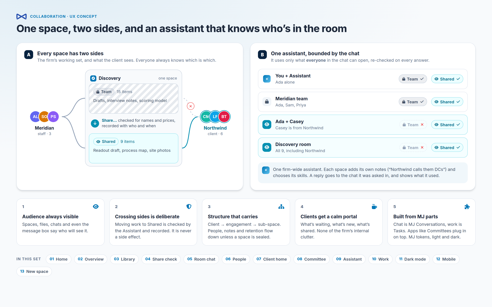

**A.** Discovery is one space with a Team side (15 items, staff only) and a Shared side (9 items, the client too). Work crosses from Team to Shared only through a check. It is never a side effect.

**B.** The Assistant uses only what everyone in the chat can open, and it re-checks on every answer. Ada alone, or Ada with her staff, gets Team and Shared material. Once Casey from the client is in the chat, it gets Shared material only.

---

## The story

It is **Friday, September 26**. **Meridian Advisory** is a consulting firm. It is in week 7 of **Discovery**, a ten-week supply-chain diagnostic for its client **Northwind**. The readout is **Thursday, October 9 at 2:00 PM**, and close-out is **October 16**.

| Person | Who they are | Side |
|---|---|---|
| **Ada Lovell** | Engagement lead at Meridian. Our main user. | Meridian staff |
| Sam Okafor | Senior consultant | Meridian staff |
| Priya Shah | Analyst | Meridian staff |
| **Casey Morgan** | VP Operations at Northwind; the client sponsor and client admin | Northwind |
| Lena Fischer | Northwind's CFO; read-only | Northwind |
| **Bea Tanaka** | Operations analyst | Northwind |
| Omar Haddad, Mia Torres, Ravi Patel | Plant director (Dayton), finance analyst, IT lead | Northwind |
| Jordan Lee | Procurement lead. Casey invited him and he is waiting for staff approval. | Northwind |
| **Dana Whitfield** | Outside director on Meridian's Audit Committee | Board |

Ada's spaces, as her left rail shows them:

```
Northwind                    client relationship
├── Discovery                engagement · week 7 of 10
│   └── Field notes          sub-space, same people as Discovery
├── Delivery                 engagement · sealed, starts after the readout
└── Closed (2)
Audit Committee              committee (from the Committees app)
Spring Leadership Cohort     cohort
Pinecrest Health             client relationship · proposal
Studio                       workshop
```

**How to read the frames**

- **Team**: a grey chip with a lock. **Shared**: a teal chip with an eye.
- People from outside the firm have a teal ring around their avatar everywhere.
- The Assistant has a rounded-square avatar with the ✦ mark.
- Each space type has its own colored tile. Engagement is blue, committee amber, cohort green, workshop violet and client relationship navy.

---

### 01 · Ada's morning

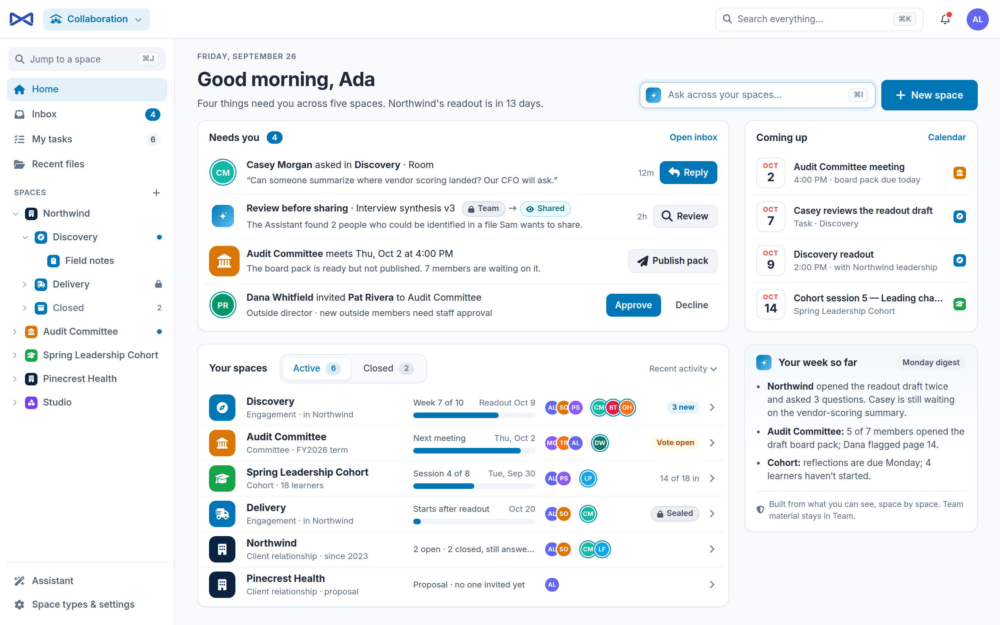

Ada opens Collaboration. Before anything else, Home answers one question: *what needs me, across all my spaces?*

- **Needs you** gathers four items from four sources. Each row has the one action it needs.
  - A client question in a chat.
  - A file the Assistant flagged before it can be shared.
  - A board pack waiting to be published.
  - An invite waiting for staff approval.
- **Coming up** lists dated items from all her spaces; see [where calendar items come from](#where-calendar-items-come-from).
- **Your spaces** shows each space in one row:
  - its type and progress;
  - who is in it: staff first, then outside people with teal rings;
  - one signal, such as *3 new*, *Vote open* or *Sealed*.
- **Your week so far** is the Assistant's weekly digest. It is built only from what Ada can see, space by space, and says so.
- **Ask across your spaces** searches everything Ada is allowed to open.

### 02 · Discovery at a glance

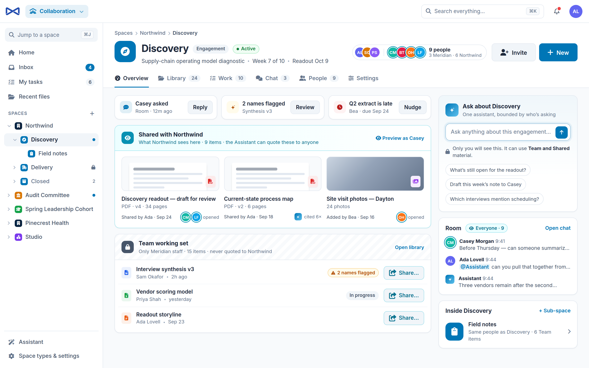

Ada opens Discovery. The overview shows the two sides as two blocks.

- The header names the audience once, *9 people · 3 Meridian · 6 Northwind*, with a staff stack and an outside stack.
- The three cards at the top are this space's share of *Needs you*.
- **Shared with Northwind** (teal) is exactly what Northwind sees, and the Assistant may quote it to anyone here. *Preview as Casey* opens the space as Casey sees it (frame 07).
- **Team working set** (hatched, lock) is staff-only and is never quoted to Northwind. Each row has *Share…*, which opens the share check (frame 04).
- On the right:
  - An Assistant box, with the material it can use stated under it.
  - A preview of the room chat.
  - The sub-spaces. *Field notes* inherits Discovery's people.

### 03 · Library

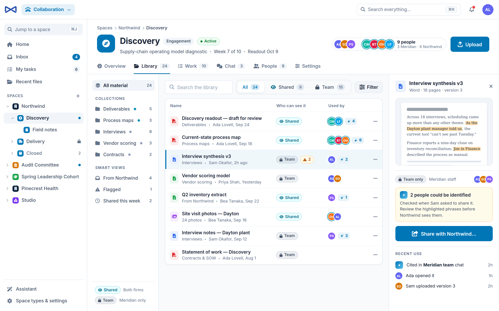

- Material from both sides is in one list, with *All / Shared / Team* tabs and counts.
- Every row carries a *Who can see it* chip. *Used by* shows who opened a file and how many times the Assistant cited it (✦ 4).
- Collections are folders. Smart views are saved filters: *From Northwind*, *Flagged*, *Shared this week*.
- The preview panel shows a Team file the Assistant flagged, because two phrases could identify an interviewee.
  - The main action is *Share with Northwind…*.
  - *Recent use* shows where the file has been.

### 04 · The share check

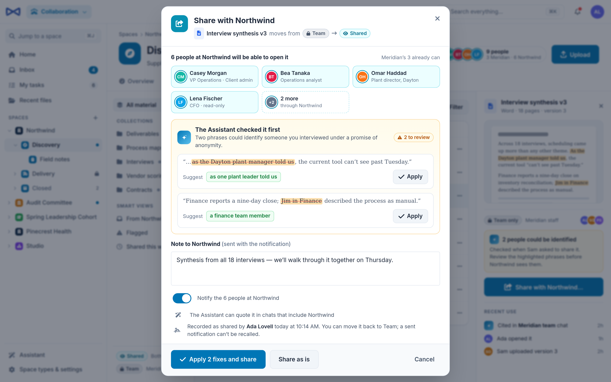

Moving work from Team to Shared is a deliberate, checked act.

- The dialog states what moves: *Interview synthesis v3* moves from **Team → Shared**.
- It names the six Northwind people who will be able to open it. Meridian's three already can.
- The Assistant checked the file first and suggests a replacement for each identifying phrase. *Apply* fixes one; *Apply 2 fixes and share* fixes both and shares.
- A note travels with the notification.
- The last lines spell out the consequences:
  - The Assistant may now quote the file in chats that include Northwind.
  - The move is recorded with who and when.
  - It can be moved back to Team, but a sent notification can't be recalled.
- Buttons follow MJ's rule: confirm on the left, cancel on the right.

### 05 · The room with the client

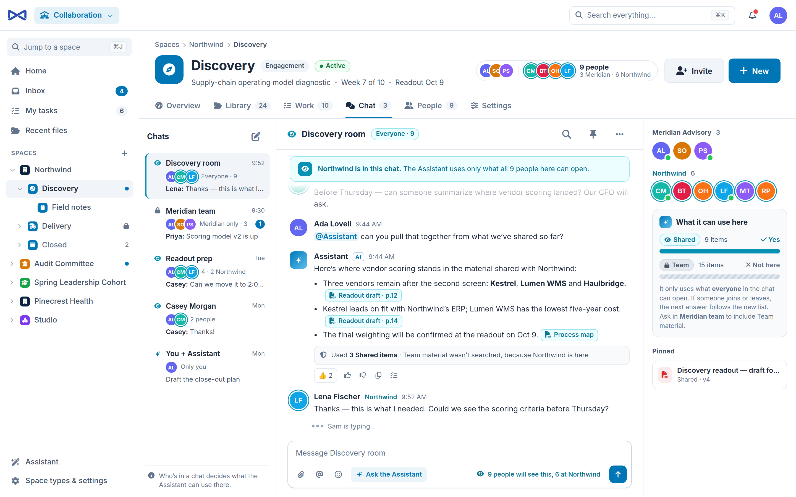

- Chats belong to a space. The list shows each chat's audience: *Everyone · 9*, *Meridian only · 3*, *2 people*, *Only you*.
- The banner says Northwind is here, so the Assistant uses only what all 9 people can open.
- Ada asks the Assistant. It answers with citations to Shared files and ends with a receipt: *Used 3 Shared items · Team material wasn't searched, because Northwind is here*.
- The right panel, *What it can use here*, draws the same rule: Shared ✓, Team ✗ *not here*, and why.
- The composer says who will see the message: *9 people will see this, 6 at Northwind*.
- The chat itself is MJ Conversations. Collaboration adds four things around it:
  - the audience banner;
  - the receipt;
  - the right panel;
  - the audience line.

### 06 · People and access

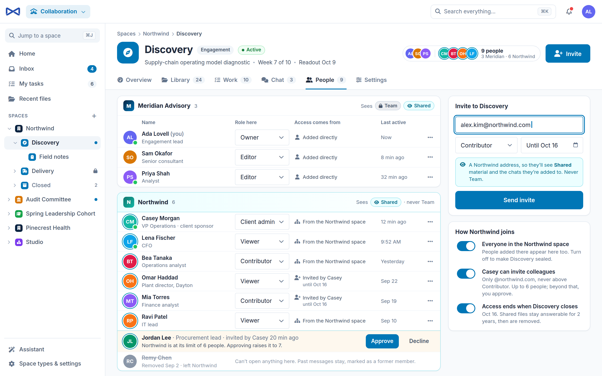

- People are grouped by organization, and each group says which sides it sees.
- *Access comes from* explains every person: added directly, inherited from the Northwind space, or invited by Casey until Oct 16.
- Casey may invite colleagues, within these limits:
  - only @northwind.com addresses;
  - never above Contributor;
  - up to 6 people.
- Jordan would be the 7th, so he waits for staff approval.
- Remy was removed. He can't open anything; his past messages stay, marked as from a former member.
- Before an invite is sent, it explains what a Northwind address will see.

### 07 · Casey's portal

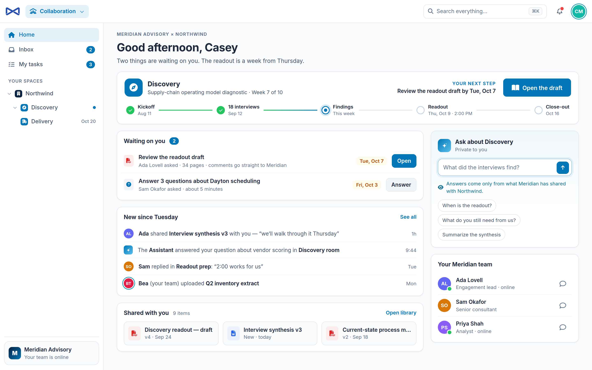

This is the same app as an outside participant sees it: calm, and showing only Shared material.

- One engagement card shows the milestone track (Kickoff → 18 interviews → Findings → Readout → Close-out) and Casey's next step.
- The page has four more parts:
  - *Waiting on you*: what Meridian asked of Casey, with due dates.
  - *New since Tuesday*.
  - *Shared with you*.
  - Casey's Meridian team, with message buttons.
- Casey's Assistant box says where answers come from: only what Meridian has shared with Northwind.
- None of the firm's internals appear: no Team side, no settings, no other clients.

### 08 · A board member, with the Committees app on top

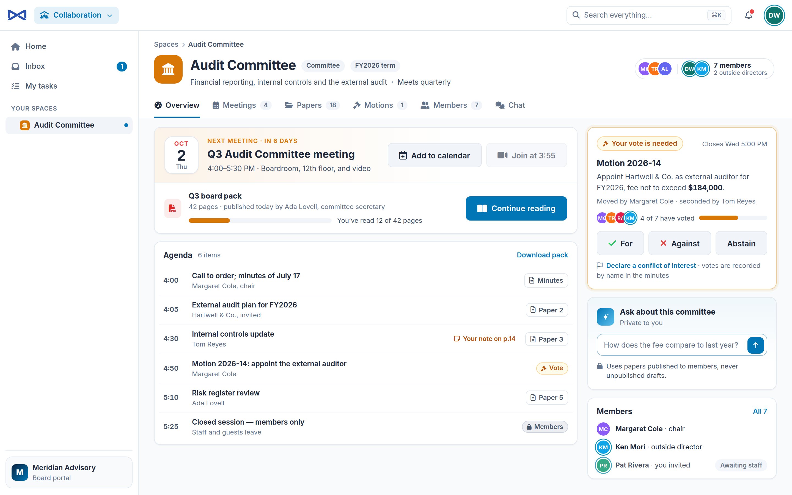

**Collaboration has no idea what a committee is.** This frame shows a host where the **Committees** app is installed on top of Collaboration and extends it.

- The space type *Committee* and the header chip *FY2026 term* come from Committees.
- Committees contributes, through Collaboration's extension points:
  - the *Meetings* and *Motions* tabs;
  - the next-meeting card with the board pack;
  - the agenda;
  - the vote card.
- *Papers* and *Members* are Collaboration's Library and People tabs, relabeled by the space type.
- Collaboration still supplies the frame: the header, tabs, chat, members, and the Assistant, which *uses papers published to members, never unpublished drafts*.
- Dana is an outside director (teal ring). Pat Rivera is someone Dana invited who is waiting for staff approval. That is the same invite Ada sees in frame 01.

### 09 · Teaching the Assistant about Discovery

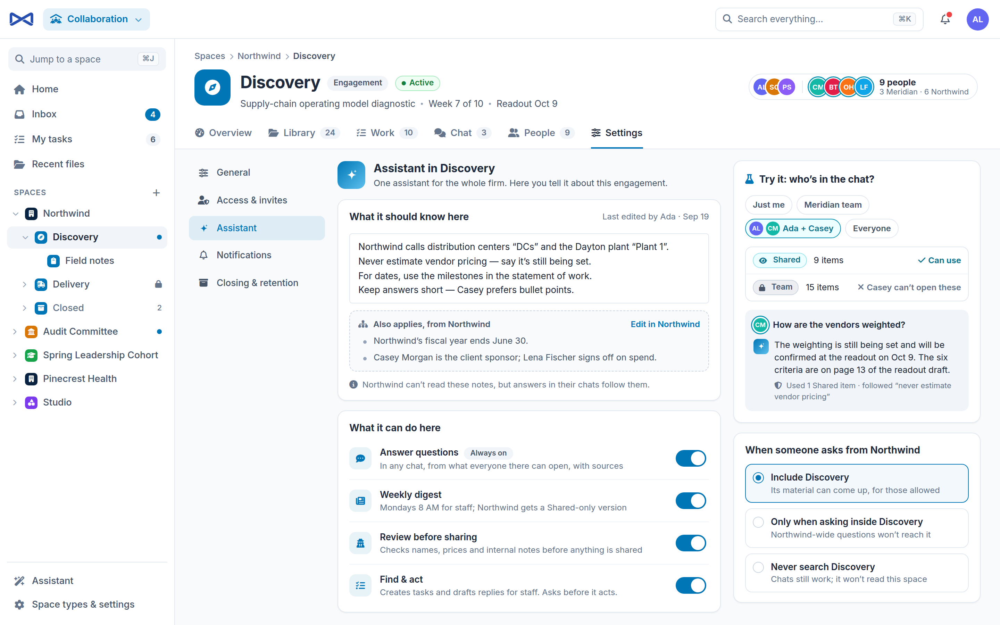

There is one Assistant for the whole firm. Each space adds what it should know and what it may do.

- **Notes for this space**, plus notes inherited from Northwind that are edited there. Northwind can't read the notes, but answers in their chats follow them.
- **Skills per space**:
  - answer questions (always on);
  - weekly digest;
  - review before sharing;
  - find & act, which asks before acting.
- ***When someone asks from Northwind*** decides whether Discovery's material can come up in questions asked across Northwind.
- **Try it** previews the rule for any audience: pick who is in the chat and see which sides the Assistant can use and a sample answer.

### 10 · Work

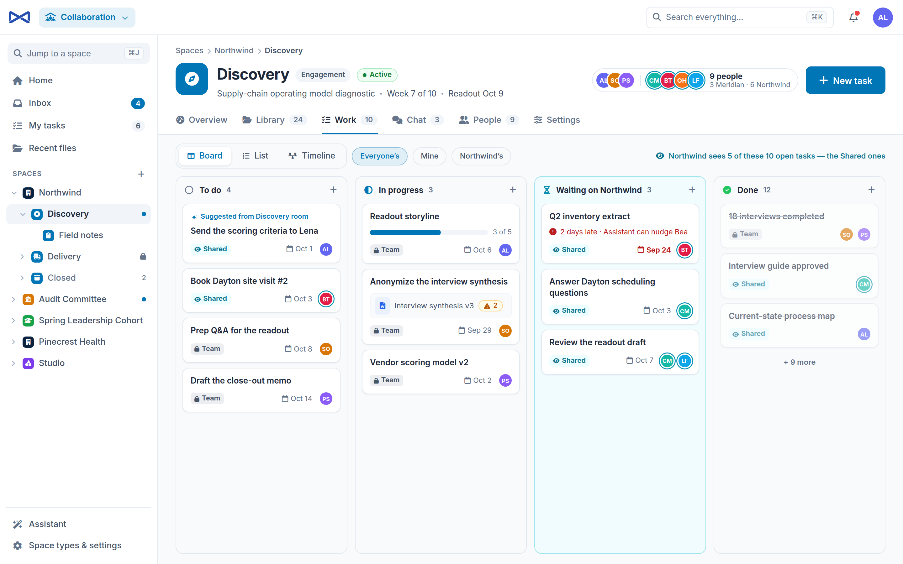

- Tasks are bizapps-tasks tasks that belong to the space, and the board, list and timeline are bizapps-tasks' own components. Collaboration supplies the cards and the column names. Each card says its side, and Northwind sees the 5 open tasks that are Shared.
- *Waiting on Northwind* collects what the client owes. A late item says so and offers a nudge.
- A card can say *Suggested from Discovery room*, which means the Assistant proposed it from a chat.
- *Board / List / Timeline* and *Everyone's / Mine / Northwind's* are views of the same tasks.

### 11 · A staff-only chat, in dark mode

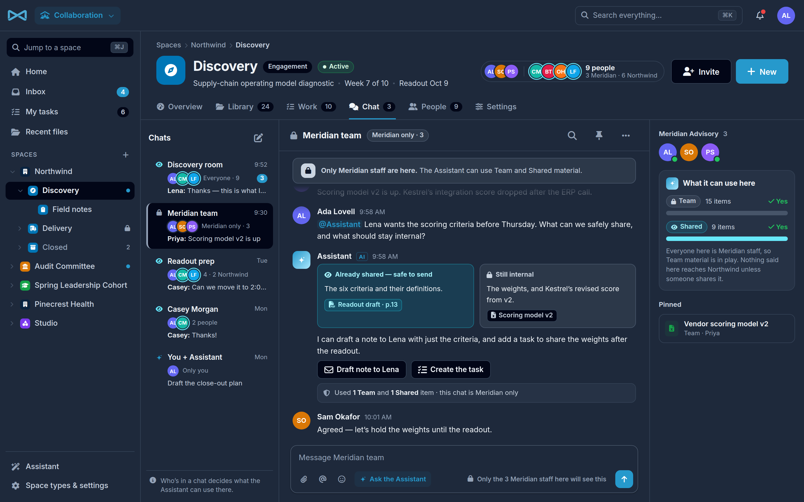

- The *Meridian team* chat has only staff in it, so the Assistant may use Team material too, and says so.
- Asked what can be shared, it splits its answer into two parts, with the files for each:
  - *Already shared, safe to send*;
  - *Still internal*.
- It offers actions (draft the note to Lena, create the task) and asks before acting.
- Dark mode uses the same tokens. Nothing is re-colored by hand.

### 12 · Bea on her phone

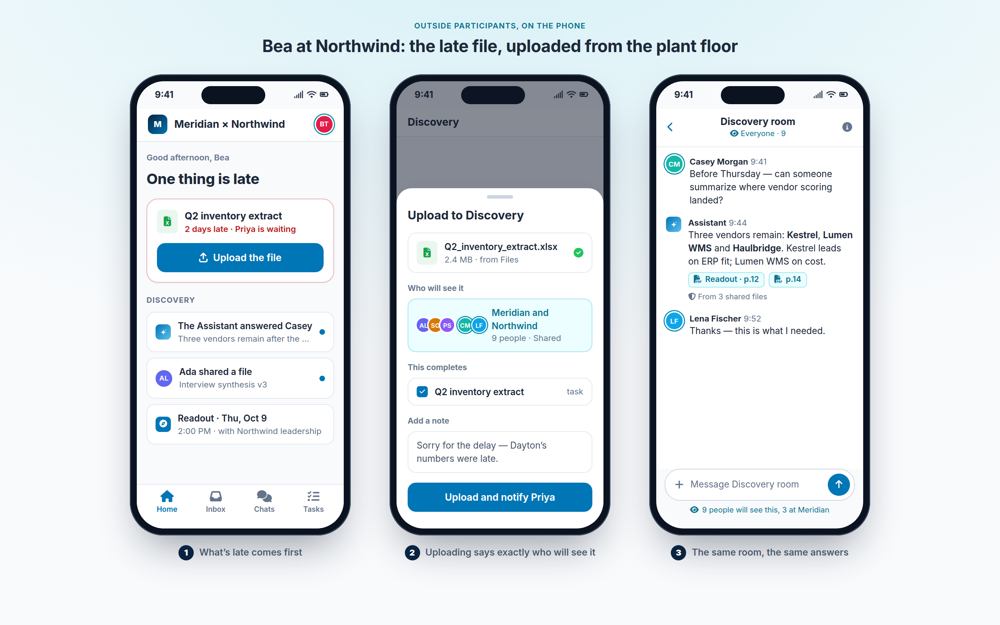

- Whatever is late comes first, with one large action.
- Uploading says exactly who will see the file (Meridian and Northwind · 9 people · Shared) and which task it completes.
- The room and the answers are the same as on desktop.

### 13 · Starting a new space

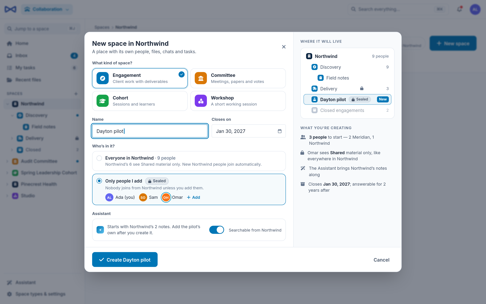

- Space types are data. Each card is a space type row. *Committee* appears only because the Committees app added it.
- *Closes on* sets the date that access and retention follow.
- *Who's in it* offers two choices:
  - Everyone in Northwind, who will see Shared material only.
  - Only the people Ada adds, which makes the space *sealed*.
- The Assistant brings Northwind's notes along. The right side shows where the space will live and what is being created.

---

## How the screens connect

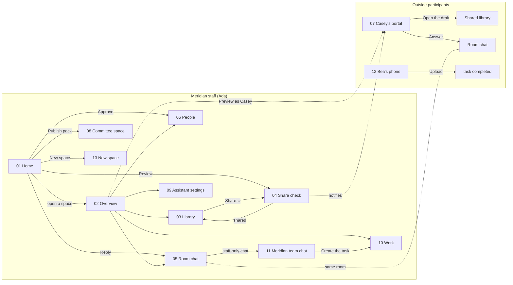

---

## Rules that hold on every screen

1. **The audience is always visible.** Anything that shows or accepts content says who can see it: chips on files and tasks, the chat banner and panel, the composer line, the upload sheet.
2. **Two sides, one space.** Team is staff-only and Shared is everyone in the space.
   - Material moves from Team to Shared only through the share check.
   - The move is recorded with who and when. It can be moved back; a sent notification can't be recalled.
3. **The Assistant is bounded by the audience.**
   - In a chat, it uses only what everyone in that chat can open, re-checked on every answer.
   - When someone joins or leaves, the next answer follows the new list.
   - Every answer ends with a receipt of what it used.
4. **Structure carries.** Client, then engagement, then sub-space. People, Assistant notes and retention flow down unless a space is sealed.
5. **Outside people get a portal, not the firm's workspace.** They see Shared material, their own tasks and the chats they are in, and never the Team side, settings or other clients.
6. **Space types are data.** The icon, color, words (Library or Papers), tabs and defaults all come from the space type row. Collaboration never branches on a type's name.
7. **Apps extend Collaboration; Collaboration knows nothing about them.** Committees, or any other app, adds tabs, overview cards, header chips, *Needs you* items and dated items through registered extension points.
8. **MJ tokens, light and dark.** Nothing is colored by hand except data: a space type's color and a person's avatar color.

## Where the data comes from

| On screen | Source |
|---|---|
| Spaces, types, members, roles, sides | Collaboration's tables: `Space`, `SpaceType`, `SpaceMember`, `SpaceRoleType`, `SpaceItem` |
| Files | MJ Files, attached to a space through `SpaceItem`, which carries the side |
| Chats | MJ Conversations, attached through `SpaceChat`, which carries the conversation's kind. The chat UI is `@memberjunction/ng-conversations`. |
| Tasks and milestones | bizapps-tasks, attached through `SpaceItem` |
| Who opened what, share notices | Collaboration's `ItemUse` and `ShareNotice` |
| Assistant answers, digest, share check | The firm's MJ agent, with agents, skills and knowledge sources set per type or space (`SpaceAgent`, `SpaceAgentSkill`, `SpaceKnowledgeSource`) |
| Meetings, papers, motions, votes (frame 08) | The Committees app, through Collaboration's extension points |

A few things in the frames have no column yet: invite provenance and share-check findings. [IMPLEMENTATION_PLAN.md § Data the frames need](IMPLEMENTATION_PLAN.md#8-data-the-frames-need) lists each one with a proposal.

### Where calendar items come from

Collaboration keeps no calendar of its own. *Coming up*, the milestone track and "Readout Oct 9" are one merged feed with three sources:

1. **Task due dates.** These are tasks in your spaces (bizapps-tasks `DueAt`), for example *Casey reviews the readout draft · Oct 7*.
2. **Milestones.** These are tasks of a *Milestone* task type: Kickoff, Readout (Thu Oct 9, 2:00 PM), Close-out, and a cohort's sessions. bizapps-tasks has no milestone type today, so Collaboration seeds one.
3. **Dated items from apps on top.** For example, Committees contributes its meetings (*Audit Committee meeting, Oct 2, 4:00 PM*) through the agenda extension point.

The *Calendar* link opens the same feed as a month view. "Week 7 of 10" is computed from the space's start date and its planned close date.

### Space types, and apps that build on Collaboration

Client relationship, Engagement, Cohort and Workshop are ordinary space type rows. Collaboration ships a small generic starter set, and a firm adds its own under *Space types & settings*.

*Committee* is different: the Committees app adds that row when it is installed. With it come the committee's tabs, cards, chips and dated items. None of that exists when Committees is absent, and Collaboration's code never mentions it.
