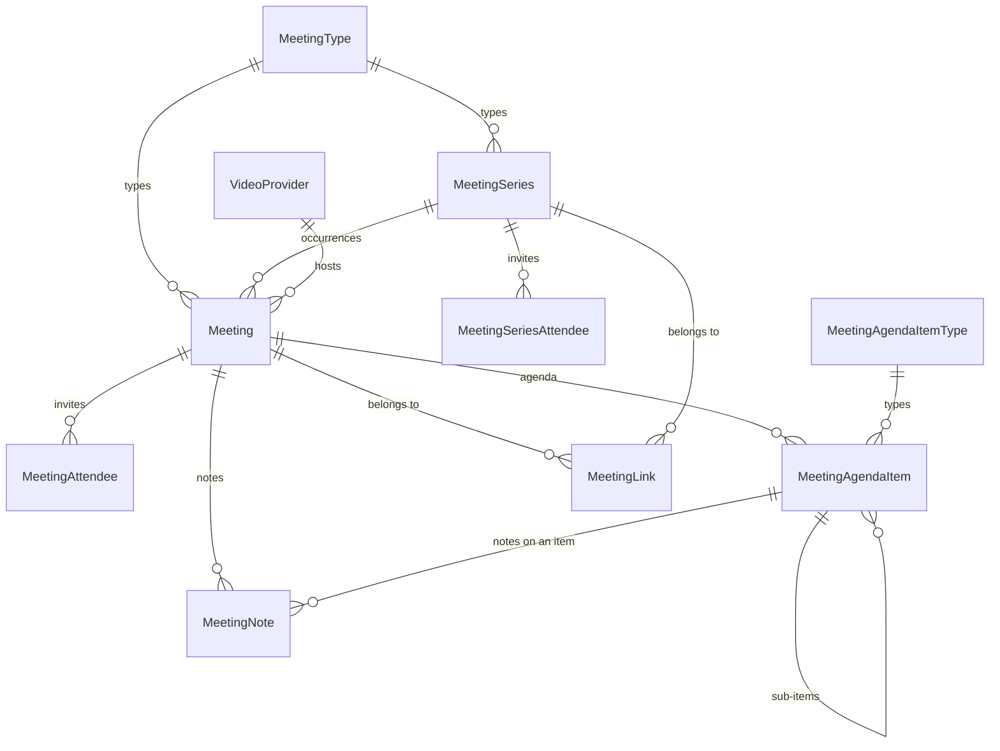

# Meetings: a first-class app in bizapps-tasks

**What this is.** The design for meetings and agendas in bizapps-tasks: the plan's workstream T ([§ 8a](plan.md#8a-workstream-t-meetings-and-agendas-in-bizapps-tasks)), D33, and Amith's call that meetings are a first-class app there, not only the tables Committees gives up (D52). It's built in its own pull request in bizapps-tasks, as part of PR 10's work ([PR 10's plan § 6](pr10-plan.md#6-meetings-a-first-class-app-in-bizapps-tasks)). Collaboration uses it for B23, and Committees for C4.

**What a person can do with it.**
- Schedule a meeting, one-off or recurring, with a type, a time and time zone, a place or a video link, and the people invited, including guests by email.
- Build its agenda: nested items with a type, a presenter and a duration, from the type's template or drafted by AI from open tasks and the last meeting's notes.
- See *My meetings*, answer invitations, and, once calendars are in MemberJunction (A18), find them in Outlook or Google, with answers flowing back.
- Run the meeting: the current item, a timer, who's there, notes, and follow-up tasks captured as they come up.
- Turn a transcript into notes, and the notes' action items into tasks, each with the person's approval.
- Link a meeting to anything: a space, a deal, a committee, a project.

## Contents

1. [The model](#1-the-model)
2. [The tables](#2-the-tables)
3. [Rules the server enforces](#3-rules-the-server-enforces)
4. [Who can see what](#4-who-can-see-what)
5. [The *Meetings* application](#5-the-meetings-application)
6. [Calendars and the `.ics` file (T2)](#6-calendars-and-the-ics-file-t2)
7. [Video providers](#7-video-providers)
8. [AI (T3)](#8-ai-t3)
9. [How other apps use it](#9-how-other-apps-use-it)
10. [Metadata to ship](#10-metadata-to-ship)
11. [Tests](#11-tests)
12. [Order, and done when](#12-order-and-done-when)
13. [Points to settle](#13-points-to-settle)

## 1. The model

- **A meeting is one occurrence,** with its own agenda, attendees, notes and follow-ups. A recurring meeting is a **series** whose occurrences are real `Meeting` rows, made ahead of time up to a horizon. Each occurrence keeps its own agenda and attendance, and one can move or be cancelled without touching the rest.
- **People are bizapps-common's People,** as everywhere in Tasks: the organizer, the presenter and each attendee are a `Person`, and a guest is an email address. An attendee also carries their MJ user when they have one, for *My meetings* and for private meetings (§ 4).
- **A meeting belongs to other records through `MeetingLink`,** the way `TaskLink` ties a task to any record. Tasks never names the apps that use it.
- **Follow-ups are tasks.** An action item from a meeting is a Task of Tasks' existing `ACTION_ITEM` type, linked to the meeting or its agenda item through `TaskLink`. There is no second action-item table.
- **Notes are the meeting's record of what happened,** written by a person or drafted by AI from a transcript. Approving minutes is a governance act, and stays in Committees.
- **Calendar events are MemberJunction's** (A18): a meeting's event is its row in `MJ: Calendar Event Links`. Tasks has no calendar table and no calendar column.

**What it takes from Committees, and what it changes.** Committees 1.4.0's `Meeting`, `AgendaItem`, `Attendance` and `VideoProvider` are the starting point, without their committee column. The design takes their fields and changes these:
- a meeting's end is required and later than its start, which Committees never checks;
- an invitation's answer and whether someone came are two columns, where Committees keeps one status for both;
- a guest can be invited by email, where Committees needs a Person;
- recurring meetings, agenda templates, private meetings and notes are new;
- the agenda item's type is a lookup, and its free-text notes become notes;
- the transcript is a file in MemberJunction's storage rather than a URL;
- quorum, the predicted quorum risk, votes and the approval of minutes stay with Committees' governance.

## 2. The tables

In `__mj_BizAppsTasks`, in one migration of the v1.7.x band, which is a minor version since it only adds. They follow bizapps-tasks' conventions:
- **Keys:** `ID UNIQUEIDENTIFIER NOT NULL DEFAULT NEWSEQUENTIALID()`, the primary key.
- **CodeGen's columns stay out:** no `__mj_CreatedAt`, `__mj_UpdatedAt` or foreign-key indexes.
- **Every column has an `MS_Description`.**
- **References:** a person is a hard foreign key to `__mj_BizAppsCommon.Person(ID)`, as Tasks' `CreatedByPersonID` is, and a core table is `${mjSchema}`. A status is a `CHECK` list, as `Task.Status` is.
- **Names:** CodeGen names each entity with Tasks' `MJ_BizApps_Tasks: ` prefix, and every table but `VideoProvider` carries the `Meeting` stem, so they sit together in Explorer.
- **The migration ships its CodeGen output,** appended under the banner after at least 50 blank lines, with each `EntityField` insert taking its `Sequence` at apply time, as Tasks' latest migrations do. Its metadata is JSON (§ 10), and the release's metadata migration is the build engineer's.

### 2.1 `Meeting` (`MJ_BizApps_Tasks: Meetings`)

| Column | Type | Null | Notes |
|---|---|---|---|
| `ID` | `UNIQUEIDENTIFIER` | no | Key |
| `Name` | `NVARCHAR(255)` | no | Its title, as `Task.Name` is a task's |
| `Description` | `NVARCHAR(MAX)` | yes | Its purpose, in Markdown |
| `TypeID` | `UNIQUEIDENTIFIER` | yes | → `MeetingType` |
| `SeriesID` | `UNIQUEIDENTIFIER` | yes | → `MeetingSeries`, on an occurrence |
| `OccurrenceStartsAt` | `DATETIMEOFFSET` | yes | The series' original slot for this occurrence. It names the occurrence after it moves |
| `Status` | `NVARCHAR(20)` | no | `Draft`, `Scheduled`, `Postponed`, `InProgress`, `Completed` or `Cancelled`; default `Scheduled` |
| `StartsAt` | `DATETIMEOFFSET` | no | |
| `EndsAt` | `DATETIMEOFFSET` | no | Later than `StartsAt` |
| `TimeZone` | `NVARCHAR(64)` | no | The IANA zone it's planned in, such as `America/Chicago`. Recurrence and display use it |
| `LocationType` | `NVARCHAR(20)` | no | `Virtual`, `InPerson`, `Hybrid` or `Phone`; default `Virtual` |
| `Location` | `NVARCHAR(500)` | yes | A room or an address |
| `VideoProviderID` | `UNIQUEIDENTIFIER` | yes | → `VideoProvider` |
| `VideoMeetingID` | `NVARCHAR(255)` | yes | The provider's meeting ID, to update or delete it |
| `VideoJoinURL` | `NVARCHAR(1000)` | yes | From the provider, or typed |
| `DialInDetails` | `NVARCHAR(1000)` | yes | Phone numbers and codes |
| `OrganizerPersonID` | `UNIQUEIDENTIFIER` | no | → Person. Their calendar holds the event (T2) |
| `Visibility` | `NVARCHAR(20)` | no | `Standard` or `Private`; default `Standard` (§ 4) |
| `ActualStartedAt` | `DATETIMEOFFSET` | yes | Set when the live meeting starts |
| `ActualEndedAt` | `DATETIMEOFFSET` | yes | Set when it ends |
| `CancelledAt` | `DATETIMEOFFSET` | yes | |
| `CancellationReason` | `NVARCHAR(500)` | yes | |
| `VideoRecordingURL` | `NVARCHAR(1000)` | yes | |
| `TranscriptFileID` | `UNIQUEIDENTIFIER` | yes | → `${mjSchema}.[File]` (`MJ: Files`). A transcript is a file in MemberJunction's storage, uploaded or saved there by the provider's driver, so nothing fetches a URL a user typed |
| `CreatedByPersonID` | `UNIQUEIDENTIFIER` | yes | → Person, as on `Task` |

Checks: the status, location type and visibility lists; `EndsAt > StartsAt`; `SeriesID` and `OccurrenceStartsAt` both set or both empty. A filtered unique index on `(SeriesID, OccurrenceStartsAt)` where `SeriesID IS NOT NULL`.

### 2.2 `MeetingSeries` (`MJ_BizApps_Tasks: Meeting Series`)

| Column | Type | Null | Notes |
|---|---|---|---|
| `ID` | `UNIQUEIDENTIFIER` | no | Key |
| `Name` | `NVARCHAR(255)` | no | Each occurrence starts with it |
| `Description` | `NVARCHAR(MAX)` | yes | |
| `TypeID` | `UNIQUEIDENTIFIER` | yes | → `MeetingType` |
| `OrganizerPersonID` | `UNIQUEIDENTIFIER` | no | → Person |
| `RecurrenceRule` | `NVARCHAR(500)` | no | An RFC 5545 `RRULE` value, such as `FREQ=WEEKLY;BYDAY=TU`. Its `UNTIL` or `COUNT` ends the series |
| `TimeZone` | `NVARCHAR(64)` | no | The rule is expanded in this zone, so a 9:00 meeting stays at 9:00 across daylight-saving changes |
| `FirstStartsAt` | `DATETIMEOFFSET` | no | The rule's `DTSTART` |
| `DurationMinutes` | `INT` | no | More than 0 |
| `LocationType`, `Location`, `VideoProviderID`, `Visibility` | as on `Meeting` | | Each new occurrence's defaults |
| `Status` | `NVARCHAR(20)` | no | `Active`, `Ended` or `Cancelled`; default `Active` |
| `MaterializedThrough` | `DATETIMEOFFSET` | yes | Occurrences exist up to here |
| `CreatedByPersonID` | `UNIQUEIDENTIFIER` | yes | → Person |

### 2.3 `MeetingSeriesAttendee` (`MJ_BizApps_Tasks: Meeting Series Attendees`)

Who each new occurrence invites: `SeriesID` (→ `MeetingSeries`, required), and `PersonID`, `UserID`, `Email`, `DisplayName` and `Role` as on `MeetingAttendee` (§ 2.4), with its checks and unique indexes on `SeriesID`. `Role` is `Required` or `Optional`; the organizer comes from the series.

### 2.4 `MeetingAttendee` (`MJ_BizApps_Tasks: Meeting Attendees`)

| Column | Type | Null | Notes |
|---|---|---|---|
| `ID` | `UNIQUEIDENTIFIER` | no | Key |
| `MeetingID` | `UNIQUEIDENTIFIER` | no | → `Meeting` |
| `PersonID` | `UNIQUEIDENTIFIER` | yes | → Person |
| `UserID` | `UNIQUEIDENTIFIER` | yes | → `${mjSchema}.[User]`, when the person has an MJ account. *My meetings* and the private-meeting filter use it |
| `Email` | `NVARCHAR(255)` | yes | A guest's address, or the address a person's invitation goes to |
| `DisplayName` | `NVARCHAR(255)` | yes | A guest's name |
| `Role` | `NVARCHAR(20)` | no | `Organizer`, `Required` or `Optional`; default `Required` |
| `ResponseStatus` | `NVARCHAR(20)` | no | `None`, `Accepted`, `Tentative` or `Declined`; default `None` |
| `RespondedAt` | `DATETIMEOFFSET` | yes | |
| `AttendanceStatus` | `NVARCHAR(20)` | no | `Unknown`, `Present`, `Late`, `LeftEarly`, `Absent` or `Excused`; default `Unknown` |
| `JoinedAt` | `DATETIMEOFFSET` | yes | From the live meeting or the video provider |
| `LeftAt` | `DATETIMEOFFSET` | yes | |
| `Notes` | `NVARCHAR(500)` | yes | Such as why someone is excused |

Checks: the three lists, and `PersonID IS NOT NULL OR Email IS NOT NULL`. Filtered unique indexes: `(MeetingID, PersonID)` where `PersonID IS NOT NULL`; `(MeetingID, Email)` where `PersonID IS NULL`; and `(MeetingID)` where `Role = 'Organizer'`, so a meeting has one organizer row.

### 2.5 `MeetingAgendaItem` (`MJ_BizApps_Tasks: Meeting Agenda Items`)

| Column | Type | Null | Notes |
|---|---|---|---|
| `ID` | `UNIQUEIDENTIFIER` | no | Key |
| `MeetingID` | `UNIQUEIDENTIFIER` | no | → `Meeting` |
| `ParentID` | `UNIQUEIDENTIFIER` | yes | → `MeetingAgendaItem`, for a sub-item |
| `Sequence` | `INT` | no | Order among its siblings; default 100 |
| `Name` | `NVARCHAR(500)` | no | |
| `Description` | `NVARCHAR(MAX)` | yes | |
| `TypeID` | `UNIQUEIDENTIFIER` | yes | → `MeetingAgendaItemType` |
| `PresenterPersonID` | `UNIQUEIDENTIFIER` | yes | → Person |
| `DurationMinutes` | `INT` | yes | 0 or more |
| `Status` | `NVARCHAR(20)` | no | `Planned`, `InProgress`, `Done`, `Deferred` or `Skipped`; default `Planned` |
| `StartedAt` | `DATETIMEOFFSET` | yes | From the live meeting |
| `EndedAt` | `DATETIMEOFFSET` | yes | |
| `Outcome` | `NVARCHAR(MAX)` | yes | What was agreed, in a sentence or two |
| `DeferredToMeetingID` | `UNIQUEIDENTIFIER` | yes | → `Meeting`: the later meeting a deferred item moved to |

The parent is declared as a hierarchy, as Tasks does for its own parent columns. An item's documents are MemberJunction files, linked through `MJ: File Entity Record Links`, as Committees links them today.

### 2.6 `MeetingNote` (`MJ_BizApps_Tasks: Meeting Notes`)

| Column | Type | Null | Notes |
|---|---|---|---|
| `ID` | `UNIQUEIDENTIFIER` | no | Key |
| `MeetingID` | `UNIQUEIDENTIFIER` | no | → `Meeting` |
| `AgendaItemID` | `UNIQUEIDENTIFIER` | yes | → `MeetingAgendaItem`, for a note on one item |
| `Kind` | `NVARCHAR(20)` | no | `Notes`, `Summary` or `Decision`; default `Notes` |
| `Title` | `NVARCHAR(255)` | yes | |
| `Body` | `NVARCHAR(MAX)` | no | Markdown |
| `Source` | `NVARCHAR(20)` | no | `Manual` or `AI`; default `Manual` |
| `Status` | `NVARCHAR(20)` | no | `Draft` or `Final`; default `Draft` |
| `AuthorPersonID` | `UNIQUEIDENTIFIER` | yes | → Person, for a person's note |
| `AIPromptRunID` | `UNIQUEIDENTIFIER` | yes | → `${mjSchema}.AIPromptRun`, for an AI draft: where it came from |
| `ProposedTasks` | `NVARCHAR(MAX)` | yes | JSON, typed through MJ's JSON types: the action items the notes propose ([§ 8](#8-ai-t3)) |

### 2.7 `MeetingLink` (`MJ_BizApps_Tasks: Meeting Links`)

| Column | Type | Null | Notes |
|---|---|---|---|
| `ID` | `UNIQUEIDENTIFIER` | no | Key |
| `MeetingID` | `UNIQUEIDENTIFIER` | yes | → `Meeting` |
| `SeriesID` | `UNIQUEIDENTIFIER` | yes | → `MeetingSeries`. Each new occurrence copies its series' links |
| `EntityID` | `UNIQUEIDENTIFIER` | no | → `${mjSchema}.Entity` |
| `RecordID` | `NVARCHAR(450)` | no | As on `TaskLink` |
| `Description` | `NVARCHAR(500)` | yes | |

Checks: exactly one of `MeetingID` and `SeriesID`. Filtered unique indexes on `(MeetingID, EntityID, RecordID)` and `(SeriesID, EntityID, RecordID)`.

### 2.8 `MeetingType` (`MJ_BizApps_Tasks: Meeting Types`)

| Column | Type | Null | Notes |
|---|---|---|---|
| `ID` | `UNIQUEIDENTIFIER` | no | Key |
| `Name` | `NVARCHAR(100)` | no | Unique |
| `Code` | `NVARCHAR(50)` | no | Unique, as on `TaskType` |
| `Description` | `NVARCHAR(MAX)` | yes | |
| `IconClass` | `NVARCHAR(100)` | yes | Font Awesome |
| `DefaultDurationMinutes` | `INT` | yes | More than 0 |
| `DefaultLocationType` | `NVARCHAR(20)` | yes | The location list |
| `DefaultVideoProviderID` | `UNIQUEIDENTIFIER` | yes | → `VideoProvider` |
| `DefaultVisibility` | `NVARCHAR(20)` | yes | `Standard` or `Private` |
| `AgendaTemplate` | `NVARCHAR(MAX)` | yes | JSON, typed through MJ's JSON types: items with a title, a type code, a duration and sub-items |
| `NotesPromptID` | `UNIQUEIDENTIFIER` | yes | → `${mjSchema}.AIPrompt`: a type's own prompt for notes. Committees points its types at its minutes prompt |
| `IsActive` | `BIT` | no | Default 1 |
| `Sequence` | `INT` | no | Default 100 |

### 2.9 `MeetingAgendaItemType` (`MJ_BizApps_Tasks: Meeting Agenda Item Types`)

`Name` (100, unique), `Code` (50, unique), `Description`, `IconClass`, `DefaultDurationMinutes`, `IsActive` and `Sequence`, as on `MeetingType`. A lookup rather than a fixed list: Tasks ships the generic ones, and Committees adds *Vote*, since voting is governance.

### 2.10 `VideoProvider` (`MJ_BizApps_Tasks: Video Providers`)

| Column | Type | Null | Notes |
|---|---|---|---|
| `ID` | `UNIQUEIDENTIFIER` | no | Key |
| `Name` | `NVARCHAR(100)` | no | Unique |
| `Code` | `NVARCHAR(50)` | no | Unique: `ZOOM`, `TEAMS`, `GOOGLE_MEET` |
| `DriverClass` | `NVARCHAR(255)` | no | The driver's registered class ([§ 7](#7-video-providers)): Committees' `ServerDriverKey` |
| `Description` | `NVARCHAR(MAX)` | yes | |
| `IconClass` | `NVARCHAR(100)` | yes | |
| `CredentialID` | `UNIQUEIDENTIFIER` | yes | → `${mjSchema}.Credential` (`MJ: Credentials`): its secrets live in MemberJunction's credential store, never here |
| `Configuration` | `NVARCHAR(MAX)` | yes | JSON: settings that aren't secret |
| `SupportsTranscripts` | `BIT` | no | Default 0 |
| `IsDefault` | `BIT` | no | Default 0. A filtered unique index allows one default |
| `IsActive` | `BIT` | no | Default 0, until it's configured |

## 3. Rules the server enforces

In `tasks-entities-server`, as `BaseEntity` subclasses, so a save through the API, an action or the UI meets the same checks:
- **A meeting's status moves forward:** `Draft` → `Scheduled` → `InProgress` → `Completed`; `Scheduled` and `Postponed` move either way; and anything but `Completed` can be `Cancelled`. Only the organizer, or someone who can edit every meeting, starts, ends or cancels one. Cancelling stamps `CancelledAt`, and after the commit cancels the video meeting (§ 7) and, from T2, the calendar event.
- **A meeting always has its organizer's attendee row,** kept in step with `OrganizerPersonID`.
- **The time zone defaults** from the organizer's setting, else bizapps-common's business time zone.
- **An agenda item's parent** is in the same meeting, and the tree has no cycle.
- **An attendee** is a person or an address, once per meeting, and their `UserID` is filled from the person's MJ account when there is one.
- **A series' rule parses** before it's saved. Saving a series makes its occurrences up to the horizon, and changing it changes only the occurrences that haven't started, keeping any that were moved or cancelled on their own.
- **Everything outside the database runs after the commit** (`RunAfterCommit`): the video provider, the calendar and notifications.

**The services** (`tasks-core`, plain classes like Tasks' own): `MeetingService` (create from a type, start, end, cancel), `MeetingSeriesService` (expanding the rule in the series' zone, and making occurrences), `MeetingAgendaService` (order, durations, a template, and carrying unfinished items forward), `MeetingNotesService` (§ 8) and `MeetingCalendarFile` (§ 6). The browser reaches them through MemberJunction's remote operations; bizapps-tasks has none yet, and these are its first.

**A scheduled job** extends each active series' occurrences once a day, the way Tasks' overdue job is registered.

## 4. Who can see what

bizapps-tasks has no row-level security today: the UI role reads every task. Meetings keep that, with one exception:
- **A `Standard` meeting** is readable by anyone who can read Meetings, as a task is.
- **A `Private` meeting,** such as a one-on-one, is readable only by its attendees, the organizer included, through a row-level security filter on the UI role: `Visibility = 'Standard' OR ID IN (SELECT MeetingID FROM __mj_BizAppsTasks.vwMeetingAttendees WHERE UserID = '{{UserID}}')`. Its attendees, agenda, notes and links take the same filter through `MeetingID`.
- **Developer and Integration** keep their full grants, as for tasks.
- **Apps that expose meetings to outsiders** add their own filters for their own roles. Collaboration's Space Participant sees only meetings linked to the spaces it reaches (B23), as it sees only the tasks there.

This is bizapps-tasks' first row-level security filter. It's metadata, never in a migration.

## 5. The *Meetings* application

**A first-class app in Explorer,** beside *Tasks*, in `metadata/applications/`:

| Nav item | What it shows |
|---|---|
| **My meetings** (default) | Upcoming and recent meetings I organize or attend, answer buttons, and a *New meeting* button |
| **Meetings** | Every meeting I can see, with filters by type, status, date and link |
| **Series** | Recurring meetings, and their occurrences |
| **Calendar** | MemberJunction's Calendar view type, from A18. It appears once A18 is in MJ `next`; Tasks draws no calendar of its own (D49) |
| **Meeting types** and **Video providers** | Their generated forms, for administrators |

**The meeting's page** extends the generated form, as Tasks' own custom forms do:
- **The header:** title, time in the viewer's zone and the meeting's own, type, status, place or *Join*, and the viewer's answer.
- **Agenda:** the builder, with drag to reorder, nesting, durations that add up against the meeting's length, *Use the type's template*, and *Draft with AI* (§ 8).
- **People:** attendees, their answers and their attendance.
- **Notes:** notes by hand, *Draft from transcript*, and the proposed tasks to accept or dismiss.
- **Follow-ups:** the tasks linked to the meeting and its agenda items.
- **Links:** what the meeting belongs to.

**The live meeting** is Committees' live-meeting screen made generic: the current item and its timer, next and previous, attendance check-in, quick notes on the item, and *Add follow-up*, which files a task linked to the item.

**Layering.** `tasks-ng` depends on Explorer's `ng-shared` in three files, so Collaboration's widgets can't use it (the UX plan's § 3). Split out a **`tasks-ng-widgets`** package with no Explorer dependency, and put the meeting components there: list, card, page sections, agenda builder, live meeting, answer control, notes editor and series editor. Records open through MemberJunction's `RecordNavigationAdapter` (`ng-base-types`). `tasks-ng` keeps the Explorer resources, and Collaboration composes the widgets.

Every screen uses MemberJunction's components and semantic tokens, works in light and dark, and fits a phone's width.

## 6. Calendars and the `.ics` file (T2)

**Through MemberJunction's calendars (A18,** in [MJ#4789](https://github.com/MemberJunction/MJ/pull/4789), Colin's):
- **Scheduling a meeting creates an event** in the organizer's calendar, Outlook or Google, and invites its attendees. A change of time, title, place or attendees updates it, and cancelling cancels it.
- **The event's link is its row in `MJ: Calendar Event Links`:** the Meetings entity and the meeting's ID, with the provider's event ID, series ID and iCalendar UID. A series is a recurring event.
- **Answers flow back** into `MeetingAttendee.ResponseStatus`, and a time moved in the calendar moves the meeting.
- **Only bizapps-tasks writes to calendars.** bizapps-common's activity sync reads them and links its *Meeting* activity to the meeting by the iCalendar UID, through MJ's link table, without naming bizapps-tasks. That needs an `ICalUID` column on common's `Activity`, next to its `ExternalID`, in a bizapps-common pull request of its own (MJ#4789's plan, § 6.1).

**The `.ics` download works without A18.** It's built on the server with a `DTSTAMP`, `METHOD:REQUEST` or `METHOD:CANCEL`, the meeting's time zone, and the link row's UID when there is one, else the meeting's ID, so a calendar that imports it and one that got the invitation hold one event, not two.

## 7. Video providers

- **Zoom's driver moves from Committees,** where it creates the meeting and registers attendees, and gains the delete that nothing called. Credentials come from `MJ: Credentials`.
- **Teams and Meet:** Committees' drivers are stubs. A Teams meeting is an Outlook event with an online meeting, and a Meet meeting a Google event with conference data, so once A18 is in MJ `next` they're created with the meeting's calendar event, through A18's interface, and their drivers only read the join details back. That needs an online-meeting option on A18's create; settle it with Colin ([§ 13](#13-points-to-settle)).
- **The drivers** register with MemberJunction's class factory under `VideoProvider.DriverClass` and share Committees' base class, which gains `UpdateMeeting`, since a meeting can move. Every call checks the provider's answer and logs a failure with `LogError`; a failed call never loses the save's own error. They're called only after the commit.
- **The credential type,** *Video Provider OAuth*, moves from Committees' metadata to Tasks'.
- **The providers ship inactive,** as metadata, until a host configures them.

## 8. AI (T3)

- **Notes from a transcript.** The generic part of Committees' `MinutesService.GenerateDraftMinutes` moves here, with its prompt as an MJ AI Prompt in `metadata/` rather than TypeScript. Given the meeting, its agenda, its attendees and the transcript, it returns a summary, notes per agenda item, the decisions, and the action items. They're saved as a `Draft` note with `Source` `AI` and its `AIPromptRunID`. A type can name its own prompt (`NotesPromptID`).
- **Where a transcript comes from:** a file someone uploads (`TranscriptFileID`), the video provider where it supports one, or MemberJunction's realtime agent when it attended through a session bridge, linked with `MeetingLink`.
- **Proposed tasks.** Each action item is kept in the note's `ProposedTasks`, with a title, an assignee, a due date and its agenda item. A person accepts or dismisses each: accepting files an `ACTION_ITEM` task with its assignment and a `TaskLink` to the meeting or the item, and records the task's ID on the proposal. Nothing is filed without that person's approval.
- **Agenda drafting,** from the type's template, the open tasks linked to what the meeting belongs to, and the items the last occurrence left unfinished.
- **Tests never call a real model:** they run the prompt through a stub.

## 9. How other apps use it

- **Collaboration (B23):** a meeting belongs to a space through `MeetingLink`; the space's *Meetings* tab lists them, and *Coming up* shows the next ones; a meeting's conversation is a `SpaceChat` whose subject is the meeting; and the space's agent can use a meeting's agenda and notes, under the same band rules. Collaboration adds the Space Participant filters.
- **Committees (C4):** its own `Meeting`, `AgendaItem`, `Attendance` and `VideoProvider` go, and its governance points at Tasks' meetings and agenda items instead: minutes, motions, votes through their motions, artifacts and comments. It seeds the *Vote* agenda item type and its committee meeting types, and keeps quorum and the approval of minutes, built on a `Final` note.
- **bizapps-common:** its activity sync links a *Meeting* activity to the meeting by the iCalendar UID (§ 6).
- **Any app** links a meeting to its own records, and reads meetings through their entities.

## 10. Metadata to ship

JSON under bizapps-tasks' `metadata/`, pushed with `mj sync push`, with no `sync` blocks and new keys from `uuidgen`. Nothing here goes in a migration:
- **Meeting types:** General, One-on-one, Team, Client and Review, each with a default duration and an agenda template.
- **Agenda item types:** Information, Discussion, Decision, Report, Presentation, Action review and Break.
- **Video providers:** Zoom, Teams and Google Meet, inactive, and the *Video Provider OAuth* credential type.
- **The *Meetings* application** and its nav items.
- **Permissions:** the UI role's grants on the new entities, matched by `@lookup` as `.ui-role-permissions.json` does, and the private-meeting filter (§ 4).
- **The AI prompts:** notes from a transcript, and agenda drafting.
- **The scheduled job** that extends series.
- **Field settings:** display names, form sections and the agenda's hierarchy.
- **`directoryOrder`** in `metadata/.mj-sync.json` gains the new folders, or CI refuses them.

## 11. Tests

- **Unit tests** (Vitest):
  - a series' rule expanded in its zone across daylight-saving changes, and an occurrence that keeps its identity after it moves;
  - the status moves;
  - the time checks;
  - one organizer, and an attendee who is a person or an address;
  - the agenda's tree and its durations;
  - the `.ics` file: `DTSTAMP`, UID, time zone, escaping, lines folded at 75 octets, and a cancellation;
  - accepting and dismissing a proposed task.
- **Integration checks,** in bizapps-tasks' own bundles:
  - a meeting created from a type gets its agenda;
  - a series makes its occurrences and extends them;
  - a private meeting can't be read by a UI user who isn't invited, and can be by one who is;
  - cancelling calls a fake video driver's delete after the commit;
  - notes drafted through a stub prompt become a note with proposals, and accepting one files a linked task;
  - all of it with no Committees package installed.
- **CI runs the unit tests.** bizapps-tasks' CI runs none today, so the pull request adds `pnpm test` to its build.
- **Screenshots** of every screen of the app, in light and dark, taken by a Playwright script committed with them.

## 12. Order, and done when

1. **T1:** the migration with its CodeGen output, the entity subclasses, the services, the metadata, and their tests.
2. **T4:** `tasks-ng-widgets`, and the app's screens but the calendar.
3. **T3:** notes, proposed tasks and agenda drafting.
4. **Video:** Zoom, and Teams and Meet as § 7 settles.
5. **T2:** calendars once A18 is in MJ `next`, with common's UID column and link.
6. **Then** Collaboration's B23 and Committees' C4.

**Done when:**
- a meeting scheduled in the app, or from a space, is in the organizer's Outlook with its attendees, and an answer there updates the attendee;
- its agenda is built in the app, and a recurring meeting makes its occurrences;
- its transcript produces notes and proposed tasks, and accepted ones are linked tasks;
- a private meeting is seen only by its attendees;
- the `.ics` opens as one event in Outlook and Google;
- all of it works with no Committees package installed;
- the tests and screenshots above pass, in a minor release of bizapps-tasks.

## 13. Points to settle

1. **Whose calendar owns a meeting:** the organizer's, as MJ#4789's plan says, or a shared mailbox per type (the plan's § 11, decision 14). This design uses the organizer's.
2. **A person's MJ account.** Tasks' notifications find it through `Person.LinkedUserID`, which bizapps-common has deprecated in favour of the platforms' own subtypes of Person. The attendee's `UserID` covers *My meetings* and private meetings, but the organizer's calendar needs the same answer: settle it with bizapps-common before T2.
3. **Teams and Meet through A18:** an online-meeting option on A18's create, with Colin (§ 7).
4. **A meeting's agent:** MemberJunction's realtime agent can join a Zoom, Teams or Meet meeting through its session bridges. Whether a meeting type can ask for it, and how its transcript and answers come back, is a later step on this design.
